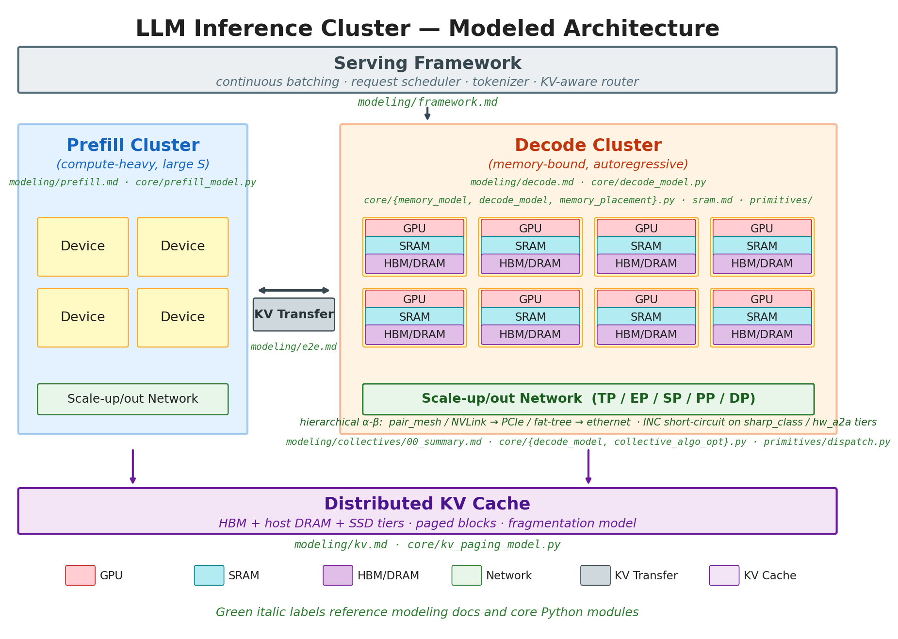
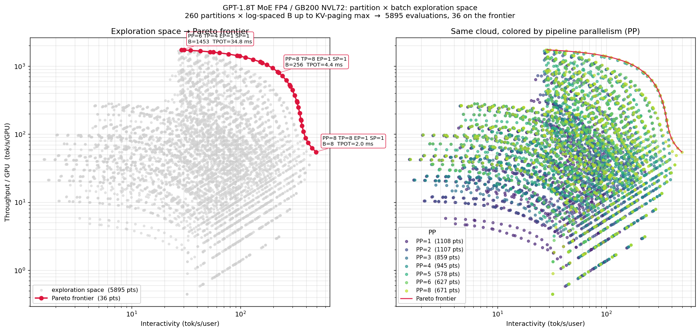

# FLARE — Fast LLM Analytical Roofline Explorer

FLARE is a lightweight, first-principles analytical framework for large-language-model inference performance modeling. It predicts latency, throughput, and memory footprint of LLM inference on a given cluster *before* you build or rent it — from JSON descriptions of the model, the hardware, the parallelism layout, the workload, and the serving stack.

A five-stage roofline pipeline (memory → FLOPs → traffic → comm → latency) extended with prefill, end-to-end metric assembly, KV paging, chunked prefill, and disaggregated prefill/decode. Composable pure functions over typed dataclasses — no global state.

**Four-pillar composition** (`model × system × partition × framework`), parameterized by a workload point (sequence length, batch size). The split keeps "which deployment shape" (partition) cleanly separated from "which serving stack runs it" (framework), so a single (model, system, partition) can be evaluated under multiple stacks (TRT-LLM, Dynamo+TRT, SGLang, vLLM, …) by swapping just the framework JSON.

This README is a navigation guide; the methodology lives in [`documentation/modeling/`](documentation/modeling/), starting with [`decode.md`](documentation/modeling/decode.md).

---

## Cluster Architecture



A disaggregated prefill/decode pipeline with a distributed KV cache. Each device exposes an ordered list of memory tiers, so SRAM-augmented architectures (Groq LPU, d-Matrix Corsair) and conventional HBM-only GPUs share one model. Collective traffic crosses one or more hierarchical fabric tiers; in-network reduction is engaged where the fabric advertises capability and the framework opts in. The KV-transfer interconnect between prefill and decode clusters folds into TTFT in disaggregated mode.

---

## What's Supported

| Layer | Variants | Doc |
|---|---|---|
| **Attention** | MHA, GQA, MQA, MLA (DeepSeek) | [`attention.md`](documentation/modeling/attention.md) |
| **Memory hierarchy** | single-tier HBM, multi-tier HBM + SRAM, hypothetical 3D-stacked | [`sram.md`](documentation/modeling/sram.md), [`dram3d.md`](documentation/modeling/dram3d.md) |
| **Collectives** | ring / tree (DBT) / Rabenseifner / PAT / hierarchical / torus / INC (NVLS, Quantum SHARP, hw_a2a) | [`collectives/`](documentation/modeling/collectives/) |
| **Fabric topology** | crossbar (NVSwitch / IB / PCIe), torus (TPU ICI), full mesh, k-D mesh | [`collectives/02_topology_mapping.md`](documentation/modeling/collectives/02_topology_mapping.md) |
| **Parallelism axes** | DP / PP / TP / EP / SP, with orthogonal or co-located TP+EP layout | [`decode.md`](documentation/modeling/decode.md) |
| **Serving stacks** | 7 calibrated framework JSONs: `default`, `trt`, `dynamo_trt`, `dynamo_sglang`, `dynamo_vllm`, `sglang`, `vllm` | [`framework.md`](documentation/modeling/framework.md) |
| **KV handoff** | co-located matched, co-located repack, disaggregated transfer | [`e2e.md`](documentation/modeling/e2e.md) |
| **SLO feasibility** | floor check, TPOT bound on B, TTFT bound on PP, goodput-optimal partition sweep | [`slo.md`](documentation/modeling/slo.md) |

---

## Collective & Network Primitives — Upstream Anchor

The α–β cost model, algorithm library, and topology composition are anchored to [`spiceMonkey/collective-comm`](https://github.com/spiceMonkey/collective-comm). Two paths in this repo are auto-synced from upstream by [`.github/workflows/sync-collectives.yml`](.github/workflows/sync-collectives.yml):

- [`llm_perf/core/primitives/collective_cost.py`](llm_perf/core/primitives/collective_cost.py) — the α–β primitive library
- [`documentation/modeling/collectives/`](documentation/modeling/collectives/) — workload-agnostic explainers + cheatsheet

Refer to the upstream repo for full derivations.

---

## Repository Layout

```
.
├── README.md
├── notebooks/         — quickstart + Pareto-frontier case study
├── documentation/
│   └── modeling/      — methodology derivations + symbol reference
├── llm_perf/
│   ├── calculators/   — InferenceCalculator, PrefillCalculator, E2ECalculator
│   ├── core/          — memory_model, decode_model, prefill_model + primitives
│   ├── database/      — model / system / tuner / framework JSON specs
│   ├── specs/         — typed dataclasses (LlmModelSpec, SystemSpec, …)
│   └── io/, utils/    — loaders, equations, HF adapter, DRAM3D helper
├── tests/             — unit + regression tests
├── sandbox/           — one-off experiments
└── scripts/           — supported CLI tools
```

---

## Quickstart

```bash
python -m venv .llm_perf
source .llm_perf/bin/activate
pip install jupyter matplotlib numpy
jupyter notebook notebooks/quickstart.ipynb
```

### Programmatic usage

```python
from llm_perf import InferenceCalculator, PartitionSpec
from llm_perf.calculators.prefill_calculator import PrefillCalculator
from llm_perf.calculators.e2e_calculator import E2ECalculator
from llm_perf.core.collective_algo_opt import optimize_collective_algorithms
from llm_perf.io import (
    load_model_from_db, load_system_from_db, load_tuner_from_db, load_framework_from_db,
)
from llm_perf.specs.overhead_spec import OverheadSpec
from llm_perf.specs.disagg_spec import DisaggSpec

model     = load_model_from_db("gpt_1_8t_moe")
system    = load_system_from_db("gb200.72gpu")
tuner     = load_tuner_from_db("gpt_1_8t_moe.tuner")
partition = PartitionSpec(PP=8, TP=8, EP=1, SP=1)
framework = load_framework_from_db("dynamo_trt")
tuner.S_input, tuner.S_decode, tuner.B_decode = 8192, 8192, 1

framework = optimize_collective_algorithms(model, partition, system, tuner, framework)

decode   = InferenceCalculator(model, system, partition, tuner, framework).run()
prefill  = PrefillCalculator(model, system, partition, tuner, framework).run()
e2e      = E2ECalculator(
    decode, prefill,
    overhead=OverheadSpec(t_graph_us=100.0),
    disagg=DisaggSpec(),
    model=model, system=system, partition=partition, tuner=tuner,
).run()

print(f"TTFT       = {e2e.TTFT*1e3:.1f} ms")
print(f"TPOT       = {e2e.TPOT*1e3:.2f} ms")
print(f"tok/s/GPU  = {e2e.throughput_per_gpu:.1f}")
```

`framework` is optional — omit for `FrameworkSpec.default()` (pure roofline). Swap framework JSONs to compare stacks on the same (model, system, partition, tuner).

---

## Case Study — `notebooks/pareto_basic.ipynb`



Enumerates every valid `(PP, TP, EP, SP)` partition, sweeps `B` from 1 to the KV-paging max, and extracts the upper-right envelope in (interactivity, throughput/GPU) space. At baseline GB200 NVL72 with `PP_MAX = 8`: 260 valid partitions → 37 frontier points, dominated by `PP=8 TP=8 EP=1 SP=1`. Raise `PP_MAX` to study the unbounded-PP frontier (winners shift toward `PP=32 TP=2`-style shapes).

Workload: GPT-1.8T MoE @ FP4 on GB200 NVL72.

---

## Utilities

- **HuggingFace Adapter** — `python scripts/convert_hf_model.py` converts any HF `config.json` (incl. MoE / GQA) into the `llm_perf.model` schema. See [`utils/hf_model_adapter.py`](llm_perf/utils/hf_model_adapter.py).
- **DRAM3D Bandwidth Calculator** — derives HBM bandwidth from die-interface parameters to evaluate future memory classes (HBM3E / HBM4 / HBM4E). See [`utils/dram3d.py`](llm_perf/utils/dram3d.py) and [`modeling/dram3d.md`](documentation/modeling/dram3d.md).

---

## Contributing

Open issues or PRs for new spec types, adapters, or analytical improvements. Keep JSON schemas backward compatible. Run the quickstart notebook after large changes.

---

## License

MIT — see [LICENSE](LICENSE).
