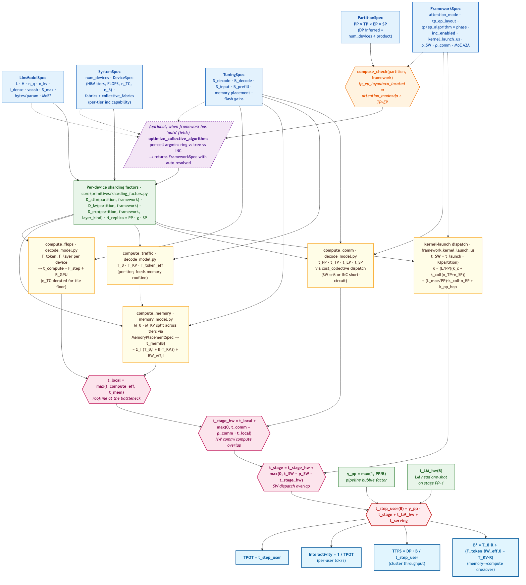
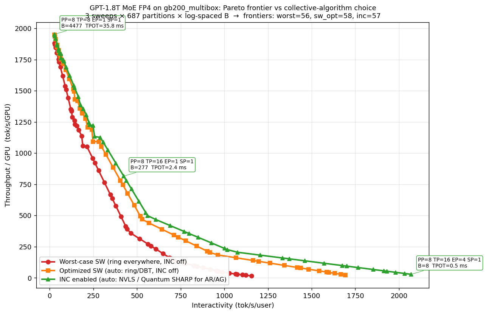
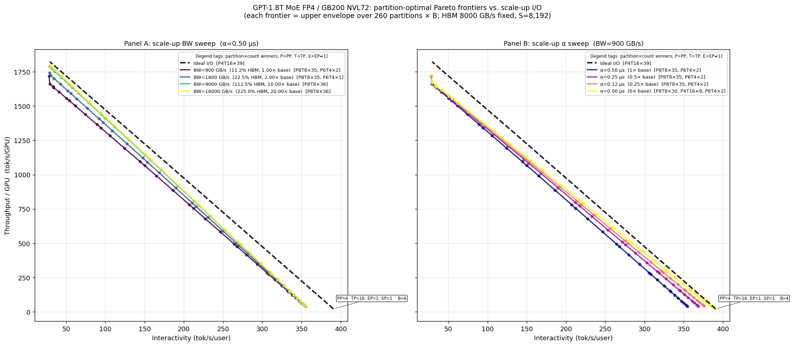
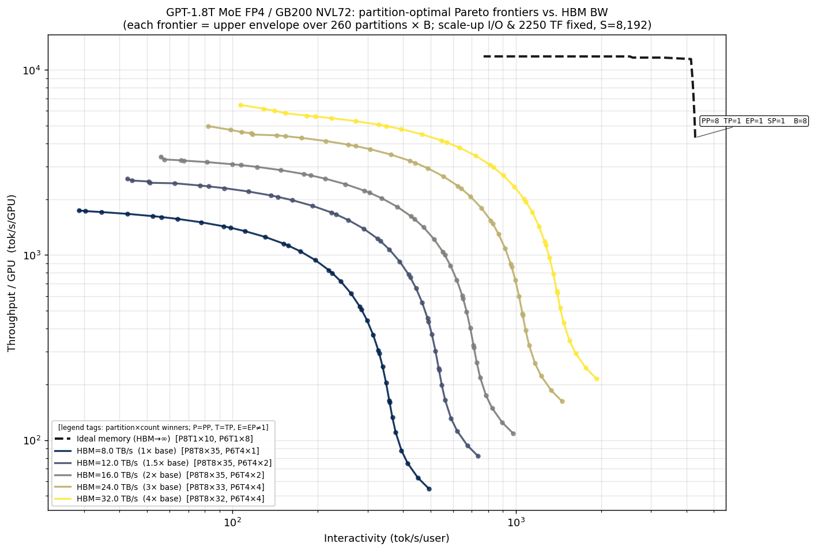
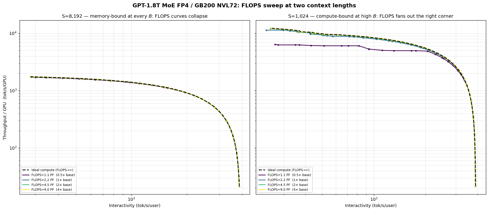

# FLARE — Fast LLM Analytical Roofline Explorer

FLARE is a lightweight, first-principles analytical framework for large-language-model inference performance modeling. It predicts latency, throughput, and memory footprint of LLM inference on a given cluster *before* you build or rent it — from a JSON description of the model, the hardware, the parallelism layout, the workload, and the serving stack.

The core is a five-stage pipeline (memory → FLOPs → traffic → comm → latency) extended with prefill, end-to-end metric assembly, KV paging, chunked prefill, and disaggregated prefill/decode. Everything is composable pure functions over typed dataclasses — no global state, no training-specific baggage.

**Four-pillar composition** (`model × system × partition × framework`), parameterized by a workload point (sequence length, batch size). Each pillar has a single concern: model = transformer arch; system = cluster hardware (devices, memory tiers, fabric topology, INC capability); partition = pure shard factors (PP/TP/EP/SP); **framework** = stack-axis decisions (attention_mode, tp_ep_layout, algorithm choices, `inc_enabled`, kernel-launch budget, comm/compute overlap, MLA mode, MoE A2A pattern). The workload point is the user's request shape, not a configuration the framework co-designs — it parameterizes the prediction. The split keeps "which deployment shape" (partition) cleanly separated from "which serving stack runs it" (framework), so a single (model, system, partition) can be evaluated under multiple stacks (TRT-LLM, Dynamo+TRT, SGLang, vLLM, …) by swapping just the framework JSON.

---

## Modeled Architecture


The diagram above shows the components of an LLM inference cluster that `llm_perf` models analytically. The system is organized as a disaggregated prefill/decode pipeline with a shared distributed KV cache underneath.

**Serving Framework** sits at the top of the stack — continuous batching, request scheduling, tokenization, KV-aware routing, and per-token detokenization streaming. CPU-side per-request startup ($t_\mathrm{tok}$, $t_\mathrm{sched}$) and per-output-token streaming ($t_\mathrm{detok}$) live here and fold into E2E latency. **Kernel-launch dispatch** ($t_\mathrm{stage,sw}$ — CUDA Graphs replay or eager `cudaLaunchKernel` budget) and the **LM head GEMM + sampling** are GPU-side per-step costs and live in the Decode stack ([`modeling/decode.md §7.1 / §6.2`](documentation/modeling/decode.md)), not here. See [`modeling/framework.md`](documentation/modeling/framework.md).

**Prefill Cluster** is the compute-heavy phase that processes the full input prompt in one (or multiple chunked) forward passes. Each device runs the same transformer layers but at sequence-length `S` rather than single-token decode. Prefill FLOPs scale quadratically with `S` in the attention block and linearly in the FFN/projection layers. See [`modeling/prefill.md`](documentation/modeling/prefill.md) and [`core/prefill_model.py`](llm_perf/core/prefill_model.py).

**Decode Cluster** is the memory-bandwidth-bound autoregressive phase. Devices are connected via a scale-up/out network that carries TP, EP, and SP collectives; pipeline-parallel (PP) stages communicate via point-to-point sends. Data parallelism (DP) replicates the full pipeline to increase throughput without affecting per-request latency. The roofline model inside each device balances compute time against per-token memory read time, and the overlap-aware latency model hides communication behind whichever is the bottleneck. See [`modeling/decode.md`](documentation/modeling/decode.md) and [`core/decode_model.py`](llm_perf/core/decode_model.py).

**Multi-tier memory hierarchy.** Each device exposes an ordered list of memory tiers, fastest first — capacity, peak bandwidth, sustained-BW deflator $\eta_\beta$, and first-byte $\alpha$ per tier. A `MemoryPlacementSpec` on the tuner places weights and KV onto tiers (greedy fastest-first by default, with `auto_priority` controlling the weights-vs-KV tiebreaker; or operator-pinned to a named tier). The decode roofline opens up to a per-tier sum, so SRAM-augmented architectures (Groq LPU, d-Matrix Corsair) and conventional HBM-only GPUs share one model. A single-tier device reproduces the legacy $t_\mathrm{mem} = T_\mathrm{step} / \mathrm{BW_\mathrm{HBM}}$ form bit-for-bit. See [`modeling/sram.md`](documentation/modeling/sram.md) and [`core/memory_placement.py`](llm_perf/core/memory_placement.py).

**KV Transfer** interconnect bridges the two clusters in a disaggregated deployment. When prefill and decode run on separate device groups, the KV cache produced during prefill must be shipped to the decode cluster before autoregressive generation can begin. The transfer cost (startup latency α + bulk BW) is modeled in [`modeling/e2e.md`](documentation/modeling/e2e.md) and can dominate TTFT for short prompts or low-bandwidth fabrics.

**Distributed KV Cache** spans HBM, host DRAM, and SSD tiers. `llm_perf` models PagedAttention-style block accounting — block size, per-sequence block count, internal fragmentation, and effective HBM capacity after subtracting weights and activations — to determine the maximum concurrent-sequence batch a given partition can serve. See [`modeling/kv.md`](documentation/modeling/kv.md) and [`core/kv_paging_model.py`](llm_perf/core/kv_paging_model.py).

The **scale-up/out network** within and between clusters carries collective traffic for tensor parallelism (TP), expert parallelism (EP), and sequence parallelism (SP). The collective cost model accounts for effective per-port bandwidth under aggregate capacity constraints, latency ($\alpha$), and the algorithm choice (ring vs. DBT, dim-decomposed torus, hierarchical RS → sub-AR → AG, plus in-network reduction where the fabric supports it). See [`modeling/collectives/`](documentation/modeling/collectives/) (the upstream-synced explainer subseries — start with `00_summary.md`) and [`core/primitives/collective_cost.py`](llm_perf/core/primitives/collective_cost.py).

**Hierarchical scale-up/out.** Each parallelism domain is described by an ordered list of switching tiers (innermost first), each with its own radix *P*<sub>i</sub>, per-port bandwidth *BW*<sub>i</sub>, and latency *α*<sub>i</sub>. A collective over *G* ranks crosses the minimum number of tiers needed to reach all ranks; multi-tier all-reduce decomposes as inner reduce-scatter → outer sub-AR → inner all-gather, with payload telescoping shrinking the cross-tier traffic. A single-tier list reproduces the legacy flat (*α*<sub>role</sub>, *BW*<sub>role</sub>) model exactly; multi-tier configurations (e.g. NVL72 intra-rack NVSwitch + inter-rack aggregation; d-Matrix `pair_mesh → pcie_server → ethernet_rack` for scale-out across servers) are supported via a `"tiers": [...]` JSON form. See [`modeling/collectives/03_hierarchical_topologies.md`](documentation/modeling/collectives/03_hierarchical_topologies.md) §2 "Composition rules for hierarchical collectives" and `notebooks/pareto_vs_scale_up_tier.ipynb` for a worked example.

---

## Collective & Network Modeling — Upstream Anchor

The collective-communication and network primitives that price every TP/EP/SP/PP collective in this framework — the Hockney α–β cost model, ring/tree/DBT/INC algorithms, hierarchical and torus composition, contention coefficients — are anchored to a dedicated upstream repository: [`spiceMonkey/collective-comm`](https://github.com/spiceMonkey/collective-comm). That repo is the single source of truth for the cost-model derivations and the primitive library; this repo carries read-only mirrors so the inference modeling here stays in lockstep with upstream changes.

Two paths in this repo are auto-synced from upstream:

- [`llm_perf/core/primitives/collective_cost.py`](llm_perf/core/primitives/collective_cost.py) ← `code/core/collective_cost.py` (the α–β primitive library)
- [`documentation/modeling/collectives/`](documentation/modeling/collectives/) ← `documentation/modeling/` (workload-agnostic explainers + cheatsheet)

Both are kept in sync by [`.github/workflows/sync-collectives.yml`](.github/workflows/sync-collectives.yml) (Mondays 06:00 UTC + manual dispatch). Each run lands the upstream snapshot as a PR; the synced code file carries an `AUTO-SYNCED — DO NOT EDIT LOCALLY` banner that the workflow re-prepends on every run. **Refer to the upstream repo for derivations, additional algorithms, contention calibration, and any further reading on the cost model itself.**

llm_perf-specific glue around the synced primitives lives in sibling modules under `llm_perf/core/primitives/` (the per-stage TP/SP/EP/PP aggregator in `stage_aggregator.py`; the topology-aware dispatcher and MoE Dispatch+Combine 2× wrap in `dispatch.py`) and evolves locally — only the upstream-synced primitives are read-only.

---

## What's Modeled

Survey of the configurations / variants supported by the framework, grouped by the layer of the architecture each addresses. Cross-referenced to the deep-dive doc per row.

### Attention model variants

| Family | Spec signal | Cache per token-per-layer | Notes | Doc |
|---|---|---|---|---|
| **MHA** (Multi-Head) | `n_q == n_kv` | `2 · n_q · d_head · b` | Original transformer attention (GPT-2/3) | [`attention.md §2`](documentation/modeling/attention.md) |
| **GQA** (Grouped-Query) | `n_q > n_kv > 1` | `2 · n_kv · d_head · b` | Llama-3, Mistral, GPT-OSS, Qwen3 — KV shrunk by n_q/n_kv | [`attention.md §3.1`](documentation/modeling/attention.md) |
| **MQA** (Multi-Query) | `n_kv == 1` | `2 · d_head · b` | Falcon, PaLM — KV minimized; special case of GQA | [`attention.md §3.2`](documentation/modeling/attention.md) |
| **MLA** (Multi-head Latent) | `MLASpec` set | `(d_c + d_qk_rope) · b` (no factor 2) | DeepSeek-V3 / R1 — single latent vector per token replaces KV pair | [`attention.md §3.4–3.6`](documentation/modeling/attention.md) |

Two orthogonal **dispatch modes** on `FrameworkSpec`:

- `attention_mode = "tp"` (default) — head-shard K/V across the TP group; per-rank KV scales as 1/G_TP. Used by GPT/Llama/GQA on classical TP stacks.
- `attention_mode = "dp"` — replicate Q/K/V projection weights, shard the batch across the TP-as-DP-attn group; per-rank KV still scales as 1/G_TP via user split. Production-canonical for MLA on Dynamo orchestrators (TP-attn buys no KV reduction for MLA — see attention.md §3.6).

MLA execution path is selected by `framework.mla_mode ∈ {"absorbed", "mat_absorb_lazy"}` (see attention.md §3.5).

### Memory hierarchy

| Tier class | Examples in `database/system/` | Capacity / BW / α | Notes |
|---|---|---|---|
| **Single-tier HBM** | gb200/gb300, b200/b300, h100/h200 | 80–192 GB · 3.4–8 TB/s · ~100 ns | Auto-promoted from legacy `hbm_capacity_GB`/`hbm_bandwidth_GBps` fields |
| **HBM with η_β deflator** | All Blackwell | + `hbm_eta_beta=0.7` sustained vs nameplate | DeviceSpec field |
| **SRAM + LPDDR (multi-tier)** | dmatrix.server, dmatrix.squadrack | 256 MB SRAM @ 18.75 TB/s + 32 GB LPDDR5 @ 51.2 GB/s per chiplet | DeviceSpec.tiers list |
| **Hypothetical 3D-stacked** | (parameterizable) | derived from die-interface params | `utils/dram3d.py` + `dram3d.md` |

The decode roofline opens to a per-tier sum: `t_mem(B) = Σ_i (T_θ,i + B·T_KV,i) / BW_eff,i`. Single-tier devices reduce to `T_step / BW_HBM` bit-for-bit. Placement policy on `tuner.placement: MemoryPlacementSpec`:

- `weights="auto"` + `kv="auto"` + `auto_priority="weights"|"kv"` — greedy fastest-first (with the priority field as tiebreaker)
- `weights="<tier_name>"` or `kv="<tier_name>"` — operator-pinned to a named tier

Doc: [`sram.md`](documentation/modeling/sram.md), [`memory_placement.py`](llm_perf/core/memory_placement.py).

### Collective communication primitives

Four operation classes × multiple algorithms per class. All α–β (Hockney) cost forms; INC entries assume the crossed tier(s) advertise `inc != "none"` AND `framework.inc_enabled=True`.

| Op | SW algorithms | INC variant | n_α (SW) | Notes |
|---|---|---|---|---|
| **Broadcast** | ring, tree | `inc_broadcast` (sharp_class) | (G−1) / log₂G | One-to-all |
| **Reduce** | ring, tree | `inc_reduce` (sharp_class) | (G−1) / log₂G | All-to-one |
| **All-Reduce** | ring, tree (DBT), Rabenseifner halving-doubling | `inc_all_reduce` (sharp_class) — n_α=2, BW_eff×2 | 2(G−1) / 2·log₂G | Dual traversal; INC collapses to switch-cut-through |
| **All-Gather** | ring, recursive doubling, PAT (Parallel Aggregated Trees) | `inc_all_gather` (sharp_class) — n_α=1 | (G−1) / log₂G | NCCL ≥ 2.23 ships PAT |
| **Reduce-Scatter** | ring, recursive halving, PAT | `inc_reduce_scatter` (sharp_class) — n_α=1 | (G−1) / log₂G | Mirror of AG |
| **MoE All-to-All** | pairwise (direct-send), ring relay (single-NIC), Bruck (small-msg log-α) | `inc_a2a` (hw_a2a tier — Tomahawk Ultra / Rubin) | (G−1) / log₂G | sharp_class doesn't accelerate A2A |
| **P2P** | `p2p_hop` (single send/recv) | — | 1 | Used for PP hops |

**Composition rules** for multi-tier fabric chains (`collective_fabrics: {TP: [tier1, tier2, …]}`):

- `hierarchical_all_reduce` / `hierarchical_all_reduce_ring_ring` — RS → sub-AR → AG with payload telescoping (collectives/03_hierarchical_topologies.md §2)
- `hierarchical_all_gather` / `hierarchical_reduce_scatter` — multi-tier AG/RS
- Per-destination-class A2A accounting on multi-tier crossbars (collectives/03 §3)

**Torus primitives** for k-D torus tiers (TPU pods, GPU NV-link torus): `torus_all_reduce`, `torus_all_gather`, `torus_reduce_scatter`, `torus_a2a`, `torus_broadcast`, `torus_reduce` (dim-by-dim).

**Selection**: `optimize_collective_algorithms(model, partition, system, tuner, framework)` resolves `framework.{tp,ep}_algorithm_{decode,prefill}="auto"` per (phase × collective × G × M) by `argmin(cost)`; short-circuits to INC when eligible.

Source: [`collective_cost.py`](llm_perf/core/primitives/collective_cost.py) (upstream-synced), [`dispatch.py`](llm_perf/core/primitives/dispatch.py); doc subseries: [`collectives/`](documentation/modeling/collectives/) (00 cheatsheet → 05 contention).

### Fabric topology classes

| Class | Topology | INC field | Used by |
|---|---|---|---|
| `CrossbarTier(ports=N)` | One monolithic switch chip (radix N) | `inc ∈ {none, sharp_class, hw_a2a}` + `inc_alpha_us` | NVSwitch4/5, Tomahawk, Quantum-2 IB, PCIe switch |
| `TorusTier(dims=(d₁,…,dₖ))` | k-D torus (wraparound) | (no INC) | TPU v4/v5 ICI |
| `MeshTier(dims=(N,), full=True)` | Full mesh | (no INC) | NVLink direct, package D2D |
| `MeshTier(dims=(d₁,…,dₖ), full=False)` | k-D mesh (no wraparound) | (no INC) | d-Matrix package_d2d 2×2 |

**INC capabilities** (declared at the tier, controlled by framework):

- `none` — pure SW collectives (the table above)
- `sharp_class` — switch ALU + multicast crossbar (NVLink SHARP / NVLS, Quantum SHARP, Spectrum-X SHARP); accelerates AR/AG/RS
- `hw_a2a` — also accelerates A2A via switch scatter-gather (Tomahawk Ultra, Rubin-class fabric)

`framework.inc_enabled` toggles whether the runtime engages INC even when the fabric advertises capability — this is how `gb200.72gpu` (NVLS-capable hardware) can be modeled both with INC engaged (notebooks studying INC effects) and without (validators calibrating against measurements that didn't enable SHARP).

Doc: [`collectives/02_topology_mapping.md`](documentation/modeling/collectives/02_topology_mapping.md), [`collectives/04_in_network_collectives.md`](documentation/modeling/collectives/04_in_network_collectives.md).

### Parallelism & sharding axes

| Axis | Spec | Per-layer comm | Bubble / overhead |
|---|---|---|---|
| **DP** (Data Parallel) | inferred = `num_devices / (PP·TP·EP·SP)` | none — replicates the pipeline | 0; scales `TTPS` linearly |
| **PP** (Pipeline Parallel) | `partition.PP` | P2P send/recv per layer hop | `γ_pp = max(1, PP/B)` first-token bubble |
| **TP** (Tensor Parallel) | `partition.TP` | per-layer all-reduce (n_TP_collectives = 2) | shards attention heads + FFN columns |
| **EP** (Expert Parallel) | `partition.EP` | MoE Dispatch + Combine all-to-all (2 × a2a per MoE layer) | MoE models only |
| **SP** (Sequence Parallel) | `partition.SP` | per-layer all-gather + reduce-scatter (n_SP_collectives = 1) | shards activations along sequence dim |

**Cross-axis composition** is set on `FrameworkSpec`, not partition (so a single partition can be evaluated under multiple framework choices):

- `tp_ep_layout = "orthogonal"` (default) — TP and EP are independent axes; replica spans `PP · TP · EP · SP` devices.
- `tp_ep_layout = "co_located"` — TP and EP overlay on the same GPUs; replica spans `PP · max(TP,EP) · SP`. Required by DeepEP-style scatter-direct dispatch. **Forces** `attention_mode="dp"` AND `TP == EP` (enforced by `compose_check`).

Per-device sharding factors (`D_attn`, `D_kv`, `D_exp`, `N_replica` from `core/primitives/sharding_factors.py`) absorb all the partition × framework algebra so the rooflines stay framework-agnostic. Docs: [`decode.md §1.4 / §5.3`](documentation/modeling/decode.md), [`notation.md §1`](documentation/modeling/notation.md).

### Serving stack overhead model — 7 production framework JSONs

`FrameworkSpec` carries every host-side / dispatch-side knob; the database ships 7 calibrated stacks. Side-by-side (per-step host work decomposes into `t_step,seq(B) = c_orch + c_seq · B`):

| Field (units) | What it models | `default` | `trt` | `dynamo_trt` | `dynamo_sglang` | `dynamo_vllm` | `sglang` | `vllm` |
|---|---|---|---|---|---|---|---|---|
| `kernel_launch_us` (μs) | Per-kernel CUDA dispatch budget τ_launch — multiplied by partition-dependent kernel count K to get `t_stage,kernel` | 1.5 | 1.5 | 4.0 | 12.0 | 8.0 | 10.0 | 10.0 |
| `c_orch_us` (μs/step) | B-independent per-step orchestration floor (graph-launch decision, scheduler tick, sampler glue between graph replays) | 0 | 0 | 0 | 0 | 0 | 0 | 0 |
| `c_seq_us` (μs/seq) | Per-sequence host work (sampling, scheduler, block-table gather) — scales with B | 0 | 75 | 5 | 5 | 5 | 40 | 40 |
| `moe_a2a_pattern` | MoE Dispatch+Combine pattern | gather | gather | scatter | scatter | scatter | scatter | scatter |
| `attention_mode` | `tp` / `dp` dispatch | tp | tp | dp | dp | dp | tp | tp |
| `tp_ep_layout` | `orthogonal` / `co_located` | orthogonal | orthogonal | co_located | co_located | co_located | orthogonal | orthogonal |
| `inc_enabled` | Engage SHARP-class INC where fabric supports it | True | True | True | True | True | True | True |
| `tp/ep_algorithm_*` | `ring` / `tree` / `auto` | ring | auto | auto | auto | auto | auto | auto |
| `comm_overlap_factor` (ρ_comm) | Collective comm hidden under HW compute | 0 | 0 | 0 | 0 | 0 | 0 | 0 |
| `kernel_overlap_factor` (ρ_kernel) | Kernel-launch dispatch hidden under GPU step | 1.0 | 1.0 | 1.0 | 1.0 | 1.0 | 0.3 | 0.3 |
| `seq_overlap_factor` (ρ_seq) | Per-step host work hidden under GPU step | 1.0 | 1.0 | 1.0 | 1.0 | 1.0 | 0.0 | 0.0 |

Anchor calibrations (from `benchmark/validate/*` against InferenceX measurements):

- `dynamo_trt`: `c_seq=5` µs/seq — Dynamo orchestrator absorbs most per-seq host work into the CUDA-graph launch (ρ_seq=1 full overlap); residual is the irreducible per-seq sampling + block-table cost.
- `trt` (raw TRT-LLM): `c_seq=75` µs/seq — fast C++ runtime but no orchestrator absorbing per-step bookkeeping; ~15× larger than `dynamo_trt`.
- `dynamo_sglang` / `dynamo_vllm`: `c_seq=5`, but `kernel_launch_us` higher (12 / 8 µs vs `dynamo_trt`'s 4) — orchestrator absorbs *per-seq* host work but not all *per-kernel* dispatch (SGLang's Python paths survive the wrap; vLLM's are partially captured).
- `sglang` / `vllm`: `c_seq=40` µs/seq with `ρ_seq=0` (eager-mode Python interpreter wraps each per-seq decision, breaks CPU-runs-ahead) and `ρ_kernel=0.3` (limited dispatch overlap from interpreter stalls).
- `c_orch=0` everywhere by default — the per-step orchestration floor is opt-in. The Kimi-K2.5/Dynamo+vLLM §5 panel-(d) residual ~10 ms gap is the primary empirical motivator pending calibration.

The kernel-launch tax `t_stage,kernel = τ_launch · K(partition)` produces visible Pareto cliffs at high τ_launch (eager-mode stacks) — see [`pareto_vs_kernel_launch.ipynb`](notebooks/pareto_vs_kernel_launch.ipynb). Docs: [`decode.md §7.1 / §7.3`](documentation/modeling/decode.md), [`framework.md`](documentation/modeling/framework.md).

### KV handoff & disaggregation

| Mode | `DisaggSpec` field | Cost model |
|---|---|---|
| **Co-located, matched-partition** | `disaggregated=False`, `colo_repack_GBps=0` | Zero handoff (KV stays in HBM) |
| **Co-located, repack** | `disaggregated=False`, `colo_repack_GBps>0` | `t_handoff = α_intra + M_KV / BW_intra · η_repack` |
| **Disaggregated transfer** | `disaggregated=True`, `inter_bandwidth_GBps>0` | `t_handoff = max(0, α_eff + M_KV / BW_inter + t_repack − ρ_KV · t_prefill)` with `α_eff = α_inter + N_WR · τ_WR` |

`M_KV = 2 · L · S · H_kv · b` (cluster-aggregate, MHA/GQA). For MLA: `(d_c + d_qk_rope) · L · S · b`. The handoff tax can dominate TTFT for short prompts or low-bandwidth fabrics — see [`disagg_bw_inter_sweep.py`](sandbox/disagg_bw_inter_sweep.py) (in `sandbox/` since this is an experimental study) and [`e2e.md §6`](documentation/modeling/e2e.md).

---

## Decode Modeling Flow

> **Start with [`decode.md`](documentation/modeling/decode.md).** It's the most important modeling doc to review — every Pareto sweep, every case study, and the entire `InferenceCalculator` path go through it. The decode roofline assembles compute + multi-tier memory + collective comm + kernel-launch dispatch + LM head + pipeline bubble into a single user-observed step time, and the rest of the framework (prefill, e2e, kv paging) builds on its conventions.



The diagram flows top-to-bottom in five color-banded stages; the prose walkthrough below maps each stage to its implementation in [`documentation/modeling/decode.md`](documentation/modeling/decode.md) and `llm_perf/core/`.

1. **Four design pillars + workload point (blue + orange).** Four typed-dataclass inputs the framework co-designs over: `LlmModelSpec` (transformer architecture), `SystemSpec` (cluster hardware + per-tier fabric capability incl. `inc` disclosure), `PartitionSpec` (`PP × TP × EP × SP`; `DP = N / product` inferred), and `FrameworkSpec` (stack-axis decisions — attention_mode, tp_ep_layout, algorithm choices, `inc_enabled`, kernel-launch budget, ρ_kernel, ρ_seq, ρ_comm, MoE A2A pattern, c_orch / c_seq host overhead). The workload point — sequence length `S` and active batch `B` (carried internally on `TuningSpec`) — parameterizes the prediction; it's the user's request shape, not a configuration the framework co-designs.

2. **Cross-input validation + per-device sharding (purple).** `compose_check(partition, framework)` enforces invariants that mix-and-match across specs — e.g. `tp_ep_layout="co_located" ⇒ attention_mode="dp" ∧ TP == EP` — on calculator entry. The validated join resolves to abstract per-device sharding factors `D_attn`, `D_kv`, `D_exp`, `N_replica` (`core/primitives/sharding_factors.py`) that encode every production-relevant configuration (orthogonal TP+EP, co-located TP+EP, DP-attention, MLA) in one lookup table so the downstream rooflines stay framework-agnostic. When `framework` ships `"auto"` algorithm fields, `optimize_collective_algorithms` resolves them per (phase × collective × G × M) before the cost branches fire.

3. **Four cost branches (yellow).** Independent per-device cost computations, each a pure function of the validated inputs and the sharding factors:
    - **Memory** → $t_\mathrm{mem}(B) = \sum_i (T_{\theta,i} + B \cdot T_\mathrm{KV,i})/\mathrm{BW_\mathrm{eff,i}}$ — multi-tier roofline; single-tier devices reduce to $T_\mathrm{step}/\mathrm{BW_\mathrm{HBM}}$ bit-for-bit (`memory_model.py`).
    - **Compute** → $t_\mathrm{compute}(B) = B \cdot F_\mathrm{token}^\mathrm{dev}/(R_\mathrm{peak} \cdot \eta_\mathrm{TC}(B))$, Tensor-Core-efficiency-derated (`decode_model.py:compute_flops`).
    - **Collective comm** → per-axis $t_\mathrm{PP}$, $t_\mathrm{TP}$, $t_\mathrm{EP}$, $t_\mathrm{SP}$ summed per stage via `cost_collective` dispatch (α–β model or INC short-circuit, per fabric capability and `framework.inc_enabled`).
    - **Stack overheads** → per-stage kernel-launch dispatch budget $t_\mathrm{stage,kernel}$ (kernel-launch × kernel count), per-step host work $t_\mathrm{step,seq}(B) = c_\mathrm{orch} + c_\mathrm{seq} \cdot B$ (B-independent orchestration floor + per-sequence inner loops), LM-head roofline $t_\mathrm{LM,hw}$, pipeline-bubble multiplier $\gamma_\mathrm{pp} = \max(1, PP/B)$.

4. **Three-stage assembly (pink).** The four cost branches combine through three composition equations governed by three overlap factors (ρ_comm for compute/comm, ρ_kernel for kernel-launch dispatch, ρ_seq for per-step host work):
    - **Roofline:** $t_\mathrm{local}(B) = \max(t_\mathrm{compute}(B), t_\mathrm{mem}(B))$ picks the bottleneck side of the device.
    - **Compute/comm overlap:** $t_\mathrm{stage,hw}(B) = t_\mathrm{local}(B) + \max(0, t_\mathrm{comm}(B) - \rho_\mathrm{comm} \cdot t_\mathrm{local}(B))$ folds in collective comm under ρ_comm.
    - **Per-step hardware window + host overlap + pipeline bubble:** First assemble the hardware window $t_\mathrm{step,base}(B) = \gamma_\mathrm{pp} \cdot [t_\mathrm{stage,hw} + \max(0, t_\mathrm{stage,kernel} - \rho_\mathrm{kernel} \cdot t_\mathrm{stage,hw})] + t_\mathrm{LM,hw}$ (kernel-launch dispatch composed under ρ_kernel inside the bubble; LM head added outside). Then layer per-step host work on top: $t_\mathrm{step,user}(B) = t_\mathrm{step,base}(B) + \max(0, t_\mathrm{step,seq}(B) - \rho_\mathrm{seq} \cdot t_\mathrm{step,base}(B))$. The LM head and per-step serving overhead fire once per step on the head node, outside the pipeline bubble.

5. **Outputs + closed-form bounds (light blue + green dashed).** $\mathrm{TPOT} = t_\mathrm{step,user}(B)$; per-replica throughput $\mathrm{TPS}(B) = B/t_\mathrm{step,user}(B)$; cluster throughput $\mathrm{TTPS}(B) = \mathrm{DP} \cdot \mathrm{TPS}(B)$. The diagnostic bounds — memory→compute crossover $B^*$, memory-vs-interconnect saturation $\mathrm{BW_\mathrm{link}^*}$, INC payoff threshold $m_\mathrm{INC}$, and the unified per-knob sensitivity table — name which primitive is binding at any operating point.

Every block in the diagram corresponds to a function in `llm_perf/core/decode_model.py` (or `core/primitives/` for the shared physics); every equation has its derivation in [`documentation/modeling/decode.md`](documentation/modeling/decode.md).

---

## SLO and Partition Feasibility

Production deployments don't run at a single (partition, $B$) point — they run at the largest arrival rate $\lambda$ that keeps both TTFT and TPOT below operator-set service-level objectives (SLOs). Inverting the rooflines of `decode.md` and `prefill.md` against those SLOs produces hard bounds on the partition shape and the operating batch — **the SLO box on the partition node in the flow diagram above is exactly this constraint layer.**

Four bounds, each derived in `slo.md`:

1. **Floor check** — partitions whose per-device weight footprint streams slower than the SLO budget are infeasible at any $B$ and any $\lambda$. The cleanest, most operationally consequential prune; runs first in the partition sweep.
   $$T_{\theta,\mathrm{device}} \,/\, \mathrm{BW_{mem}} \;\le\; \mathrm{TPOT_{SLO}}$$
2. **TPOT-SLO bound on $B$** (Zone-3 closed form) — caps batch size in compute-bound operation. Independent of the per-device weight footprint; depends only on the per-device compute capacity, the per-token FLOPs, and the SLO target.
   $$B_\mathrm{max} \;\approx\; R_\mathrm{GPU} \cdot \mathrm{TPOT_{SLO}} \,/\, F_\mathrm{token,device}$$
3. **TTFT-SLO bound on $PP$** (prefill-warmup linearity) — caps pipeline depth via the first-token traversal cost. The asymmetry that drives most production stacks toward TP-first / shallow-PP.
   $$\mathrm{PP_{max}} \;\approx\; 1 + (\mathrm{TTFT_{SLO}} - t_\mathrm{sched} - t_\mathrm{prefill,local} - t_\mathrm{step,user}) \,/\, t_\mathrm{stage,max}$$
4. **Goodput** (the optimization target) — the maximum sustained arrival rate over the joint feasibility region; goodput-optimal partition is the argmax over the discrete $(PP, TP, EP, SP)$ space.
   $$\mathrm{Goodput} \;=\; \max\,\lambda \quad \text{s.t.} \quad P_p[\mathrm{TTFT}(\lambda)] \le \mathrm{TTFT_{SLO}} \;\wedge\; P_p[\mathrm{TPOT}(\lambda)] \le \mathrm{TPOT_{SLO}}$$

The joint feasibility region $\mathcal{F}_\mathrm{SLO}$, the dynamic-stability cushion ($\overline{B} \ge PP + z_p \sqrt{\overline{B}}$ at percentile $p$), the disaggregated-vs-co-located decision rule when the two SLOs disagree on PP, the goodput-optimal partition sweep recipe, and the workload-class SLO target profiles (chat / agentic / batch) are all in [`slo.md`](documentation/modeling/slo.md).

---

## Repository Layout

```
.
├── README.md                         — this file
├── assets/                           — PNGs embedded in README + notebooks
├── notebooks/                        — interactive tutorial + case studies (Pareto + TTFT sweeps)
├── documentation/
│   ├── modeling/                     — methodology derivations
│   │   ├── decode.md                 — decode roofline (compute + multi-tier mem + comm + SW + LM + bubble)
│   │   ├── prefill.md                — prefill latency (incl. chunked + LM head)
│   │   ├── e2e.md                    — TTFT, TPOT, throughput, interactivity, goodput, Pareto
│   │   ├── slo.md                    — SLO-driven partition feasibility (B_max, PP_max, goodput-optimal sweep)
│   │   ├── kv.md                     — paged-attention KV bookkeeping
│   │   ├── framework.md              — CPU-side serving overhead (t_tok, t_sched, t_detok)
│   │   ├── notation.md               — canonical symbol reference (synced with decode/prefill/e2e)
│   │   ├── sram.md, dram3d.md        — multi-tier memory + 3D-DRAM bandwidth derivations
│   │   ├── references.md             — bibliography
│   │   └── collectives/              — upstream-synced explainer subseries (00 cheatsheet through 05 contention)
│   └── explaining/                   — design-intent walkthroughs (PP/TP/EP scaling, kernel-launch, pipeline bubble, FLOPS-doesnt-help, scale-up I/O break-even, …)
├── sandbox/                          — one-off experiments + ad-hoc Python sweeps (not part of supported tooling)
├── scripts/                          — supported CLI tools
│   └── convert_hf_model.py           — HF config.json → llm_perf model JSON converter
├── tests/                            — unit + regression tests (`unit/`, `regression/`)
└── llm_perf/
    ├── calculators/
    │   ├── inference_calculator.py   — decode-phase orchestration
    │   ├── prefill_calculator.py     — prefill-phase orchestration
    │   └── e2e_calculator.py         — TTFT/TPOT/throughput assembly
    ├── core/
    │   ├── memory_model.py           — M_θ, M_act, M_kv, per-tier residency, fit predicate
    │   ├── memory_placement.py       — split T_θ / T_KV across device memory tiers (greedy or pinned); multi-tier t_mem
    │   ├── decode_model.py           — decode FLOPs, traffic, comm, multi-tier roofline + overlap-aware TPOT, B*, t_kernel, t_step_seq, t_LM, γ_pp
    │   ├── prefill_model.py          — prefill FLOPs, traffic, comm, latency (incl. chunked prefill, LM head)
    │   ├── collective_algo_opt.py    — post-partition resolver for `auto` collective algorithms (per-cell min(cost), INC short-circuit)
    │   ├── kv_paging_model.py        — paged-attention block accounting
    │   └── primitives/               — phase-agnostic physics
    │       ├── weight_footprint.py   — dense / MoE / embedding bytes
    │       ├── kv_footprint.py       — KV cache bytes for n_tokens
    │       ├── linear_flops.py       — proj + FFN + MoE-router FLOPs per token
    │       ├── collective_cost.py    — α–β cost formulas (AUTO-SYNCED from upstream)
    │       ├── dispatch.py           — topology-aware dispatcher (ring/DBT/INC/hierarchical/torus selection)
    │       ├── stage_aggregator.py   — per-stage TP/SP/EP/PP accumulator
    │       └── partition_layout.py   — nested-layout helper for tier-aware PP-hop costing
    ├── database/                     — on-disk spec store (35 JSONs total)
    │   ├── model/         (12)       — model JSONs (gpt_1_8t_moe, gpt_oss_120b, llama3.1_{8b,70b}, deepseek_{r1_0528,v4_pro}, glm5, kimi_k25, minimax_m25, qwen35_397b_a17b, qwen3_vl_235b_fp8, example.model.dense)
    │   ├── system/        (14)       — system JSONs: per-family `<chip>.8gpu` (B/H series) + `<chip>.multibox` template; gb200.{72gpu,multibox}; gb300.72gpu; dmatrix.{server,squadrack}; tpu.v5p.pod; example.sys
    │   ├── tuner/         (4)        — workload knob JSONs (S_decode, B_decode, MemoryPlacementSpec, attention/MLP gains)
    │   └── framework/     (7)        — per-stack framework JSONs (default, dynamo_trt, dynamo_sglang, dynamo_vllm, sglang, trt, vllm — algorithm choices, INC, kernel_launch_us, ρ_kernel, ρ_seq, ρ_comm, c_orch_us, c_seq_us)
    ├── specs/                        — LlmModelSpec, SystemSpec (DeviceSpec + MemoryTierSpec + FabricSpec + CrossbarTier/TorusTier/MeshTier), PartitionSpec, TuningSpec (+ MemoryPlacementSpec), FrameworkSpec, OverheadSpec, DisaggSpec
    ├── io/                           — JSON loaders + list helpers per schema (load_{model,system,tuner,framework}_from_db)
    └── utils/                        — constants, equations, HF adapter, DRAM3D helper, plotting, partition_enum

archives/hf/                         — raw HuggingFace configs (conversion inputs for scripts/convert_hf_model.py; not loaded by the library)
```

> Note: there is no `partition/` directory — partitions are runtime sweep parameters constructed inline (`PartitionSpec(PP=…, TP=…, EP=…, SP=…)`), not curated catalog entries. There is also no per-GPU-count system permutation — multi-rack/multi-box deployments use a single `<family>.multibox.json` template per chip family, parameterized by `system_with_eta(num_devices=N)` which auto-resizes the outer fabric (IB) tier's port count to `ceil(N / inner_island_size)`. One-off hypotheticals (rail-optimized α, flat 576-port "ideal" fabric, BW-uplifted dmatrix variant, …) are constructed inline in their consuming notebook via `deepcopy + small mutation` — `database/system/` is reserved for real production hardware deployments.

### Core modeling code structure

The `llm_perf` package is organized as four concentric layers — each one pure, each one a single-purpose target for reading and extension:

**1. Specs (`llm_perf/specs/`)** — typed dataclasses that describe the problem. `LlmModelSpec` + optional `MoESpec` fix the architecture; `SystemSpec` + nested `DeviceSpec` (+ optional `tiers: List[MemoryTierSpec]` or top-level `sram_capacity_MB` / `sram_bandwidth_TBps` for SRAM-augmented devices) + `FabricSpec` + tier classes (`CrossbarTier`, `TorusTier`, `MeshTier`, each with optional `inc: "nvls" | "sharp" | "hw_a2a"` capability disclosure) fix the hardware and its fabric-chain topology; `PartitionSpec` is strictly the 4 shard ints (PP / TP / EP / SP); `TuningSpec` is strictly workload knobs (`S_input`, `S_decode`, `B_prefill`, `B_decode`, `chunk_size`, attention/MLP flash gains, plus a `MemoryPlacementSpec` that decides which memory tier holds weights vs KV); **`FrameworkSpec`** carries every stack-axis decision (`attention_mode` `"tp"`/`"dp"`, `tp_ep_layout` `"orthogonal"`/`"co_located"`, per-phase algorithm choices `tp/ep_algorithm_decode/prefill ∈ {ring, tree, auto}`, `inc_enabled` toggle, per-layer collective counts `n_TP/EP/SP_collectives`, `kernel_launch_us`, `kernel_overlap_factor` ρ_kernel, `comm_overlap_factor` ρ_comm, `seq_overlap_factor` ρ_seq, MLA mode, MoE A2A pattern, `c_orch_us`, `c_seq_us`); `OverheadSpec` and `DisaggSpec` add framework overheads and inter-cluster KV transfer. No behaviour — only data.

> **System describes capability; framework describes selection.** A fabric tier with `inc: "nvls"` advertises that the silicon supports NVLink SHARP; `FrameworkSpec.inc_enabled` decides whether the runtime engages it. The benchmark validators set `inc_enabled=False` because the InferenceX measurements they calibrate against were not captured with SHARP-class INC engaged; INC-study notebooks (`pareto_collective_algorithms`, `pareto_vs_kernel_launch`, `pareto_vs_mem_alpha*`) keep the default `inc_enabled=True`. Cross-spec invariants (e.g. `tp_ep_layout="co_located"` forces `attention_mode="dp"` and `TP == EP`) are enforced by `core/primitives/sharding_factors.compose_check(partition, framework)` on calculator entry.

**2. Core primitives (`llm_perf/core/primitives/`)** — phase-agnostic physics reused by both decode and prefill. Four modules, each a pure function of specs only: `weight_footprint.py` (dense / MoE / embedding bytes), `kv_footprint.py` (KV bytes for `n_tokens` context), `linear_flops.py` (proj + FFN + MoE-router FLOPs per token, attention excluded), and `collective_cost.py` (α-β cost formulas for p2p-hop, ring/tree all-reduce, ring/tree MoE all-to-all, ring all-gather, plus the per-stage aggregator). Everything downstream composes these.

**3. Core phase models (`llm_perf/core/`)** — the roofline stack, one pure function per step, returning a small result dataclass. `memory_model.py` computes weight / activation / KV footprint, calls `memory_placement.resolve_placement` to split bytes across the device's memory tiers, and exposes a per-tier `M_resident_per_tier` plus a `fits_in_HBM` boolean (legacy name, generalized to "fits in every tier"). `memory_placement.py` is the placement layer for SRAM-augmented architectures (sram.md §1.3, §2.1) — `resolve_placement` returns the per-tier (weights, KV) split under the policy on `MemoryPlacementSpec`, and `t_mem_from_placement` evaluates the multi-tier roofline `Σ_i (T_θ,i + B·T_KV,i) / BW_eff,i` consumed by both `decode_model` and `prefill_model`. `decode_model.py` wires primitives with decode-specific attention (4·S·H per token) and single-token messages, exposing `compute_flops / compute_traffic / compute_comm / compute_latency`; the latency step routes through the multi-tier helper, so single-tier devices reproduce the legacy `T_step / BW_HBM` numbers exactly. `prefill_model.py` mirrors that shape with prefill-specific physics: S²-attention, S-scaled messages, pipeline warmup, and a chunked-prefill loop that re-prices comm at `tokens_per_step=C` per chunk. `collective_algo_opt.py` resolves `auto` placeholders on `FrameworkSpec` after the partition is fixed, picking `min(cost)` per (phase × collective × G × M) and short-circuiting to INC when the fabric advertises capability AND `framework.inc_enabled=True`. `kv_paging_model.py` accounts for PagedAttention-style block allocation and fragmentation to derive max concurrent sequences.

**4. Calculators (`llm_perf/calculators/`)** — thin orchestrators that stitch the phase models into user-facing workflows: `InferenceCalculator` (decode end-to-end), `PrefillCalculator` (prefill end-to-end incl. batched / chunked), and `E2ECalculator` (TTFT = prefill + overhead + disagg KV transfer; TPOT from decode; E2E(N_out); throughput/GPU; interactivity). Each returns a single aggregate result dataclass you can inspect field-by-field.

**Dataflow.** Every call is `(specs) → primitives → phase-model pure functions → calculator result`. No global state, no side effects, no I/O in the hot path — JSON loaders in `llm_perf/io/` are only touched once at spec-construction time. This is what makes the pipeline safe to sweep inside tight notebook loops: you can call a calculator thousands of times across `(partition, tuner)` grids without contention or setup cost.

**Extending.** Adding a new spec field is a dataclass edit + loader pass-through. Adding a new collective algorithm (e.g. `tree_all_reduce`) means adding a function in `core/primitives/collective_cost.py` and dispatching to it by name in the `compute_comm` branch of the phase models. Adding a new model or system is a JSON drop into `llm_perf/database/` — no code change required.

---

## Quickstart

```bash
python -m venv .llm_perf
source .llm_perf/bin/activate
pip install jupyter matplotlib numpy
jupyter notebook notebooks/quickstart.ipynb
```

The quickstart walks through discovery, loading, running `InferenceCalculator`, and inspecting the memory/FLOPs/traffic/comm/latency breakdown.

### Programmatic usage

```python
from llm_perf import InferenceCalculator, PartitionSpec
from llm_perf.calculators.prefill_calculator import PrefillCalculator
from llm_perf.calculators.e2e_calculator import E2ECalculator
from llm_perf.core.collective_algo_opt import optimize_collective_algorithms
from llm_perf.io import (
    load_model_from_db, load_system_from_db, load_tuner_from_db, load_framework_from_db,
)
from llm_perf.specs.framework_spec import FrameworkSpec
from llm_perf.specs.overhead_spec import OverheadSpec
from llm_perf.specs.disagg_spec import DisaggSpec

model     = load_model_from_db("gpt_1_8t_moe")
system    = load_system_from_db("gb200.72gpu")
tuner     = load_tuner_from_db("gpt_1_8t_moe.tuner")
partition = PartitionSpec(PP=8, TP=8, EP=1, SP=1)         # constructed inline
framework = load_framework_from_db("dynamo_trt")          # or FrameworkSpec.default() / FrameworkSpec(...)
tuner.S_input, tuner.S_decode, tuner.B_decode = 8192, 8192, 1

# Per-stack JSONs ship algorithm fields = "auto"; resolve them per-(partition, B)
# via the optimizer before calling .run(). FrameworkSpec.default() ships concrete
# "ring" algorithms and skips this step.
framework = optimize_collective_algorithms(model, partition, system, tuner, framework)

decode   = InferenceCalculator(model, system, partition, tuner, framework).run()
prefill  = PrefillCalculator(model, system, partition, tuner, framework).run()
e2e      = E2ECalculator(
    decode, prefill,
    overhead=OverheadSpec(t_graph_us=100.0),    # CUDA graph overhead
    disagg=DisaggSpec(),                         # co-lo, matched partition
    model=model, system=system, partition=partition, tuner=tuner,
).run()

print(f"TTFT       = {e2e.TTFT*1e3:.1f} ms")
print(f"TPOT       = {e2e.TPOT*1e3:.2f} ms")
print(f"tok/s/GPU  = {e2e.throughput_per_gpu:.1f}")
```

`framework` is optional in `InferenceCalculator` / `PrefillCalculator` — omitting it falls back to `FrameworkSpec.default()` (ring everywhere, no INC, no overlap; pure roofline). To compare two stacks against the same (model, system, partition, tuner), swap only the framework JSON.

---

## Case Studies

Each notebook is a self-contained design question with a plot and a short takeaway. They're meant as reading material — a reader can step through the cells to understand how a specific decision (partition, I/O BW, HBM BW, overhead, chunk size, disagg) shapes the end-to-end metric that matters.

The case studies use **GPT-1.8T MoE @ FP4** on **GB200-class devices** (NVL72 baseline; cluster-size study extends past 72 GPUs hypothetically). The TPU-vs-GB200 study is the one exception — it compares a TPU v5p pod against GB200 NVL576 to isolate fabric-topology and AR-algorithm effects.

> **Operational PP cap.** All `pareto_*` notebooks pin **`PP_MAX = 8`** in cell #5 — the typical PP-capped operational regime where pipeline bubble cost / latency budget / microbatch-floor make deeper PP impractical. Raise `PP_MAX` in any notebook to study the unbounded-PP frontier (winners shift toward `PP=32 TP=2`-style shapes that amortize attention more efficiently at the cost of longer pipelines).

### `notebooks/pareto_basic.ipynb` — the full exploration space behind the frontier


*Question: where does the Pareto frontier come from? What does the underlying point cloud look like?*

Enumerates every valid `(PP, TP, EP, SP)` partition, sweeps `B` from 1 to the KV-paging max per partition, then extracts the upper-right envelope in (interactivity, throughput/GPU) space. Left panel shows the full cloud with the frontier overlaid; right panel colors the same cloud by pipeline parallelism (PP) so the regime segmentation is visible.

**Headline:** at baseline GB200 NVL72 under the operational `PP_MAX = 8` cap (consistent across the entire `pareto_*` notebook suite), **260 valid partitions → 37 frontier points**. Of those 37, `PP=8 TP=8 EP=1 SP=1` claims 33 (the dominant winner — PP=8 amortizes weight reads as much as the cap allows, TP=8 is the largest group that fits in a single NVL5 rank slot per AR), and `PP=6 TP=4 EP=1 SP=1` rounds out the high-interactivity corner with 4. The §8 latency-breakdown table dumps per-collective costs ($t_\mathrm{compute}$, $t_\mathrm{mem}$, $t_\mathrm{TP}$, $t_\mathrm{SW}$, $t_\mathrm{LM}$, $\gamma_\mathrm{pp}$) for every frontier point so you can read the regime directly. The later notebooks (`pareto_vs_io`, `pareto_vs_mem`, `pareto_vs_overhead`) re-run this exact enumeration once per hardware/overhead anchor and plot only the frontier — this notebook is what's underneath.

To compare against the unbounded-PP regime (PP up to 32 — the `pareto_basic` historical setup), raise `PP_MAX` in cell #5; winners then shift toward `PP=32 TP=2`-style shapes that amortize attention more efficiently at the cost of longer pipelines.

### `notebooks/pareto_collective_algorithms.ipynb` — worst-case vs optimized SW vs INC on the same hardware



*Question: how much does the choice of collective algorithm move the decode Pareto frontier on a fixed cluster?*

Three frontiers, same model + system, only the `FrameworkSpec` algorithm fields and `inc_enabled` flag differ:

1. **Worst-case SW** — pin every collective to ring; `inc_enabled=False`. The do-nothing baseline (red).
2. **Optimized SW** — `tp/ep_algorithm_*='auto'` + `optimize_collective_algorithms` resolves per (phase × collective × M); `inc_enabled=False`. Picks DBT vs ring per cell (orange).
3. **INC** — `auto` fields + `inc_enabled=True`. Optimizer short-circuits to NVLS / Quantum SHARP for AR / AG where the fabric supports it (EP A2A still on SW pairwise — sharp_class doesn't accelerate A2A; would need a `hw_a2a` tier) (green).

System: `gb200.multibox` loaded with `num_devices=576` (8 racks × 72 GPUs; NVLink5 + IB, NVLS + Quantum SHARP declared on both tiers).

**Headline at the corners** (under the operational `PP_MAX = 8` cap; cluster spans tier-1 IB so collectives can cross the rack boundary):

| Corner | Mode | Partition | B | TPOT (ms) | tput/GPU |
|---|---|---|---|---|---|
| high interactivity | worst | `PP=8 TP=8 EP=8 SP=1` | 8 | 0.70 | 19.7 |
| | sw_opt | `PP=8 TP=16 EP=4 SP=1` | 8 | 0.47 | 29.8 |
| | inc | `PP=8 TP=16 EP=4 SP=1` | 8 | 0.42 | 33.2 |
| mid frontier | worst | `PP=8 TP=16 EP=1 SP=1` | 560 | 3.09 | 1259 |
| | sw_opt | `PP=6 TP=16 EP=1 SP=1` | 534 | 3.35 | 1660 |
| | inc | `PP=6 TP=16 EP=1 SP=1` | 534 | 3.21 | 1735 |
| high throughput | worst | `PP=8 TP=8 EP=1 SP=1` | 4096 | 24.86 | 2575 |
| | sw_opt | `PP=8 TP=8 EP=1 SP=1` | 4477 | 25.72 | 2720 |
| | inc | `PP=8 TP=8 EP=1 SP=1` | 4477 | 25.64 | 2728 |

Under the PP=8 cap, the optimizer can no longer amortize via deep PP, so it activates **EP-sharding** (EP=4/8 winners emerge at the high-interactivity corner). The cheaper AR cost from `sw_opt` and `inc` lets the optimizer afford TP=16 + EP=4 — sacrificing throughput for lower TPOT (0.42 ms with INC vs 0.70 ms for `worst`). Mid- and high-throughput corners converge as compute starts dominating comm at large B. With `TP=16` exceeding the 72-port NVL5 inner tier when combined with EP=4 (TP·EP = 64), the multi-tier hierarchical AR / AG branch begins firing, and INC's lift is both the `n_α` collapse + BW-eff doubling on AR plus the cross-tier RS → sub-AR → AG payload-telescoping savings. EP A2A still uses the SW path on `sharp_class` fabrics.

### `notebooks/pareto_vs_io.ipynb` — decode Pareto under scale-up I/O provisioning



*Question: how does the partition-optimal Pareto frontier move as you vary scale-up NVLink bandwidth and α?*

Sweeps BW (`[1×, 2×, 10×, 20×]` × baseline = 900 GB/s → 18 TB/s, well past HBM-class scale-up) and α (`[1×, 0.5×, 0.25×, 0×]` × baseline = 0.5 μs → complete elimination) as two panels. Enumerates all valid (PP, TP, EP, SP) partitions under the PP=8 cap, finds the upper-right envelope in (interactivity, throughput/GPU) space, annotates winners.

**Headline:** **BW alone — even at 20× current — cannot trigger a partition-shape change.** `PP=8 TP=8 EP=1 SP=1` exclusively wins all 36 frontier corners at every BW from 1× through 20×; the optimizer's bias toward smaller TP outweighs the per-device weight savings of TP=16 even when scale-up BW is HBM-class. **α elimination alone partially activates wide-TP** — the α sweep is flat through 0.25×, but at α=0 (complete elimination) `PP=4 TP=16 EP=1 SP=1` emerges (6 corners) because the per-collective `2(G−1)·α` cost at G=16 is the structural latency floor. The ideal-I/O reference (BW→∞, α→0, ρ=1) wins `PP=4 TP=16` at 39/40 corners — getting *all three* knobs simultaneously is what fully shifts the frontier. **BW boost is necessary but not sufficient** for wide-TP wins: it makes those shapes affordable in absolute terms (β-side `t_comm` shrinks proportionally), but α reduction or ρ overlap improvement is also required to actually flip the winner.

For the closed-form theory behind this — and a sandbox script that computes the BW threshold $BW^* (B) = b_p(B) / (f \cdot t_\mathrm{mem}(B) - a_p \cdot \alpha)$ for any (model, partition, B) — see [`documentation/explaining/scale_up_io_break_even.md`](documentation/explaining/scale_up_io_break_even.md) and the companion [`notebooks/scale_up_io_bw_target.ipynb`](notebooks/scale_up_io_bw_target.ipynb).

### `notebooks/pareto_vs_mem.ipynb` — decode Pareto under HBM-BW scaling



*Question: as HBM bandwidth grows (DRAM-3D / stacked-memory trajectory), which partition wins?*

Sweeps HBM BW from 1× (8 TB/s, baseline) to 4× (32 TB/s) at fixed scale-up I/O and FLOPS.

**Headline:** under the PP=8 cap, the partition shape **evolves with HBM** (in contrast to the unbounded-PP regime where TP stays pinned at 2). With abundant HBM, the optimizer accepts a smaller TP group (cheaper per-collective AR) and reaches for EP-sharding to free up SRAM headroom.

| HBM BW | Dominant winner (×points on frontier) |
|---|---|
| 1× (8 TB/s)  | `PP=8 TP=8 EP=1 SP=1` × 33 |
| 2× (16 TB/s) | `PP=8 TP=8 EP=1` × 28; `PP=8 TP=4 EP=2` × 3 emerges |
| 4× (32 TB/s) | `PP=8 TP=8 EP=1` × 18; `PP=8 TP=4 EP=2` × 9; `PP=8 TP=4 EP=1` × 8 |
| ideal (∞)   | `PP=8 TP=1 EP=1` × 10; `PP=6 TP=1 EP=1` × 8 — TP collective is pure overhead |

Scarce HBM favors wide TP to parallelize weight reads; abundant HBM makes the TP collective pure overhead and activates EP for the MoE-FFN slice. **Practical implication:** under the operational PP cap, a partition tuned for today's HBM may need adjustment as HBM scales 2-4× — re-run the partition-optimal sweep when the fabric upgrades.

### `notebooks/pareto_vs_flops.ipynb` — decode Pareto under peak-FLOPS scaling



*Question: if GPU peak FLOPS grew without any change to HBM or scale-up I/O, how much further would the decode Pareto frontier push?*

Sweeps peak FLOPS from 0.5× (H100-class ~4.5 PF) to 4× (~36 PF) at fixed HBM (8 TB/s) and scale-up I/O, plus an `ideal compute` (FLOPS → ∞) reference. Runs the same sweep at two context lengths to expose the regime boundary.

**Headline (split by regime; under PP=8 cap, dominant winner `PP=8 TP=8 EP=1 SP=1`):**

- **At `S`=8192 (left): all five curves overlap exactly** — peak FLOPS is a non-knob. `t_mem / t_compute` is 6×–1400× across every `B`, so the memory-bound asymptote pins the frontier. More FLOPS only widens the machine balance point further from the workload's per-`B` arithmetic intensity.
- **At `S`=1024 (right): the right corner fans out** — shorter context shrinks `T_kv`'s slope in `B` ~8×, pushing per-`B` AI above GB200's 1125 FLOPs/byte balance. At `B`=8192 on 1× FLOPS the step flips compute-bound; 4× FLOPS then lifts high-`B` throughput/GPU from ~7500 → ~9400 (~25% gain), tracing the ideal-compute ceiling.

**Complementary read with `pareto_vs_mem`:** at long `S` this workload is memory-bound end-to-end, so HBM BW moves both corners and FLOPS moves neither. At short `S`, the corners split — memory BW still drives the high-interactivity corner, FLOPS drives the high-throughput corner.

**Prefill / training are the opposite regime** — their attention compute grows as `S²` while KV traffic grows as `S`, putting arithmetic intensity orders of magnitude above any hardware balance point. FLOPS is the primary knob for TTFT and for training throughput. See `documentation/explaining/why_flops_doesnt_help_at_long_context.md` for the full AI / slope derivation and the decode-vs-prefill-vs-training contrast, and `documentation/explaining/frontier_convergence_at_high_b.md` for the $B^*$ story.

### `notebooks/ttft_vs_io.ipynb` — mismatched-partition disaggregation: does it pay off?


*Question: if prefill and decode clusters use different partitions (prefill shape optimized for its compute profile, decode shape optimized for its own), when does the KV handoff cost get paid back by faster prefill?*

Fixes decode partition at `PP=8 TP=8 EP=1 SP=1` (the decode-Pareto winner) and compares two mismatched prefill shapes vs. co-lo reference across the **2–32k commercial prompt band** (anchored to ShareGPT / Splitwise / DistServe / Mooncake traces):

- **Mismatch A** — wide-TP prefill (`PP=1 TP=16 EP=4`): PP/TP/EP **all differ** from decode.
- **Mismatch B** — MoE-EP prefill (`PP=2 TP=8 EP=4`): PP+EP differ; TP matches.

Sweeps inter-cluster BW (50 GB/s → 3.6 TB/s) and α (0.5 μs → 5 ms) as two panels.

**Headline:** in the 2–32k commercial band, **mismatched-partition disagg doesn't pay off** — at any BW, at any α. Compute savings from the mismatched prefill partitions are 0.4–8 ms; the KV handoff tax exceeds those savings everywhere. The win case is long-context (64k+) workloads (Mooncake P99 territory) where wide-TP prefill's attention-FLOP savings materialize. For the bulk of commercial traffic, matched-partition co-lo — or disagg-with-matched-partition for scheduling benefits — is the simpler choice.

### `notebooks/ttft_vs_chunk.ipynb` — chunked prefill sweet-spot


*Question: what chunk size minimizes TTFT for chunked prefill, and how does the sweet spot shift with prompt length?*

Fixes partition at `PP=8 TP=8 EP=1 SP=1` (co-lo, matched). Sweeps chunk size log-spaced from 128 tokens up to `S_input` across the same 2–32k band.

**Headline:** a sweet spot of `C* ≈ 2–4k` tokens across the entire commercial band — 2k at 2k prompts, shifting to 4k for 4k+ prompts.

| S_input | Workload | C\* | n_chunks | TTFT\* | vs. single-pass |
|---|---|---|---|---|---|
| 2k | chat+hist     | 2048 | 1 | 3.8 ms   | 5.4× |
| 4k | code/RAG      | 4096 | 1 | 7.6 ms   | 5.5× |
| 8k | prod+RAG      | 4096 | 2 | 15.4 ms  | 5.7× |
| 16k | long-doc     | 4096 | 4 | 32.0 ms  | 6.1× |
| 32k | reason/agent | 4096 | 8 | 68.5 ms | 6.7× |

The U-shape is genuine — small C (128) pays `n_chunks × T_θ` weight re-reads; large C pays quadratic attention; optimum sits near 2–4k tokens. A single hard-coded `C = 2–4k` is within 5–10% of optimal across the full band, so production engines don't need per-request tuning. Most of the headline speedup is from avoiding the PP warmup tax that single-pass prefill pays fully; within the chunked regime itself the win is a more modest ~1–3%.

---

## Utilities

**HuggingFace Adapter** — converts any HuggingFace `config.json` (including MoE and GQA variants) into the `llm_perf.model` schema so it can be used directly with the calculators. Available as a library call (`convert_hf_config_to_model_json()`) or as a CLI script (`python scripts/convert_hf_model.py`). See [`utils/hf_model_adapter.py`](llm_perf/utils/hf_model_adapter.py).

**DRAM3D Bandwidth Calculator** — derives HBM bandwidth from physical die-interface parameters (die area, bump pitch, data-pin fraction, data rate, number of dies) to evaluate future memory classes (HBM3E, HBM4, HBM4E) before silicon is available. Can also update an existing `database/system/*.json` file in place with the computed bandwidth. See [`utils/dram3d.py`](llm_perf/utils/dram3d.py) and [`modeling/dram3d.md`](documentation/modeling/dram3d.md).

---

## Contributing

- Open issues or PRs for new spec types, adapters, or analytical improvements.
- Keep JSON schemas backward compatible when possible.
- Run the quickstart notebook after large changes to confirm the pipeline still loads and runs.

---

## License

MIT — see [LICENSE](LICENSE).
