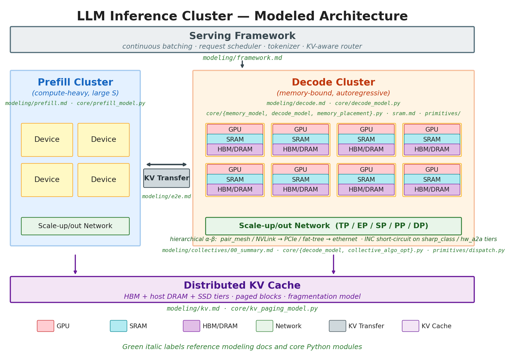
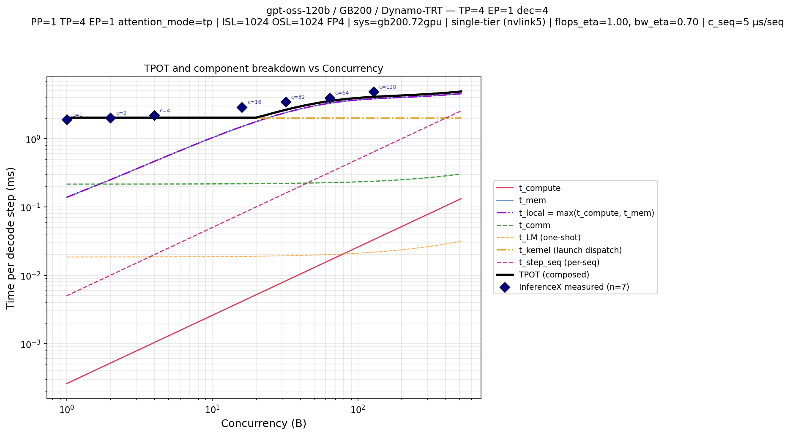
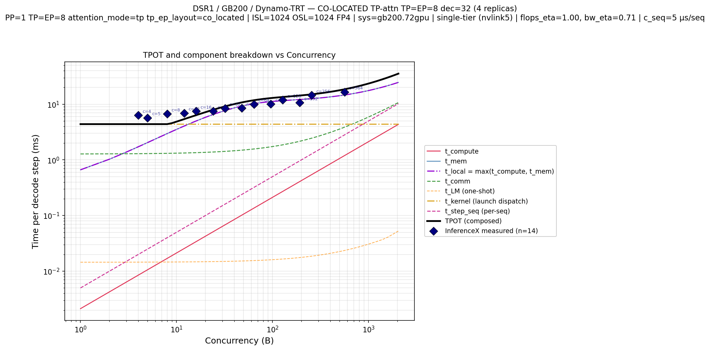
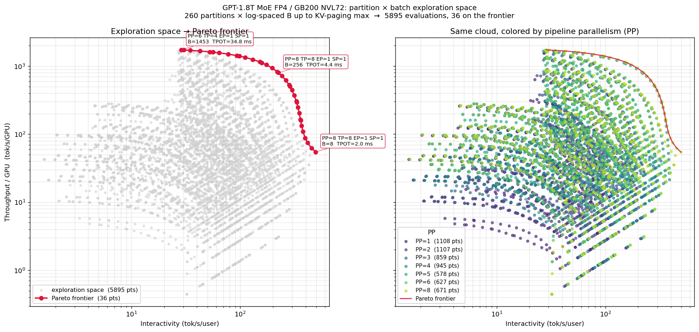

<p align="center">
  
</p>

# FLARE — Fast LLM Analytical Roofline Explorer

FLARE is a lightweight, first-principles analytical framework for large-language-model inference performance modeling. It predicts latency, throughput, and memory footprint of LLM inference on a given cluster *before* you build or rent it — from JSON descriptions of the model, the hardware, the parallelism layout, the workload, and the serving stack.

A five-stage roofline pipeline (memory → FLOPs → traffic → comm → latency) extended with prefill, end-to-end metric assembly, KV paging, chunked prefill, and disaggregated prefill/decode. Composable pure functions over typed dataclasses — no global state.

**Four-pillar composition** (`model × system × partition × framework`), parameterized by a workload point (sequence length, batch size). The split keeps "which deployment shape" (partition) cleanly separated from "which serving stack runs it" (framework), so a single (model, system, partition) can be evaluated under multiple stacks (TRT-LLM, Dynamo+TRT, SGLang, vLLM, …) by swapping just the framework JSON.

This README is a navigation guide; the methodology is published as the [Decode Modeling book](https://spicemonkey.github.io/flare-llm/) (see **Tutorial** below), starting with [decode](https://spicemonkey.github.io/flare-llm/decode.html).

**Tutorial:** [**Decode Modeling**](https://spicemonkey.github.io/flare-llm/) — a walkthrough of the decode-phase derivation (decode + attention + memory hierarchy + 3D-stacked DRAM) and the serving layer above it (KV cache management, framework overhead, SLO feasibility), with a pointer to the upstream collective-communication tutorial.

**API reference:** [`documentation/api/`](documentation/api/) — generated reference for the public `llm_perf` classes and functions (specs, calculators, core models, loaders, utilities).

---

## Cluster Architecture



A disaggregated prefill/decode pipeline with a distributed KV cache. Each device exposes an ordered list of memory tiers, so SRAM-augmented architectures (Groq LPU, d-Matrix Corsair) and conventional HBM-only GPUs share one model. Collective traffic crosses one or more hierarchical fabric tiers; in-network reduction is engaged where the fabric advertises capability and the framework opts in. The KV-transfer interconnect between prefill and decode clusters folds into TTFT in disaggregated mode.

---

## What's Supported

| Layer | Variants | Doc |
|---|---|---|
| **Attention** | MHA, GQA, MQA, MLA (DeepSeek) | [attention](https://spicemonkey.github.io/flare-llm/attention.html) |
| **Memory hierarchy** | single-tier HBM, multi-tier HBM + SRAM, hypothetical 3D-stacked | [sram](https://spicemonkey.github.io/flare-llm/sram.html), [dram3d](https://spicemonkey.github.io/flare-llm/dram3d.html) |
| **Collectives** | ring / tree (DBT) / Rabenseifner / PAT / hierarchical / torus / INC (NVLS, Quantum SHARP, hw_a2a) | [collectives](https://spicemonkey.github.io/flare-llm/collective_comm.html) |
| **Fabric topology** | crossbar (NVSwitch / IB / PCIe), torus (TPU ICI), full mesh, k-D mesh | [collectives](https://spicemonkey.github.io/flare-llm/collective_comm.html) |
| **Parallelism axes** | DP / PP / TP / EP / SP, with orthogonal or co-located TP+EP layout | [decode](https://spicemonkey.github.io/flare-llm/decode.html) |
| **Serving stacks** | 7 calibrated framework JSONs: `default`, `trt`, `dynamo_trt`, `dynamo_sglang`, `dynamo_vllm`, `sglang`, `vllm` | [framework](https://spicemonkey.github.io/flare-llm/framework.html) |
| **KV handoff** | co-located matched, co-located repack, disaggregated transfer | [kv](https://spicemonkey.github.io/flare-llm/kv.html) |
| **SLO feasibility** | floor check, TPOT bound on B, TTFT bound on PP, goodput-optimal partition sweep | [slo](https://spicemonkey.github.io/flare-llm/slo.html) |

---

## Validation — Predicted vs. Measured TPOT

FLARE's decode predictions are cross-validated against measured production-stack Time-Per-Output-Token (TPOT) from the [InferenceX™](https://github.com/SemiAnalysisAI/InferenceX) public benchmark dataset (SemiAnalysis LLC, Apache-2.0; snapshot vendored under [`benchmark/inferenceX/`](benchmark/inferenceX/), fetched 2026-05-09, 4,952 rows across 8 models). Each driver under [`benchmark/validate/`](benchmark/validate/) pins one (model, hardware, framework) cut, sweeps concurrency *B*, and overlays the model's cost-component breakdown on the measured scatter — so the plot shows not just *whether* the prediction lands, but *which primitive* sets the floor at each operating point.

Two per-cut calibration constants are used: *bw_eta* (sustained-to-nameplate HBM bandwidth, a function of chip generation × access pattern) and *c*<sub>seq</sub> (per-sequence host-side serving work, a function of the serving stack). Everything else is first-principles. Each example below is reproducible with the single command shown.

### Small MoE — gpt-oss-120b on GB200



```bash
python benchmark/validate/gpt_oss_120b_gb200_dynamo_trt.py
```

120B MoE at FP4, TP=4 EP=1 on GB200 NVL72 under Dynamo+TRT-LLM, ISL/OSL = 1024/1024. **MAE 13.6% over 7 measured points (B = 1…128).** The interesting feature is the flat left half: through *B* ≈ 16 the deployment is *kernel-dispatch-bound* — the ~1.9 ms *t*<sub>kernel</sub> floor exceeds all GPU work, so TPOT is invariant to batch. Weight traffic only takes over past that, which is exactly where the measured points begin to rise.

### Large MoE — DeepSeek-R1 on GB200 NVL72



```bash
python benchmark/validate/dsr1_gb200_dynamo_trt.py --cut colo_tp_attn
```

671B / 37B-active MoE + MLA at FP4 on GB200 NVL72 under Dynamo+TRT-LLM, in the **co-located TP+EP layout** (TP = EP = 8, TP attention, 4 replicas across 32 GPUs). **MAE 19.6% over 14 measured points spanning B = 4…564** — the widest single-cut coverage in the dataset, crossing the dispatch-bound plateau, the memory-bound ramp, and the expert-collective regime where *t*<sub>comm</sub> becomes material.

Broader coverage lives in `benchmark/validate/coverage_sweep.py`, which runs all 8 InferenceX models across every single-island system and stack (794 rows, 44 model × hardware × framework cells) with no per-cut tuning.

> Benchmark data © 2026 SemiAnalysis LLC, licensed under Apache-2.0. This is an **unofficial** analysis derived from the InferenceX public API — the canonical source is [SemiAnalysisAI/InferenceX](https://github.com/SemiAnalysisAI/InferenceX). See [`benchmark/inferenceX/NOTICE`](benchmark/inferenceX/NOTICE).

---

## Repository Layout

```
.
├── README.md
├── notebooks/         — quickstart + Pareto-frontier case study
├── benchmark/
│   ├── inferenceX/    — vendored InferenceX measurement snapshot
│   └── validate/      — per-cut predicted-vs-measured TPOT drivers
├── documentation/
│   └── api/           — generated API reference
└── llm_perf/
    ├── calculators/   — InferenceCalculator, PrefillCalculator, E2ECalculator
    ├── core/          — memory_model, decode_model, prefill_model + primitives
    │   └── primitives/collective_cost.py   — mirrored from spiceMonkey/collective-comm
    ├── database/      — model / system / tuner / framework JSON specs
    ├── specs/         — typed dataclasses (LlmModelSpec, SystemSpec, …)
    └── io/, utils/    — loaders, equations, HF adapter, DRAM3D helper
```

---

## Quickstart

```bash
python -m venv .llm_perf
source .llm_perf/bin/activate
pip install jupyter matplotlib numpy
jupyter notebook notebooks/quickstart.ipynb
```

### Programmatic usage

```python
from llm_perf import InferenceCalculator, PartitionSpec
from llm_perf.calculators.prefill_calculator import PrefillCalculator
from llm_perf.calculators.e2e_calculator import E2ECalculator
from llm_perf.core.collective_algo_opt import optimize_collective_algorithms
from llm_perf.io import (
    load_model_from_db, load_system_from_db, load_tuner_from_db, load_framework_from_db,
)
from llm_perf.specs.overhead_spec import OverheadSpec
from llm_perf.specs.disagg_spec import DisaggSpec

model     = load_model_from_db("gpt_1_8t_moe")
system    = load_system_from_db("gb200.72gpu")
tuner     = load_tuner_from_db("gpt_1_8t_moe.tuner")
partition = PartitionSpec(PP=8, TP=8, EP=1, SP=1)
framework = load_framework_from_db("dynamo_trt")
tuner.S_input, tuner.S_decode, tuner.B_decode = 8192, 8192, 1

framework = optimize_collective_algorithms(model, partition, system, tuner, framework)

decode   = InferenceCalculator(model, system, partition, tuner, framework).run()
prefill  = PrefillCalculator(model, system, partition, tuner, framework).run()
e2e      = E2ECalculator(
    decode, prefill,
    overhead=OverheadSpec(t_graph_us=100.0),
    disagg=DisaggSpec(),
    model=model, system=system, partition=partition, tuner=tuner,
).run()

print(f"TTFT       = {e2e.TTFT*1e3:.1f} ms")
print(f"TPOT       = {e2e.TPOT*1e3:.2f} ms")
print(f"tok/s/GPU  = {e2e.throughput_per_gpu:.1f}")
```

`framework` is optional — omit for `FrameworkSpec.default()` (pure roofline). Swap framework JSONs to compare stacks on the same (model, system, partition, tuner).

---

## Case Study — `notebooks/pareto_basic.ipynb`



Enumerates every valid `(PP, TP, EP, SP)` partition, sweeps `B` from 1 to the KV-paging max, and extracts the upper-right envelope in (interactivity, throughput/GPU) space. At baseline GB200 NVL72 with `PP_MAX = 8`: 260 valid partitions → 37 frontier points, dominated by `PP=8 TP=8 EP=1 SP=1`. Raise `PP_MAX` to study the unbounded-PP frontier (winners shift toward `PP=32 TP=2`-style shapes).

Workload: GPT-1.8T MoE @ FP4 on GB200 NVL72.

---

## Utilities

- **HuggingFace Adapter** — converts any HF `config.json` (incl. MoE / GQA) into the `llm_perf.model` schema. See [`utils/hf_model_adapter.py`](llm_perf/utils/hf_model_adapter.py).
- **DRAM3D Bandwidth Calculator** — derives HBM bandwidth from die-interface parameters to evaluate future memory classes (HBM3E / HBM4 / HBM4E). See [`utils/dram3d.py`](llm_perf/utils/dram3d.py) and the [3D-stacked DRAM bandwidth](https://spicemonkey.github.io/flare-llm/dram3d.html) chapter.

---

## Contributing

Open issues or PRs for new spec types, adapters, or analytical improvements. Keep JSON schemas backward compatible. Run the quickstart notebook after large changes.

---

## License

MIT — see [LICENSE](LICENSE).
