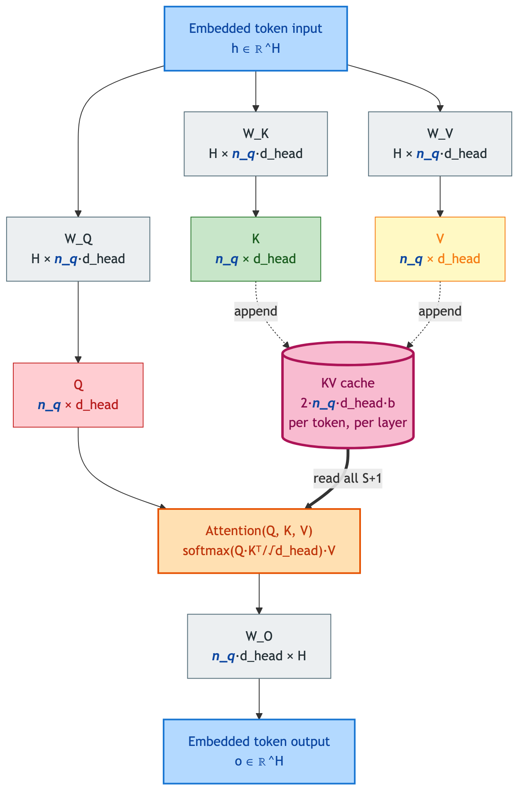
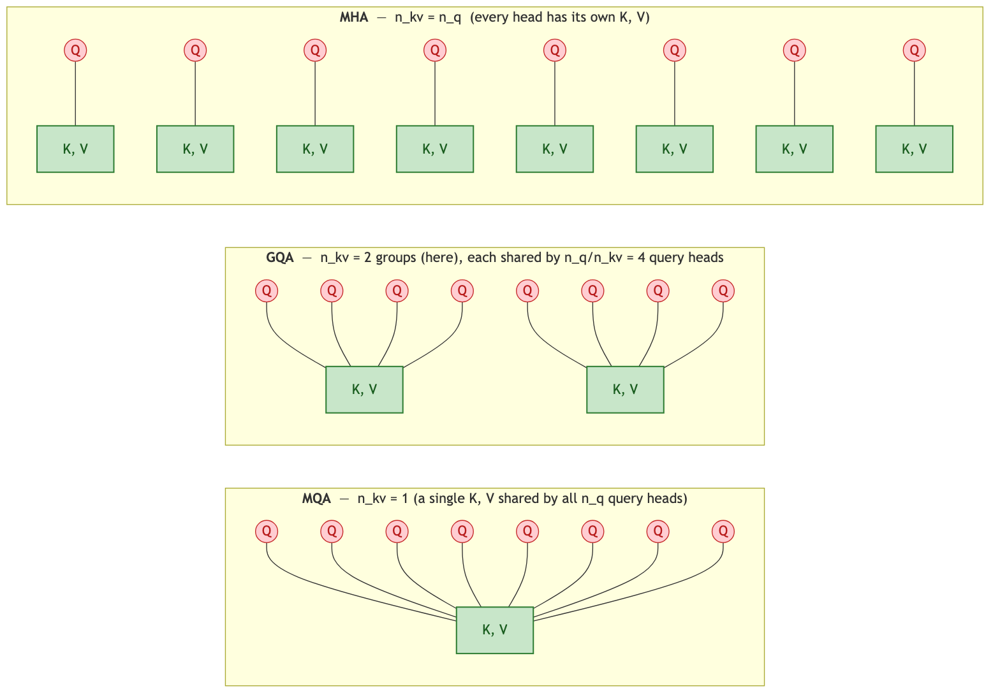
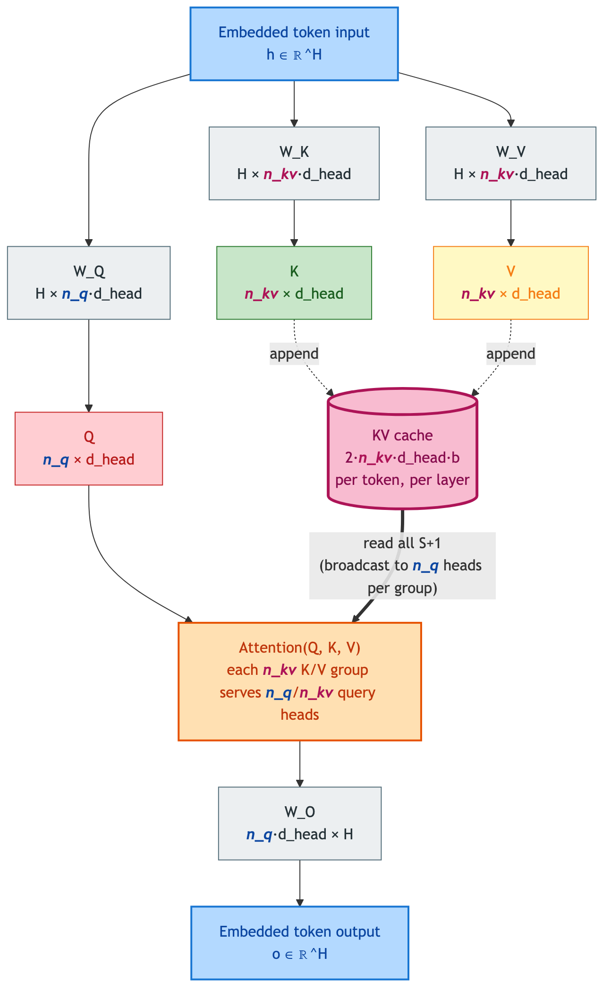
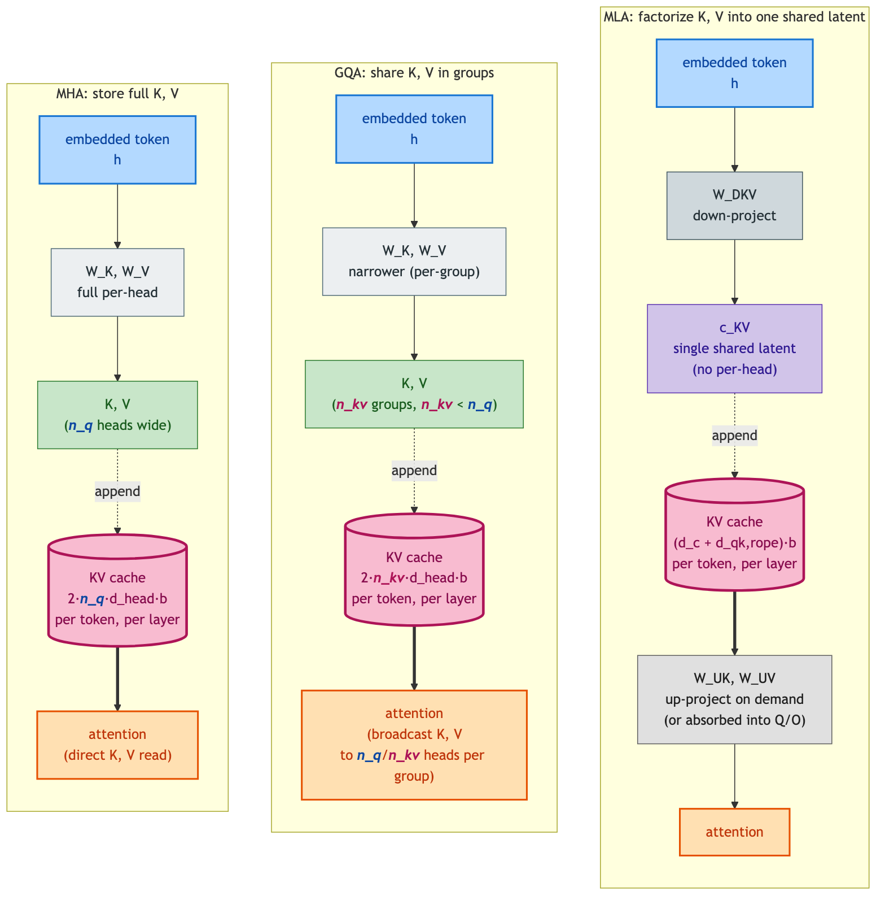
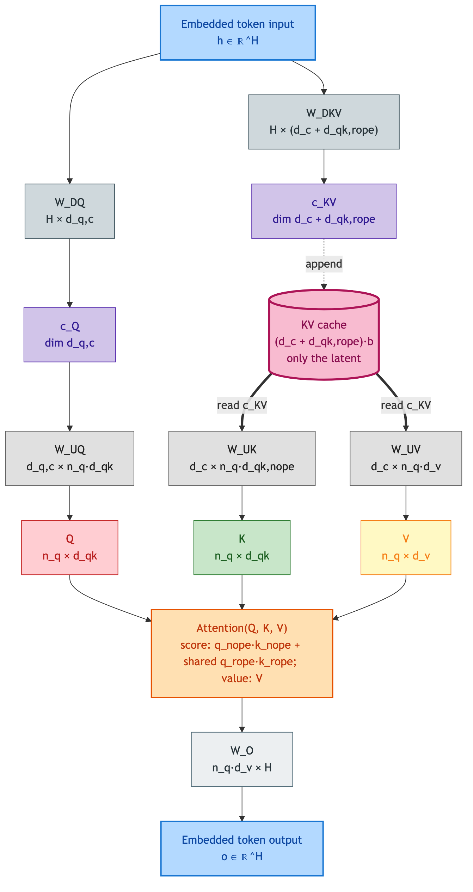
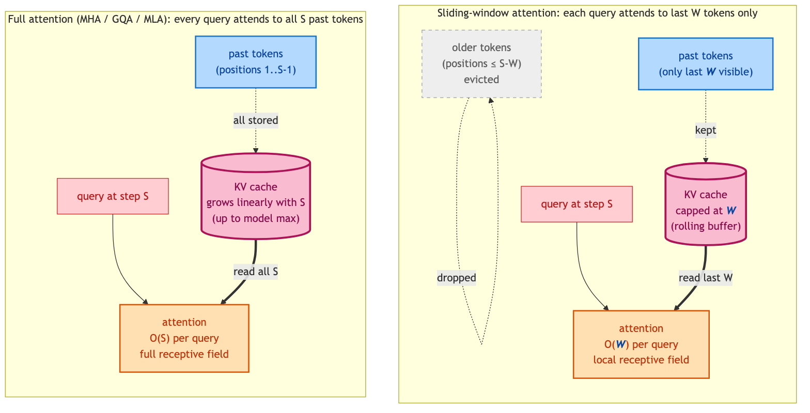
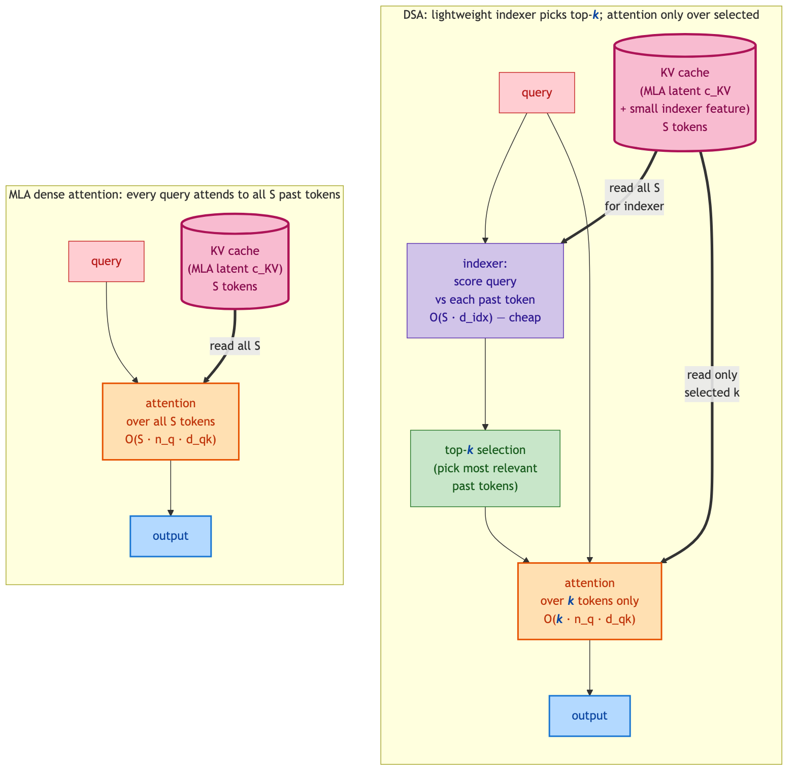
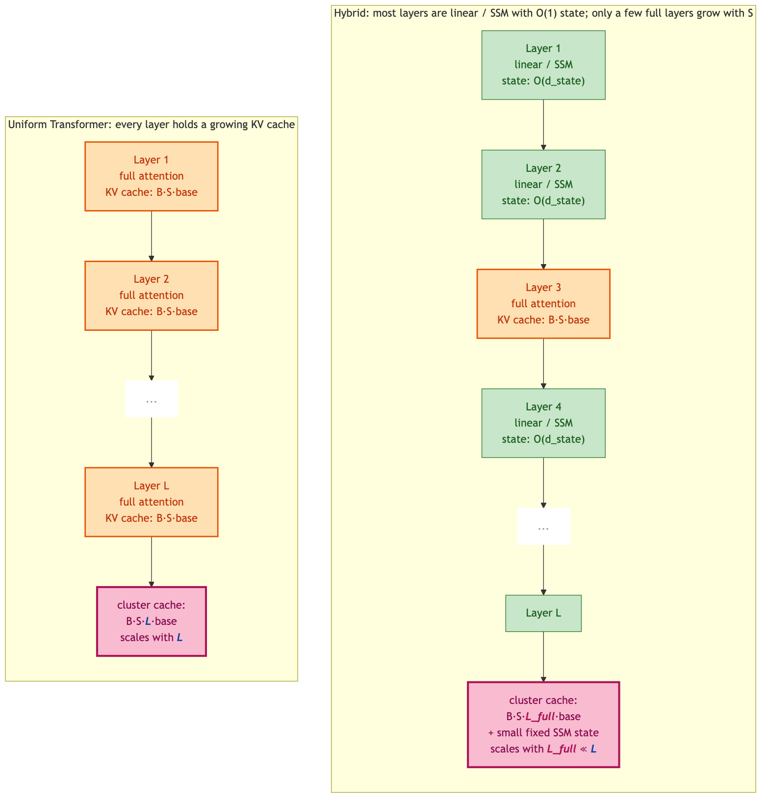

# Attention Variants

**Author:** Yue Lu  
**Date:** May 2026  

This document covers per-token attention architectures used in production large language models — from the original multi-head attention (MHA), through its production-dominant grouped-query attention (GQA) variant, to the more recent multi-head latent attention (MLA), with placeholder sections for sliding-window attention, DeepSeek Sparse Attention (DSA), and hybrid linear / full attention. Each architecture's per-layer parameter count, key-value (KV) cache footprint, per-token floating-point operations (FLOPs), and sharding behavior is given in one self-contained section. The rest of the transformer layer (feed-forward network (FFN), Mixture-of-Experts (MoE), collective communication) is unchanged across variants and lives in `decode.md` / `prefill.md`.

**Scope.** Each section gives (a) an architectural overview, (b) a symbol register, (c) per-layer parameter count, (d) KV cache footprint per token per layer, (e) per-token compute, (f) sharding behavior under tensor parallelism (TP) attention and data parallelism (DP) attention, and (g) a worked example. The decode and prefill cost formulas in `decode.md` / `prefill.md` use MHA / GQA (§1, §2) as the default reference; for each non-MHA/GQA variant they carry inline cross-references to the matching section here.

**Variants in this document:**

- §1 Multi-Head Attention (MHA) — original transformer formulation; LLaMA-1, GPT-3
- §2 Grouped-Query Attention (GQA) — LLaMA-3, Mistral, Qwen-2/3, most modern dense LLMs
- §3 Multi-head Latent Attention (MLA) — DeepSeek-V3 / R1, DeepSeek-V4-Pro, GLM-5, Kimi-K2.5
- §4 Sliding-window attention (SWA) — Mistral 7B, Gemma 2 / 3, GPT-OSS
- §5 DeepSeek Sparse Attention (DSA) — DeepSeek-V3.2-Exp; informs DeepSeek-V4 / GLM-5 generation
- §6 Hybrid linear / full attention — Jamba, Hymba, MiniMax-01

---

## 1. Multi-Head Attention (MHA)

### 1.1 Architectural overview

Multi-head attention is the original transformer attention formulation [VASWANI17]. Each transformer layer projects the embedded token $h \in \mathbb{R}^H$ into $n_q$ independent attention heads, each carrying its own per-head $d_{\mathrm{head}}$-dimensional query, key, and value vector. Per token:

- **Q / K / V projection.** Three weight matrices $W_Q, W_K, W_V \in \mathbb{R}^{H \times n_q d_{\mathrm{head}}}$ project $h$ into per-head queries, keys, and values. By convention $n_q \cdot d_{\mathrm{head}} = H$, so each per-head slice is a $H \times d_{\mathrm{head}}$ block of the larger matrix and the full output is $\mathbb{R}^H$.
- **Per-head attention.** Each head $i$ independently computes $\mathrm{softmax}(q_i K_i^\top / \sqrt{d_{\mathrm{head}}}) \cdot V_i$, where $K_i, V_i$ contain the $S$ past tokens' K and V for that head (read from the KV cache; the current token's K and V are appended first).
- **Output projection.** Per-head outputs are concatenated into a $\mathbb{R}^H$ vector and projected back to the hidden dimension via $W_O \in \mathbb{R}^{n_q d_{\mathrm{head}} \times H}$.

Each head can be intuitively viewed as projecting the hidden state into a different subspace, capturing a different "view" of inter-token correlation; the output projection then mixes these views back into the hidden representation to produce the layer's output $o \in \mathbb{R}^H$.

The KV cache stores K and V for every past token so per-step decode does not have to recompute them. Per token per layer this is $2 \cdot n_q \cdot d_{\mathrm{head}}$ values (one K plus one V across all $n_q$ heads). For modern context lengths and head counts the KV cache dominates the per-rank static memory footprint at large $S$ — the constraint that motivates GQA (§2) and MLA (§3).

### 1.2 Symbol register

MHA uses the standard transformer symbols from `notation.md §3` directly, with no extensions:

| Symbol | Description | Typical LLaMA-1 7B value |
|--------|-------------|-------|
| $H$ | Hidden size | 4096 |
| $n_q$ | Number of query heads | 32 |
| $d_{\mathrm{head}} = H / n_q$ | Per-head dimension | 128 |
| $L$ | Number of transformer layers | 32 |

The convention $n_q \cdot d_{\mathrm{head}} = H$ ties the per-head dimension to the hidden size; the $n_q$ heads partition $H$ exactly. For MHA, $H_{kv} = n_q \cdot d_{\mathrm{head}} = H$, i.e. the KV side has the same total dimension as the Q side.

### 1.3 Per-layer attention parameter count

The MHA per-layer attention parameter count is the sum of the four projection matrices:

$$P_{\mathrm{attn,MHA}} = \underbrace{H \cdot n_q d_{\mathrm{head}}}_{W_Q} + \underbrace{H \cdot n_q d_{\mathrm{head}}}_{W_K} + \underbrace{H \cdot n_q d_{\mathrm{head}}}_{W_V} + \underbrace{n_q d_{\mathrm{head}} \cdot H}_{W_O} = 4 H^2$$

In bytes: multiply by $b$ (bytes per parameter, `notation.md §4`). The simplification $n_q \cdot d_{\mathrm{head}} = H$ collapses the four matrices to $4 H^2$ regardless of how the hidden dimension is split into heads — a useful invariant when reasoning about per-layer attention weight footprint across MHA-class models.

### 1.4 KV cache footprint

The per-token-per-layer building block:

$$M_{\mathrm{KV,MHA}} = 2 \cdot n_q \cdot d_{\mathrm{head}} \cdot b = 2 H \cdot b$$

The factor of 2 accounts for K plus V; the per-head $d_{\mathrm{head}}$ scales with all $n_q$ heads since each head writes its own K and V to the cache; $b$ is bytes per parameter (`notation.md §4`). For LLaMA-1 7B at FP16 ($H = 4096$, $b = 2$), this is $16{,}384$ bytes per token per layer.

The cluster-total KV residency is built from this base by three independent multiplicative factors, one per "axis" of the workload:

$$M_{\mathrm{KV,MHA}}^{\mathrm{cluster}} = \underbrace{B}_{\text{users}} \cdot \underbrace{S}_{\text{tokens per user}} \cdot \underbrace{L}_{\text{layers}} \cdot M_{\mathrm{KV,MHA}} = 2 \cdot B \cdot S \cdot L \cdot n_q \cdot d_{\mathrm{head}} \cdot b$$

where $B$ is the number of concurrent user sequences served (`notation.md §4`), $S$ is the per-user context length, and $L$ is the layer count. Each user owns a private KV state — there is no cross-user sharing of K or V at the architectural level — so the $B$ factor is genuine multiplicative replication of the entire per-user KV footprint, not a batched re-use of one shared cache. For heterogeneous batches at varying per-user context lengths $S_i$, replace $B \cdot S$ with $\sum_{i=1}^{B} S_i$.

Concrete cluster-wide values for LLaMA-1 7B at FP16, $L = 32$:

- One user, $S = 2{,}048$: $\sim 1.07$ GB.
- $B = 16$ users at $S = 2{,}048$: $\sim 17$ GB.
- $B = 64$ users at $S = 8{,}192$: $\sim 275$ GB — already exceeds a single H100's 80 GB HBM.

This linear-in-$B \cdot S$ growth is the headline scaling problem of MHA at modern context lengths and batch sizes, and the direct motivation for GQA (§2) — sharing K and V across multiple query heads — and the more aggressive compression in MLA (§3).

### 1.5 Sharding under TP-attention / DP-attention

The cluster-total KV cache from §1.4 is partitioned across the $G_{TP}$ tensor-parallel ranks one of two ways: by head (TP-attention) or by user (DP-attention). The two modes hold the same total content but place it differently — and consequently scale differently with $B$ and $S$ on a single rank.

**TP-attention (head-sharded).** Each rank owns $n_q / G_{TP}$ heads, but holds those heads' K and V for *all $B$ users*:

- $W_Q$, $W_K$, $W_V$ are head-sharded — each rank gets $n_q / G_{TP}$ heads' worth of these weights.
- $W_O$ is input-dimension-sharded along the $n_q d_{\mathrm{head}}$ axis (one slice per rank, matching its head subset). A final all-reduce sums each rank's partial output to produce the layer's $\mathbb{R}^H$ output.

Per-rank attention parameter footprint:

$$P_{\mathrm{attn,device}}^{\mathrm{TP}} = \frac{4 H^2}{G_{TP}}$$

Per-rank KV cache footprint, for one pipeline stage of $L / PP$ layers (the $PP$ factor and outer composition follow `decode.md §1.4` and `decode.md §2.3`):

$$M_{\mathrm{KV,device}}^{\mathrm{TP}} = B \cdot S \cdot \frac{L}{PP} \cdot 2 \cdot \frac{n_q}{G_{TP}} \cdot d_{\mathrm{head}} \cdot b$$

The $B$ factor is replicated — every TP rank holds every user's KV state for its assigned head subset. Only the head dimension is divided by $G_{TP}$.

**DP-attention (batch-sharded).** All MHA weights are replicated on every rank ($D_{\mathrm{attn}} = 1$ per `notation.md §1`), and the batch is split across the $G_{TP}$ attention DP groups so each rank serves $B / G_{TP}$ users with full $n_q$ heads:

$$P_{\mathrm{attn,device}}^{\mathrm{DP}} = 4 H^2 \quad \text{(replicated)}$$

$$M_{\mathrm{KV,device}}^{\mathrm{DP}} = \frac{B}{G_{TP}} \cdot S \cdot \frac{L}{PP} \cdot 2 \cdot n_q \cdot d_{\mathrm{head}} \cdot b$$

Both modes hold the same cluster-total KV footprint ($G_{TP} \cdot PP \cdot M_{\mathrm{KV,device}} = M_{\mathrm{KV,MHA}}^{\mathrm{cluster}}$) — TP-attention partitions the head dimension and replicates users; DP-attention partitions users and replicates heads. The choice trades attention-parameter savings (TP-attention divides $4 H^2$ across ranks; DP-attention does not) against attention-collective overhead (TP-attention requires a per-step all-reduce across head shards; DP-attention does not) and KV-cache placement constraints (DP-attention concentrates each user's KV on one rank, simplifying paged-attention bookkeeping at the cost of weaker batch-balancing flexibility).

### 1.6 Attention compute

Per-layer MHA FLOPs for one user, one new token, and $S$ past tokens in the user's KV cache:

$$F_{\mathrm{attn,MHA}}(S) = \underbrace{6 H^2}_{W_Q, W_K, W_V \text{ projections}} + \underbrace{2 S \cdot n_q \cdot d_{\mathrm{head}}}_{Q \cdot K^\top} + \underbrace{2 S \cdot n_q \cdot d_{\mathrm{head}}}_{\mathrm{softmax} \cdot V} + \underbrace{2 H^2}_{W_O} = 8 H^2 + 4 S H$$

The first and last terms are $S$-independent (per-token projection cost); the middle two scale linearly with $S$ (per-past-token attention cost). For typical decode workloads, the projection terms dominate at small $S$ and the score / value terms cross over at $S \sim 2 H$.

Per decode step the cluster processes $B$ new tokens — one per user — across all $L$ layers. Total per-step attention FLOPs:

$$F_{\mathrm{attn,MHA}}^{\mathrm{step}}(B, S) = B \cdot L \cdot F_{\mathrm{attn,MHA}}(S)$$

The two halves of $F_{\mathrm{attn,MHA}}(S)$ batch across users *differently* — a distinction that drives whether attention is weight-bound or compute-bound at a given $B$:

- **Projection terms** ($W_Q, W_K, W_V, W_O$). The same weights apply to every user, so the $B$ users' projections fuse into a single $B \times H$ GEMM per layer per matrix. Weight traffic is paid once and amortized across all $B$ tokens — weight-bound at small $B$, compute-bound at large $B$.
- **Score / value terms** ($Q K^\top$, $\mathrm{softmax} \cdot V$). The K and V each user reads come from that user's private KV cache, so these stay as $B$ independent attention computations — no cross-user fusion. The $B \cdot 4 S H$ contribution is genuine work, not amortized GEMM cost.

For heterogeneous batches with varying per-user $S_i$, replace the score / value contribution with $\sum_{i=1}^{B} 4 S_i H$ rather than $4 \cdot B \cdot S \cdot H$.

For prefill, where $S_{\mathrm{input}}$ tokens enter the cache simultaneously per user, the per-token projection cost is amortized into a single GEMM across all $B \cdot S_{\mathrm{input}}$ tokens in the prefill batch; the score / value terms become $S_{\mathrm{input}}^2$-scaling per user per layer (full causal attention matrix per user). See `prefill.md §1.1` for the prefill aggregate form.

### 1.7 Worked example — LLaMA-1 65B

LLaMA-1 65B architecture: $H = 8192$, $n_q = 64$, $d_{\mathrm{head}} = 128$, $L = 80$. Total reported weight footprint: 65.2 B parameters. LLaMA-1 65B is the largest production-shipped MHA model in the LLaMA series; its near-shape successor LLaMA-3 70B (§2.7) inherits the same attention dimensions but switches to GQA with $n_{kv} = 8$, making the §1.7 / §2.7 pair a near-controlled comparison of MHA vs GQA at the same scale.

Per-layer attention parameter count:

| Matrix | Term | Value |
|--------|------|------:|
| $W_Q$ | $H \cdot n_q d_{\mathrm{head}}$ | 67.1 M |
| $W_K$ | $H \cdot n_q d_{\mathrm{head}}$ | 67.1 M |
| $W_V$ | $H \cdot n_q d_{\mathrm{head}}$ | 67.1 M |
| $W_O$ | $n_q d_{\mathrm{head}} \cdot H$ | 67.1 M |
| **Total** | $4 H^2$ | **268.4 M** |

Across all 80 layers: total attention parameters = 21.5 B, about 33 % of LLaMA-1 65B's total weight footprint. KV cache per token per layer at FP16: $2 \cdot 64 \cdot 128 \cdot 2 = 32{,}768$ bytes — exactly $8\times$ larger than the LLaMA-3 70B GQA value ($4{,}096$ bytes / token / layer; see §2.7).

Cluster-wide KV residency at FP16, $L = 80$:

- One user, $S = 8{,}192$: $\sim 21.5$ GB.
- $B = 64$ users at $S = 8{,}192$: $\sim 1.4$ TB.
- $B = 64$ users at $S = 32{,}768$: $\sim 5.5$ TB.

The single-user 8K case alone exceeds a single H100's 80 GB HBM; the batched cases require multi-node deployments to hold the KV state. For long-context decode the gap with GQA widens further: at $S = 128$K, a single MHA sequence at FP16 is $\sim 344$ GB versus $\sim 43$ GB under GQA at $n_{kv} = 8$. The operational pressure of these numbers is what drove the industry to GQA for nearly all 70B-class production models from LLaMA-2 onward.

---

## 2. Grouped-Query Attention (GQA)

### 2.1 Architectural overview

Grouped-query attention generalizes MHA by sharing K and V across groups of query heads [GQA]. The $n_q$ query heads are partitioned into $n_{kv}$ shared K/V groups; each group's K and V serves $n_q / n_{kv}$ query heads. When $n_{kv} = n_q$, GQA reduces to MHA; when $n_{kv} = 1$, it reduces to multi-query attention (MQA). Production LLMs typically pick $n_{kv}$ in the range 4–16 to balance KV cache savings (~$n_q / n_{kv}\times$ reduction) against quality loss.

The figure below visualizes the head-sharing pattern across the spectrum, using $n_q = 8$ as a concrete example. **MHA** (top) gives every query head its own dedicated K, V — eight Q heads, eight K/V heads, no sharing. **GQA** (middle, with $n_{kv} = 2$ groups) groups the eight query heads into two clusters of four, each cluster sharing one K, V — the 1-to-1 mapping of MHA collapses to a 4-to-1 fan-in per group. **MQA** (bottom) takes this to the limit with a single K, V shared by all $n_q$ query heads — an 8-to-1 fan-in. The visual fan-in pattern is what GQA / MQA buy at the cost of representational diversity: the K/V cache and projection matrices shrink by the same factor as the fan-in. The 3-panel comparison style follows [GQA] Fig. 1, also reproduced as Fig. 3 in [LI-MLA].

Per token:

- **Q projection.** $W_Q \in \mathbb{R}^{H \times n_q d_{\mathrm{head}}}$ is unchanged from MHA — the query side still has $n_q$ independent heads.
- **K, V projection.** $W_K, W_V \in \mathbb{R}^{H \times n_{kv} d_{\mathrm{head}}}$ — the K and V side has only $n_{kv}$ heads, so these matrices are $n_q / n_{kv}\times$ smaller than MHA's $W_K, W_V$.
- **Per-head attention.** Each query head attends to its assigned K/V group; the K and V are shared (broadcast) across the $n_q / n_{kv}$ query heads in the group. Per-head $\mathrm{softmax}$ and value-weighted-sum are unchanged structurally.
- **Output projection.** $W_O \in \mathbb{R}^{n_q d_{\mathrm{head}} \times H}$ is unchanged from MHA — per-head outputs are still concatenated to a $\mathbb{R}^H$ vector before projection.

The asymmetry — full $n_q$ heads on the Q side, shared $n_{kv}$ groups on the K/V side — is the key efficiency trade-off. Q-side compute and parameter count are unchanged from MHA, but KV cache footprint and KV projection cost shrink by the $n_q / n_{kv}$ factor. This is the defining property of GQA: cheaper KV cache, same attention compute.

### 2.2 Symbol register

GQA adds one symbol — $n_{kv}$ — to the standard MHA register from `notation.md §3`:

| Symbol | Description | Typical LLaMA-3 70B value |
|--------|-------------|-------|
| $H$ | Hidden size | 8192 |
| $n_q$ | Number of query heads | 64 |
| $n_{kv}$ | Number of K/V groups | 8 |
| $d_{\mathrm{head}} = H / n_q$ | Per-head dimension | 128 |
| $H_{kv} = n_{kv} \cdot d_{\mathrm{head}}$ | Total K/V projection dimension | 1024 |
| $L$ | Number of transformer layers | 80 |

The convention $n_q \cdot d_{\mathrm{head}} = H$ from MHA is preserved on the Q side. The K/V side has its own total dimension $H_{kv} = n_{kv} \cdot d_{\mathrm{head}}$, generally much smaller than $H$. The compression ratio $n_q / n_{kv}$ governs both the KV cache savings and the K/V projection parameter savings.

### 2.3 Per-layer attention parameter count

The GQA per-layer attention parameter count is:

$$P_{\mathrm{attn,GQA}} = \underbrace{H \cdot n_q d_{\mathrm{head}}}_{W_Q} + \underbrace{H \cdot n_{kv} d_{\mathrm{head}}}_{W_K} + \underbrace{H \cdot n_{kv} d_{\mathrm{head}}}_{W_V} + \underbrace{n_q d_{\mathrm{head}} \cdot H}_{W_O} = 2 H^2 + 2 H \cdot H_{kv}$$

In bytes: multiply by $b$. For $n_{kv} = n_q$ (MHA limit), $H_{kv} = H$ and this reduces to $4 H^2$. For typical production GQA at $n_{kv} = 8$, $n_q = 64$: the K and V matrices are 8× smaller than the MHA equivalent, but $W_Q$ and $W_O$ are unchanged. GQA saves on K/V projection parameters only — the Q and O sides are full-sized.

### 2.4 KV cache footprint

The per-token-per-layer building block:

$$M_{\mathrm{KV,GQA}} = 2 \cdot n_{kv} \cdot d_{\mathrm{head}} \cdot b = 2 H_{kv} \cdot b$$

The factor of $n_q / n_{kv}$ savings vs MHA is the headline efficiency gain — for $n_q = 64$, $n_{kv} = 8$ this is 8× smaller than MHA at the same $H$ and $n_q$. For LLaMA-3 70B at FP16 ($H_{kv} = 1024$, $b = 2$), this is 4096 bytes per token per layer.

The cluster-total KV residency follows the same $B \cdot S \cdot L$ build-up as MHA in §1.4 — only the per-token-per-layer base shrinks:

$$M_{\mathrm{KV,GQA}}^{\mathrm{cluster}} = B \cdot S \cdot L \cdot M_{\mathrm{KV,GQA}} = 2 \cdot B \cdot S \cdot L \cdot n_{kv} \cdot d_{\mathrm{head}} \cdot b$$

with $B$ = concurrent users, $S$ = per-user context length (`notation.md §4`), and each user's KV remaining private (the $n_q / n_{kv}$ broadcast happens *within* a user, not across users). Concrete values for LLaMA-3 70B at FP16, $L = 80$:

- One user, $S = 8{,}192$: $\sim 2.7$ GB.
- $B = 64$ users at $S = 8{,}192$: $\sim 172$ GB.
- $B = 64$ users at $S = 32{,}768$: $\sim 687$ GB.

The same $B = 64$, $S = 8{,}192$ workload under MHA (collapsing $n_{kv} = n_q = 64$) would be $8\times$ larger, $\sim 1.4$ TB cluster-wide. The GQA savings make multi-user long-context decode tractable on a single accelerator footprint — the operational reason GQA dominated post-2024 production deployments.

### 2.5 Sharding under TP-attention / DP-attention

The cluster-total KV cache from §2.4 partitions across the $G_{TP}$ tensor-parallel ranks the same two ways as MHA — by head (TP-attention) or by user (DP-attention) — but with a GQA-specific wrinkle: the K/V side has only $n_{kv}$ groups, so once $G_{TP}$ exceeds $n_{kv}$ the K/V weights and KV cache stop scaling down and become a per-rank floor.

**TP-attention (head-sharded).**

- $W_Q$ is head-sharded across $n_q / G_{TP}$ heads per rank.
- $W_K$ and $W_V$ are head-sharded across $n_{kv} / G_{TP}$ groups per rank when $G_{TP} \le n_{kv}$. When $G_{TP} > n_{kv}$ (common in large-TP deployments), $W_K$ and $W_V$ are replicated across the $G_{TP} / n_{kv}$ ranks within each K/V group — every rank in the group holds the full $W_K, W_V$ for the group's heads.
- $W_O$ is input-dimension-sharded along the $n_q d_{\mathrm{head}}$ axis (one slice per rank). A final all-reduce sums partial outputs to produce $\mathbb{R}^H$.
- KV cache is head-sharded into $\min(G_{TP}, n_{kv})$ pieces; each rank holds its piece for *all $B$ users*.

Per-rank attention parameter footprint (depends on the relative ordering of $G_{TP}$ and $n_{kv}$):

$$P_{\mathrm{attn,device}}^{\mathrm{TP}} = \begin{cases} \dfrac{2 H^2 + 2 H \cdot H_{kv}}{G_{TP}} & G_{TP} \le n_{kv} \\[6pt] \dfrac{2 H^2}{G_{TP}} + \dfrac{2 H \cdot H_{kv}}{n_{kv}} & G_{TP} > n_{kv} \end{cases}$$

The second case captures the practical floor on KV-side sharding: once $G_{TP}$ exceeds $n_{kv}$, $W_K$ and $W_V$ stop scaling down and become a per-rank constant cost.

Per-rank KV cache footprint, for one pipeline stage of $L / PP$ layers:

$$M_{\mathrm{KV,device}}^{\mathrm{TP}} = B \cdot S \cdot \frac{L}{PP} \cdot 2 \cdot \frac{n_{kv}}{\min(G_{TP}, n_{kv})} \cdot d_{\mathrm{head}} \cdot b$$

When $G_{TP} \le n_{kv}$ the divisor is $G_{TP}$ and per-rank KV scales as $1 / G_{TP}$ (clean head-sharding). When $G_{TP} > n_{kv}$ the divisor saturates at $n_{kv}$ and per-rank KV stops shrinking — the same $n_{kv}$ floor that affects $W_K, W_V$ also affects the KV cache. The $B$ factor is replicated across all $G_{TP}$ ranks in either regime. This is the main reason production deployments cap $G_{TP}$ at or near $n_{kv}$ for TP-attention GQA models.

**DP-attention (batch-sharded).** All GQA weights are replicated on every rank ($D_{\mathrm{attn}} = 1$ per `notation.md §1`), and the batch is split across the $G_{TP}$ attention DP groups so each rank serves $B / G_{TP}$ users with full $n_q$ heads:

$$P_{\mathrm{attn,device}}^{\mathrm{DP}} = 2 H^2 + 2 H \cdot H_{kv} \quad \text{(replicated)}$$

$$M_{\mathrm{KV,device}}^{\mathrm{DP}} = \frac{B}{G_{TP}} \cdot S \cdot \frac{L}{PP} \cdot 2 \cdot n_{kv} \cdot d_{\mathrm{head}} \cdot b$$

DP-attention sidesteps the $n_{kv}$ floor entirely — per-rank KV scales as $1 / G_{TP}$ for any $G_{TP}$, since the partition is on the user dimension, not the head dimension. This is one of the operational reasons large-$G_{TP}$ GQA deployments (e.g., LLaMA-3 70B at $G_{TP} = 16$ on an $n_{kv} = 8$ model) prefer DP-attention.

### 2.6 Attention compute

Per-layer GQA FLOPs for one user, one new token, $S$ past tokens:

$$F_{\mathrm{attn,GQA}}(S) = \underbrace{2 H^2}_{W_Q} + \underbrace{4 H \cdot H_{kv}}_{W_K, W_V} + \underbrace{2 S \cdot n_q \cdot d_{\mathrm{head}}}_{Q \cdot K^\top} + \underbrace{2 S \cdot n_q \cdot d_{\mathrm{head}}}_{\mathrm{softmax} \cdot V} + \underbrace{2 H^2}_{W_O} = 4 H^2 + 4 H H_{kv} + 4 S H$$

The Q · K⊤ and softmax · V terms scale with $n_q$ (not $n_{kv}$) — every query head independently computes its attention scores, with the shared K and V broadcast across the group. KV cache memory shrinks $n_q / n_{kv}\times$ vs MHA, but attention FLOPs do not. This is the cheaper-memory-same-compute property of GQA: exactly what makes it operationally attractive for long-context, memory-bound decode workloads.

Per decode step the cluster processes $B$ new tokens (one per user) across $L$ layers; total per-step attention FLOPs:

$$F_{\mathrm{attn,GQA}}^{\mathrm{step}}(B, S) = B \cdot L \cdot F_{\mathrm{attn,GQA}}(S)$$

Same batching pattern as MHA (§1.6): the projection terms ($W_Q, W_K, W_V, W_O$) fuse across users into a single $B \times H$ GEMM per layer per matrix — same weights, $B$ different inputs, weight-bound at small $B$ and compute-bound at large $B$. The score / value terms remain $B$ independent per-user attention computations because each user reads only its own KV state — no cross-user broadcast. For heterogeneous batches with varying $S_i$, replace the score / value contribution by $\sum_{i=1}^{B} 4 S_i H$.

For prefill, the analogous form has $S_{\mathrm{input}}^2$-scaling on the score / value terms; see `prefill.md §1.1`.

### 2.7 Worked example — LLaMA-3 70B

LLaMA-3 70B architecture: $H = 8192$, $n_q = 64$, $n_{kv} = 8$, $d_{\mathrm{head}} = 128$, $H_{kv} = 1024$, $L = 80$. Total reported weight footprint: 70.6 B parameters.

Per-layer attention parameter count:

| Matrix | Term | Value |
|--------|------|------:|
| $W_Q$ | $H \cdot n_q d_{\mathrm{head}}$ | 67.1 M |
| $W_K$ | $H \cdot n_{kv} d_{\mathrm{head}}$ | 8.4 M |
| $W_V$ | $H \cdot n_{kv} d_{\mathrm{head}}$ | 8.4 M |
| $W_O$ | $n_q d_{\mathrm{head}} \cdot H$ | 67.1 M |
| **Total** | $2 H^2 + 2 H H_{kv}$ | **151.0 M** |

Across all 80 layers: total attention parameters = 12.1 B, about 17 % of LLaMA-3 70B's total weight footprint (vs ~33 % for MHA at the same $H$ and $n_q$ — see §1.7's LLaMA-1 65B; the GQA savings reduce attention's share of the weight budget by nearly half). KV cache per token per layer at FP16: $2 \cdot 1024 \cdot 2 = 4096$ bytes. For an 8192-token sequence: $8192 \cdot 80 \cdot 4096 / 10^9 \approx 2.7$ GB.

The headline number for GQA at this scale: ~8× smaller KV cache than the MHA equivalent at the same $H$ and $n_q$ ($\sim 21.5$ GB for the same single-user 8K sequence — exactly the LLaMA-1 65B figure from §1.7). This compression makes long-context decode tractable on a single accelerator (e.g., H100 80 GB) for batch sizes that would not fit under MHA. The corresponding attention-weight savings (~117 M per layer, or ~9.4 B across 80 layers — see the §1.7 vs §2.7 attention-param tables) are a secondary benefit; the KV-cache shrinkage is what made GQA the dominant production attention architecture by 2024.

---

## 3. Multi-head Latent Attention (MLA)

The progression MHA (§1) → GQA (§2) → MLA can be read as three answers to one question: how much of the per-token K and V state actually needs to live in HBM?

- **MHA** stores everything: one K and one V per query head, per token, per layer.
- **GQA** observes that adjacent query heads can share K and V in groups, shrinking the cache by the factor $n_q / n_{kv}$.
- **MLA** goes one step further and observes that K and V are themselves *low-rank* — both can be reconstructed from a single shared latent $c_{KV}$ via per-head up-projections $W_{UK}, W_{UV}$. The cache holds only the latent; per-head K, V are recomputed at attention time, or in absorbed mode (§3.5) never explicitly materialized at all.

At DSv3 dimensions and FP4, this collapses the per-token-per-layer cache from ~7168 bytes (full MHA) or ~448 bytes (typical GQA at $n_{kv} = 8$) to ~288 bytes under MLA — a ~25× reduction vs MHA, ~1.5× vs GQA. The trade-off MLA accepts in exchange is more attention-side compute (the per-step latent-to-K/V reconstruction, or its absorbed-mode equivalent in latent space) and more attention parameters (the down/up projection pair adds capacity vs GQA's straight projection); §3.7 and §3.8 quantify both.

The figure below sketches the three approaches side by side. The rest of §3 develops the MLA case in detail.

### 3.1 Architectural overview

MLA replaces the standard per-head Q / K / V projections with two compressed paths: a query latent and a jointly-compressed KV latent [DSV3]. Per token:

- **Query path.** The hidden state $h \in \mathbb{R}^H$ is first down-projected to a query latent $c_Q \in \mathbb{R}^{d_{q,c}}$ via $W_{DQ}$, then up-projected to per-head queries via $W_{UQ}$. Each per-head query has two parts: a non-positional component $q_i^{\mathrm{nope}} \in \mathbb{R}^{d_{qk,\mathrm{nope}}}$ and a rotary-position-embedded (RoPE) component $q_i^{\mathrm{rope}} \in \mathbb{R}^{d_{qk,\mathrm{rope}}}$.
- **KV path.** The hidden state is jointly down-projected to a KV latent $c_{KV} \in \mathbb{R}^{d_c + d_{qk,\mathrm{rope}}}$ via $W_{DKV}$. The first $d_c$ dimensions form a head-shared K / V latent; the trailing $d_{qk,\mathrm{rope}}$ dimensions form the RoPE-positional K, also shared across all heads.
- **Per-head reconstruction.** Non-positional keys $k_i^{\mathrm{nope}}$ are reconstructed on demand as $W_{UK,i} \cdot c_{KV}[:d_c]$; per-head values $v_i$ as $W_{UV,i} \cdot c_{KV}[:d_c]$. The RoPE part is shared, not per-head.
- **Attention.** Computed per head against $(k_i^{\mathrm{nope}}, c_{KV}[d_c:])$ and $v_i$, then per-head outputs are projected back to the hidden dimension via $W_O$.

The compression has two benefits relative to standard MHA. First, the KV cache stores only the latent $c_{KV}$ — $(d_c + d_{qk,\mathrm{rope}})$ per token per layer — instead of the full per-head K and V at $2 \cdot n_q \cdot d_{qk}$ bytes per token per layer. Second, the per-step latent space is compact enough that attention can run entirely in the $d_c$-dimensional space without materializing the full per-head K and V each step (see §3.5 absorbed mode).

### 3.2 Symbol register

| Symbol | Description | Typical DSv3 value |
|--------|-------------|-------|
| $H$ | Hidden size | 7168 |
| $n_q$ | Number of attention heads (same as `notation.md §3`) | 128 |
| $d_c$ | KV latent dimension (head-shared) | 512 |
| $d_{q,c}$ | Query latent dimension | 1536 |
| $d_{qk,\mathrm{nope}}$ | Non-positional Q / K head dimension | 128 |
| $d_{qk,\mathrm{rope}}$ | RoPE-positional Q / K head dimension (head-shared on K side) | 64 |
| $d_v$ | Value head dimension | 128 |
| $L$ | Number of transformer layers | 61 |

Composite shorthand: $d_{qk} = d_{qk,\mathrm{nope}} + d_{qk,\mathrm{rope}}$ — total per-head Q / K dimension on the query side.

The MHA / GQA symbols $H$, $H_{kv} = n_{kv} \cdot d_{\mathrm{head}}$, $d_{\mathrm{head}} = H / n_q$ from §1.2 / §2.2 and `notation.md §3` are not used in MLA accounting; the relationship $H = n_q \cdot d_{\mathrm{head}}$ does not constrain MLA dimensions, which are independent design choices.

### 3.3 Per-layer attention parameter count

The GQA per-layer attention parameter count from §2.3 (which reduces to MHA's $4 H^2$ at $n_{kv} = n_q$):

$$P_{\mathrm{attn,GQA}} = 2 H^2 + 2 H \cdot H_{kv}$$

The MLA per-layer attention parameter count is the sum of the six weight matrices:

$$P_{\mathrm{attn,MLA}} = \underbrace{H \cdot d_{q,c}}_{W_{DQ}} + \underbrace{d_{q,c} \cdot n_q \cdot d_{qk}}_{W_{UQ}} + \underbrace{H \cdot (d_c + d_{qk,\mathrm{rope}})}_{W_{DKV}} + \underbrace{n_q \cdot d_c \cdot d_{qk,\mathrm{nope}}}_{W_{UK}} + \underbrace{n_q \cdot d_c \cdot d_v}_{W_{UV}} + \underbrace{n_q \cdot d_v \cdot H}_{W_O}$$

In bytes: multiply by $b$ (bytes per parameter, `notation.md §4`).

The two large terms for typical deployments are $W_{UQ}$ (scales with $n_q \cdot d_{qk}$ on the inside dimension) and $W_O$ (scales with $n_q \cdot d_v \cdot H$). The four smaller terms ($W_{DQ}$, $W_{DKV}$, $W_{UK}$, $W_{UV}$) are roughly an order of magnitude smaller in DSv3-class configurations; see the worked example in §3.8.

### 3.4 KV cache footprint

The MLA per-token-per-layer base stores only the joint latent — not per-head K and V:

$$M_{\mathrm{KV,MLA}} = (d_c + d_{qk,\mathrm{rope}}) \cdot b$$

The cluster-total KV residency follows the same $B \cdot S \cdot L$ build-up as MHA in §1.4 and GQA in §2.4 — only the per-token-per-layer base changes:

$$M_{\mathrm{KV,MLA}}^{\mathrm{cluster}} = B \cdot S \cdot L \cdot M_{\mathrm{KV,MLA}} = B \cdot S \cdot L \cdot (d_c + d_{qk,\mathrm{rope}}) \cdot b$$

with $B$ = concurrent users and $S$ = per-user context length (`notation.md §4`). Each user keeps its own latent KV state — the head sharing is *within* a user (all $n_q$ heads of one user read the same latent), not across users — so the $B$ factor remains genuine multiplicative replication of the per-user latent footprint. The $B \cdot S \cdot L$ outer multiplier is identical across MHA / GQA / MLA; the variant choice changes only the per-token-per-layer base.

Numerical comparison on equivalent models. A worked DSv3 comparison: MLA stores $(512 + 64) \cdot 0.5 = 288$ bytes per token per layer at FP4 (`notation.md §4`); equivalent dense MHA at $H_{kv} = H = 7168$ would store $2 \cdot 7168 \cdot 0.5 = 7168$ bytes per token per layer — about 25× larger; a typical production GQA at $n_{kv} = 8$ would store $2 \cdot 8 \cdot 56 \cdot 0.5 = 448$ bytes — about 1.5× larger than MLA. See §3.8 for the joint comparison of attention weights and KV cache against multiple baselines, including the GQA form one obtains by tuning $n_{kv}$ to recover MLA's KV footprint.

Concrete cluster-wide values for DSv3 at FP4, $L = 61$:

- One user, $S = 4{,}096$: $\sim 72$ MB.
- $B = 256$ users at $S = 4{,}096$: $\sim 18$ GB.
- $B = 1{,}024$ users at $S = 32{,}768$: $\sim 580$ GB.

The same $B = 1{,}024$, $S = 32{,}768$ workload under typical GQA ($n_{kv} = 8$, 448 bytes per token per layer) would be $\sim 900$ GB; under full MHA ($n_{kv} = 128$, 7168 bytes) it would be $\sim 14$ TB. The latter is the throughput-per-rank ceiling that MLA was designed to lift, and is what justifies the modest attention-weight increase relative to GQA documented in §3.8.

### 3.5 Two execution modes

MLA admits two equivalent ways of computing attention per step. Both consume the same KV cache content $(c_{KV}[:d_c], c_{KV}[d_c:])$ and produce the same output — they differ in where the $W_{UK}$ and $W_{UV}$ multiplications happen.

#### Materialized mode

For each step, decompress the latent into per-head K and V, then run standard attention:

- Read $c_{KV}$ from the KV cache for all $S$ past tokens (KV cache traffic per token per layer = $(d_c + d_{qk,\mathrm{rope}}) \cdot b$).
- Compute $K_i = W_{UK,i} \cdot c_{KV}[:d_c]$ for each head $i$ and each past token (one-time per token added to the cache; cached in fast on-die memory if possible).
- Compute $V_i = W_{UV,i} \cdot c_{KV}[:d_c]$ similarly.
- Run standard multi-head attention on $(K_i, c_{KV}[d_c:])$ and $V_i$.

The materialization step costs $2 \cdot n_q \cdot d_c \cdot (d_{qk,\mathrm{nope}} + d_v)$ FLOPs per token-added-to-cache per layer (for MLA-class decode this is once per step per layer, since one new token enters the cache per step). It also requires a transient per-head K / V buffer of size $n_q \cdot S \cdot (d_{qk,\mathrm{nope}} + d_v) \cdot b$ in fast memory.

#### Absorbed mode (production default)

Fold the up-projections into Q and O at compile time so attention runs entirely in the $d_c$-dimensional latent space:

- Precompute $W_{UQ} \otimes W_{UK}$ so the query is projected directly to a form that can dot-product against $c_{KV}[:d_c]$ — no per-step K reconstruction.
- Precompute $W_{UV} \otimes W_O$ so the output projection consumes a weighted sum of $c_{KV}[:d_c]$ entries — no per-step V reconstruction.

Effectively the per-step attention is:

$$\mathrm{score}_i = q'_i \cdot c_{KV}[:d_c]^T + q_i^{\mathrm{rope}} \cdot c_{KV}[d_c:]^T$$

$$\mathrm{output}_i = \mathrm{softmax}(\mathrm{score}_i) \cdot c_{KV}[:d_c]$$

followed by the absorbed output projection. The compute is dominated by two per-past-token multiplications in $d_c$ space (score and value sum), each $O(n_q \cdot d_c)$ per past token per layer, instead of the materialized form's $O(n_q \cdot d_{qk,\mathrm{nope}} + n_q \cdot d_v)$ per past token. For DSv3 with $d_c = 512$ and $d_{qk,\mathrm{nope}} = d_v = 128$, the absorbed score / value cost per past token is $\sim 4 \times$ the materialized form's score / value cost ($2 \cdot 128 \cdot 512 = 131{,}072$ vs $128 \cdot (128 + 128) = 32{,}768$ FLOPs per past token per layer) — but the absorbed form skips the per-token K and V materialization entirely and avoids the transient per-head K / V buffer. The DSv3 paper itself derives the canonical decode-time forward pass without explicitly naming the two modes; the materialized / absorbed distinction is a production-framework implementation choice. Production frameworks (NVIDIA TensorRT-LLM, SGLang's DeepSeek-V3 path) use absorbed mode by default for decode; materialized mode appears in some reference and CPU-fallback implementations.

The exact per-mode FLOP breakdown is given in §3.7.

### 3.6 Sharding under TP-attention / DP-attention

The cluster-total KV cache from §3.4 partitions across the $G_{TP}$ tensor-parallel ranks the same two ways as MHA / GQA — but with a *much sharper* asymmetry between the modes. MLA's latent $c_{KV}$ is *not head-structured*: it is a single shared vector per token per layer, used by all $n_q$ heads. There is no head dimension to partition under TP-attention — the latent is replicated on every rank. DP-attention is therefore the only sharding choice that achieves any per-rank KV cache reduction for MLA, and is the production default for DSv3 / R1.

**TP-attention (head-sharded).**

- $W_{UQ}$, $W_{UK}$, $W_{UV}$, $W_O$ are head-sharded — each rank gets $n_q / G_{TP}$ heads' worth of these weights.
- $W_{DQ}$, $W_{DKV}$ are not sharded — they project from / to the hidden dimension $H$ and are replicated on every rank.
- KV cache: the latent $c_{KV}$ is computed once per rank via $W_{DKV}$ and stored full (no head-sharding — the latent is shared across all heads by construction); each rank stores all $B$ users' latent KV states.

Per-rank attention parameter footprint:

$$P_{\mathrm{attn,device}}^{\mathrm{TP}} = \frac{1}{G_{TP}} \cdot (W_{UQ} + W_{UK} + W_{UV} + W_O) + W_{DQ} + W_{DKV}$$

Per-rank KV cache footprint, for one pipeline stage of $L / PP$ layers (the $PP$ factor and outer composition follow `decode.md §1.4` and `decode.md §2.3`):

$$M_{\mathrm{KV,device}}^{\mathrm{TP}} = B \cdot S \cdot \frac{L}{PP} \cdot (d_c + d_{qk,\mathrm{rope}}) \cdot b$$

No $G_{TP}$ divisor — every rank stores the full latent for every user. This is the architectural cost of MLA's compression: TP-attention buys attention-parameter savings on the up-projections, but no KV-cache locality at all.

**DP-attention (batch-sharded).** All MLA weights are replicated on every rank ($D_{\mathrm{attn}} = 1$ per `notation.md §1`), and the batch is split across the $G_{TP}$ attention DP groups so each rank serves $B / G_{TP}$ users:

$$P_{\mathrm{attn,device}}^{\mathrm{DP}} = P_{\mathrm{attn,MLA}} \quad \text{(replicated)}$$

$$M_{\mathrm{KV,device}}^{\mathrm{DP}} = \frac{B}{G_{TP}} \cdot S \cdot \frac{L}{PP} \cdot (d_c + d_{qk,\mathrm{rope}}) \cdot b$$

DP-attention is the only mode that scales per-rank KV cache down with $G_{TP}$ for MLA (the $G_{TP}$ divisor present in MHA / GQA's TP-attention KV form is absent in MLA's TP-attention). Combined with MLA's already-tiny per-token-per-layer base ($d_c + d_{qk,\mathrm{rope}}$ vs $2 \cdot n_{kv} \cdot d_{\mathrm{head}}$ for GQA), DP-attention enables per-rank decode batches that are an order of magnitude larger than what GQA-class models can sustain on the same hardware.

### 3.7 Attention compute

Per-layer MLA attention FLOPs for one user, one new token, $S$ past tokens in the user's KV cache. Materialized mode:

$$F_{\mathrm{attn,MLA,materialized}}(S) = \underbrace{2 H \cdot d_{q,c}}_{W_{DQ}} + \underbrace{2 \cdot d_{q,c} \cdot n_q \cdot d_{qk}}_{W_{UQ}} + \underbrace{2 H \cdot (d_c + d_{qk,\mathrm{rope}})}_{W_{DKV}} + \underbrace{2 \cdot n_q \cdot d_c \cdot d_{qk,\mathrm{nope}}}_{W_{UK} \text{ on new token}} + \underbrace{2 \cdot n_q \cdot d_c \cdot d_v}_{W_{UV} \text{ on new token}} + \underbrace{2 S \cdot n_q \cdot d_{qk}}_{Q \cdot K^T} + \underbrace{2 S \cdot n_q \cdot d_v}_{\mathrm{softmax} \cdot V} + \underbrace{2 \cdot n_q \cdot d_v \cdot H}_{W_O}$$

Absorbed mode:

$$F_{\mathrm{attn,MLA,absorbed}}(S) = \underbrace{2 H \cdot d_{q,c}}_{W_{DQ}} + \underbrace{2 \cdot d_{q,c} \cdot n_q \cdot d_{qk}}_{W_{UQ}} + \underbrace{2 H \cdot (d_c + d_{qk,\mathrm{rope}})}_{W_{DKV}} + \underbrace{2 S \cdot n_q \cdot (d_c + d_{qk,\mathrm{rope}})}_{\text{score in latent}} + \underbrace{2 S \cdot n_q \cdot d_c}_{\text{value in latent}} + \underbrace{2 \cdot n_q \cdot d_c \cdot H}_{\text{absorbed } W_O}$$

The structure of the difference: materialized pays a fixed (S-independent) cost per step to reconstruct K and V for the new token, then standard attention scales with $S$ in the smaller $d_{qk,\mathrm{nope}}$ and $d_v$ dimensions. Absorbed pays no per-step reconstruction but the per-past-token attention scales with the larger $d_c$ dimension. Crossover happens at moderate $S$; production deployments at $S \gtrsim 1\mathrm{K}$ generally prefer absorbed because the $S$-scaling savings on the per-token reconstruction exceed the $d_c$-vs-$d_{qk,\mathrm{nope}}$ overhead on the score / value compute.

Per decode step the cluster processes $B$ new tokens (one per user) across $L$ layers; total per-step attention FLOPs:

$$F_{\mathrm{attn,MLA}}^{\mathrm{step}}(B, S) = B \cdot L \cdot F_{\mathrm{attn,MLA}}(S)$$

(using either materialized or absorbed form per the deployment choice). Same batching pattern as MHA (§1.6) and GQA (§2.6): the down- and up-projections ($W_{DQ}, W_{DKV}, W_{UQ}$, plus $W_{UK}, W_{UV}$ in materialized mode) and the output projection ($W_O$ or its absorbed form) batch across users into per-layer GEMMs over $B$-wide activation tensors — same weights, $B$ different inputs. The score / value compute does *not* batch across users: each user reads only its own latent $c_{KV}$ from cache, producing $B$ independent attention computations. For heterogeneous batches with varying $S_i$, replace the score / value contributions by their $\sum_{i=1}^{B}$-summed form in $S$.

For prefill, where the input has $S_{\mathrm{input}}$ tokens entering the cache simultaneously, the materialization cost amortizes over the full input: the per-token cost is the same $(W_{UK}, W_{UV})$ work but consolidated into a single GEMM. Per-token compute differences between modes are smaller in prefill than in decode.

### 3.8 Worked example — DSv3 / DSR1

DeepSeek-V3 / R1 architecture: $H = 7168$, $n_q = 128$, $d_c = 512$, $d_{q,c} = 1536$, $d_{qk,\mathrm{nope}} = 128$, $d_{qk,\mathrm{rope}} = 64$, $d_v = 128$, $L = 61$ (60 MoE + 1 dense). Bytes per parameter $b$ depends on quantization (FP4 → 0.5, FP8 → 1, BF16 → 2). Total reported weight footprint: 671 B parameters.

Per-layer MLA attention parameter count (six matrices from §3.3):

| Matrix | Term | Value |
|--------|------|------:|
| $W_{DQ}$ | $H \cdot d_{q,c}$ | 11.0 M |
| $W_{UQ}$ | $d_{q,c} \cdot n_q \cdot (d_{qk,\mathrm{nope}} + d_{qk,\mathrm{rope}})$ | 37.7 M |
| $W_{DKV}$ | $H \cdot (d_c + d_{qk,\mathrm{rope}})$ | 4.1 M |
| $W_{UK}$ | $n_q \cdot d_c \cdot d_{qk,\mathrm{nope}}$ | 8.4 M |
| $W_{UV}$ | $n_q \cdot d_c \cdot d_v$ | 8.4 M |
| $W_O$ | $n_q \cdot d_v \cdot H$ | 117.4 M |
| **Total MLA** | | **187.0 M** |

Comparison against same-$H$ MHA / GQA baselines, with $H = 7168$ and $n_q = 128$ held fixed (so $d_{\mathrm{head}} = H / n_q = 56$ in the MHA / GQA forms $P = 2 H^2 + 2 H \cdot H_{kv}$ from §2.3):

| Attention variant | Attn params / layer | KV bytes / token / layer (FP4) | Across $L = 61$ layers | % of 671 B total weights |
|---|---:|---:|---:|---:|
| Full MHA ($n_{kv} = 128$) | 205.5 M | 7168 | 12.5 B | 1.87 % |
| **MLA (real)** | **187.0 M** | **288** | **11.4 B** | **1.70 %** |
| Typical GQA ($n_{kv} = 8$) | 109.2 M | 448 | 6.66 B | 0.99 % |
| GQA tuned to MLA KV ($n_{kv} = 5$) | 106.8 M | 280 | 6.51 B | 0.97 % |

**Reading the table.** MLA's relevant deployed-baseline alternative is typical GQA, since full MHA is rarely deployed at this scale. Against typical GQA, MLA *costs* ~78 M extra attention parameters per layer (~4.7 B across 61 layers, ~0.7 % of total weights) to *buy* a ~1.5× smaller KV cache (288 vs 448 bytes per token per layer). Against full MHA, MLA is both smaller in attention weights *and* ~25× smaller in KV cache — but full MHA is a reference point rather than an active alternative at this parameter count. The original MLA design pitch (DSv3 [DSV3] §2.1.1) frames MLA against MHA, where the KV-cache reduction looks dramatic; the production-relevant pitch is against GQA, where MLA buys a more modest KV-cache reduction in exchange for a slight attention-weight increase.

The fourth row shows what the generic GQA form produces when $n_{kv}$ is tuned to recover MLA's tiny KV cache — the same approximation used by some MLA model specs before the variant-aware path lands. The KV cache footprint matches real MLA to within ~3 % (280 vs 288), but the attention-parameter count is ~80 M per layer too low — about a 43 % relative under-count on the attention block alone, equivalent to ~0.7 % under-count on total weights. For decode workloads where KV-cache traffic dominates and the attention-weight under-count is second-order, this approximation is acceptable. For prefill / TTFT predictions and per-device static memory accounting, the proper MLA accounting from §3.3 is meaningfully more accurate.

---

## 4. Sliding-window attention (SWA)

The progression MHA / GQA / MLA (§1–3) → SWA shifts the compression axis from *what is stored per token* to *which tokens are visible*. Where MLA recognized that K and V are low-rank and could be factorized, SWA recognizes that most queries care most about *recent* tokens — and caps each query's attention range to a fixed window of $W$ past tokens. Both the KV cache (rolling eviction beyond $W$) and the per-step attention compute (capped at $W$, not $S$) become bounded in $W$ rather than growing with the context length $S$.

The trade-off is loss of long-range information per layer: a query at step $t$ in an SWA layer cannot see tokens earlier than $t - W$. The model's overall receptive field is still long because information propagates through the layer stack — each layer can route information one window's worth, giving a theoretical receptive field of $L \cdot W$ tokens. Production deployments mitigate the loss further by *interleaving* SWA layers with full-attention layers (Gemma 2/3, GPT-OSS), so a few full-attention layers per stack preserve global routing while the rest carry the cheap local context.

The figure below contrasts full attention (§1–3) with SWA. The rest of §4 develops SWA in detail and treats interleaved patterns as a per-layer composition over the SWA / full-attention pair.

### 4.1 Architectural overview

Sliding-window attention replaces full causal attention's "attend to all past tokens" rule with "attend to the last $W$ past tokens" [LONGFORMER, MISTRAL7B]. Mechanically, when computing the attention scores at decode step $t$, only positions $[t - W + 1, t]$ are eligible; earlier positions are masked out. Three direct consequences follow:

- **KV cache caps at $W$ tokens per sequence per layer.** Once the buffer is full, each new token evicts the oldest in a rolling-buffer fashion. The cache footprint is $O(W)$ per sequence per layer regardless of $S$.
- **Per-step attention compute caps at $W$.** Score and value terms scale with $\min(S, W)$ instead of $S$. Once $S$ exceeds $W$, decode-time attention becomes constant in $S$.
- **Per-layer receptive field is bounded.** Information from token $t_0$ can reach token $t > t_0$ in the same layer only if $t - t_0 < W$. Longer-range dependencies must propagate vertically through the layer stack, reaching at most $L \cdot W$ tokens of effective range across $L$ stacked SWA layers.

The rest of the attention block — Q / K / V projections, output projection, head structure — is unchanged from the underlying MHA / GQA baseline. SWA is *purely a mask-and-eviction modification*; the projection matrices and KV projection dimensions are inherited from §1 or §2. This is the chief reason SWA is cheap to deploy: it adds no new parameters, only changes which past tokens enter the attention computation.

Production variants modify this picture in three common ways:

- **Pure SWA** (Mistral 7B [MISTRAL7B]): all $L$ layers use SWA with the same $W$. Simplest design; relies entirely on layer-stack propagation for long-range routing.
- **Interleaved SWA + full attention** (Gemma 2 [GEMMA2], Gemma 3 [GEMMA3], GPT-OSS [GPT-OSS]): some layers use SWA, others use full attention, in a fixed pattern (1:1, 5:1 SWA-to-full, etc.). Full-attention layers preserve global routing per layer; SWA layers handle local context cheaply. The cluster KV cache is dominated by the small number of full layers at long $S$.
- **Attention sinks** [STREAMINGLLM]: in addition to the rolling window, retain the first few "sink" tokens (positions 0 through $n_{\mathrm{sink}}$) permanently. Stabilizes attention distributions when older context is evicted. Adds a tiny constant to the cache footprint.

### 4.2 Symbol register

SWA inherits the standard MHA / GQA symbols (`notation.md §3` and §1.2 / §2.2) and adds the window and layer-type partition symbols:

| Symbol | Description | Typical Mistral 7B value |
|--------|-------------|--------------------------:|
| $H$ | Hidden size | 4096 |
| $n_q$ | Number of query heads | 32 |
| $n_{kv}$ | Number of K/V groups (GQA) | 8 |
| $d_{\mathrm{head}}$ | Per-head dimension | 128 |
| $L$ | Total transformer layers | 32 |
| $W$ | Sliding-window size (per-token attention range) | 4096 |
| $L_{\mathrm{swa}}$ | Number of layers using SWA | 32 (all) |
| $L_{\mathrm{full}}$ | Number of layers using full attention | 0 |
| $S_{\mathrm{eff}}$ | Effective per-layer attention span = $\min(S, W)$ | $\min(S, 4096)$ |

For interleaved models: $L = L_{\mathrm{swa}} + L_{\mathrm{full}}$. The interleaving pattern itself (which layers are SWA, which are full) does not affect aggregate cost in the closed-form expressions of §4.3–§4.6 — only the layer counts $L_{\mathrm{swa}}$ and $L_{\mathrm{full}}$ matter for steady-state decode accounting.

### 4.3 Per-layer attention parameter count

SWA adds no parameters to the underlying GQA (or MHA) baseline. Per-layer attention parameter count is exactly the §2.3 form (or §1.3 if the SWA model is built on MHA, which is rare in practice):

$$P_{\mathrm{attn,SWA}} = P_{\mathrm{attn,GQA}} = 2 H^2 + 2 H \cdot H_{kv}$$

For interleaved models, both SWA and full-attention layers share this same per-layer count — they differ only in the masking policy applied at attention time, not in the projection matrices. Total attention parameters across $L$ layers is $L \cdot P_{\mathrm{attn,GQA}}$ regardless of the SWA / full split.

### 4.4 KV cache footprint

The headline benefit of SWA. The per-token-per-layer base is unchanged from the underlying GQA model (§2.4):

$$M_{\mathrm{KV,SWA}} = 2 \cdot n_{kv} \cdot d_{\mathrm{head}} \cdot b = 2 H_{kv} \cdot b$$

The cluster total uses a *capped* sequence length $S_{\mathrm{eff}} = \min(S, W)$ rather than the full $S$:

$$M_{\mathrm{KV,SWA}}^{\mathrm{cluster}} = B \cdot L_{\mathrm{swa}} \cdot \min(S, W) \cdot M_{\mathrm{KV,SWA}} + B \cdot L_{\mathrm{full}} \cdot S \cdot M_{\mathrm{KV,SWA}}$$

For pure-SWA models ($L_{\mathrm{full}} = 0$): the second term vanishes and the cluster cache scales linearly with $\min(S, W)$, not $S$. For $S \gg W$ (long-context decode), this is the dominant savings: the cache stops growing once $S$ exceeds $W$.

For interleaved models ($L_{\mathrm{full}} > 0$): the full-attention term grows with $S$ and dominates at long context, but is multiplied by the small $L_{\mathrm{full}}$ rather than the full $L$. The cluster cache reduction relative to a pure-full model is the ratio $(L_{\mathrm{swa}} \cdot \min(S, W) + L_{\mathrm{full}} \cdot S) / (L \cdot S)$, which approaches $L_{\mathrm{full}} / L$ as $S \to \infty$ (e.g., $\sim 1/6$ savings for Gemma 3's 5:1 SWA:full ratio).

Concrete cluster-wide values for Mistral 7B at FP16, $L = 32$, $W = 4096$:

- One user, $S = 4096$ (within window): $1 \cdot 32 \cdot 4096 \cdot 4096 / 10^9 \approx 0.54$ GB.
- One user, $S = 32{,}768$ (well past window): $1 \cdot 32 \cdot 4096 \cdot 4096 / 10^9 \approx 0.54$ GB (capped at $W$).
- $B = 64$ users at $S = 32{,}768$: $\sim 34$ GB cluster-wide.
- Same workload under pure GQA (no SWA): $64 \cdot 32 \cdot 32{,}768 \cdot 4096 / 10^9 \approx 275$ GB — $8\times$ larger.

The savings ratio at $S = 32{,}768$ is exactly $S / W = 8\times$. At longer $S$ the ratio grows linearly: $S = 256$K would give $64\times$ savings vs full GQA. This is what makes pure SWA at moderate $W$ practical for long-context serving on small per-rank HBM footprints.

### 4.5 Sharding under TP-attention / DP-attention

SWA's sharding behavior is identical to its underlying GQA structure (§2.5) since the projection matrices are unchanged; only the per-rank KV cache size differs because of the window cap. Both modes follow §2.5 with $S$ replaced by $\min(S, W)$ in the per-rank KV expressions.

**TP-attention (head-sharded).** Per-rank attention parameter footprint is the §2.5 cases formula, unchanged. Per-rank KV cache footprint, for one pipeline stage of $L_{\mathrm{swa}} / PP$ SWA layers + $L_{\mathrm{full}} / PP$ full layers:

$$M_{\mathrm{KV,device}}^{\mathrm{TP}} = B \cdot 2 \cdot \frac{n_{kv}}{\min(G_{TP}, n_{kv})} \cdot d_{\mathrm{head}} \cdot b \cdot \left( \frac{L_{\mathrm{swa}}}{PP} \cdot \min(S, W) + \frac{L_{\mathrm{full}}}{PP} \cdot S \right)$$

**DP-attention (batch-sharded).** Same pattern but the batch is divided by $G_{TP}$:

$$M_{\mathrm{KV,device}}^{\mathrm{DP}} = \frac{B}{G_{TP}} \cdot 2 \cdot n_{kv} \cdot d_{\mathrm{head}} \cdot b \cdot \left( \frac{L_{\mathrm{swa}}}{PP} \cdot \min(S, W) + \frac{L_{\mathrm{full}}}{PP} \cdot S \right)$$

Pipeline parallelism (PP) interacts with SWA in one new way: when an interleaved model is split across pipeline stages, the assignment of full-attention layers to stages affects per-stage KV cache footprint heterogeneously. A stage that holds two full-attention layers has roughly $2\times$ the KV-cache per rank vs a stage with zero full-attention layers (assuming $S \gg W$). Production framework partitioners account for this when picking PP stage boundaries.

### 4.6 Attention compute

Per-layer attention FLOPs for one user, one new token, with $S$ past tokens accumulated and an SWA window of $W$:

$$F_{\mathrm{attn,SWA}}(S) = \underbrace{2 H^2}_{W_Q} + \underbrace{4 H \cdot H_{kv}}_{W_K, W_V} + \underbrace{2 \cdot \min(S, W) \cdot n_q \cdot d_{\mathrm{head}}}_{Q \cdot K^\top} + \underbrace{2 \cdot \min(S, W) \cdot n_q \cdot d_{\mathrm{head}}}_{\mathrm{softmax} \cdot V} + \underbrace{2 H^2}_{W_O}$$

$$ = 4 H^2 + 4 H \cdot H_{kv} + 4 \cdot \min(S, W) \cdot H$$

Compared to the full-GQA form (§2.6, $4 H^2 + 4 H H_{kv} + 4 S H$), only the score / value terms change — and they cap at $W$ once $S$ exceeds it. The projection terms ($W_Q, W_K, W_V, W_O$) cost the same as full GQA per token.

Per decode step the cluster processes $B$ new tokens (one per user) across $L$ layers; total per-step attention FLOPs decompose by layer type:

$$F_{\mathrm{attn,SWA}}^{\mathrm{step}}(B, S) = B \cdot \left[ L_{\mathrm{swa}} \cdot F_{\mathrm{attn,SWA}}(S) + L_{\mathrm{full}} \cdot F_{\mathrm{attn,GQA}}(S) \right]$$

Same batching pattern as MHA / GQA / MLA (§1.6, §2.6, §3.7): the projection terms fuse across users into a single $B \times H$ GEMM per layer per matrix; the score / value terms remain $B$ independent attention computations because each user reads its own KV state.

For prefill, SWA changes the score / value compute pattern qualitatively: instead of the $S_{\mathrm{input}}^2$-scaling causal attention matrix that full attention requires, SWA produces a *banded* causal matrix of width $W$, with score / value cost $O(S_{\mathrm{input}} \cdot W)$ per layer per user. This is a major prefill-time savings at long input lengths and is one of the primary reasons SWA models can ingest very long contexts cheaply (Mistral 7B's 32K input window at $W = 4096$ → $8\times$ prefill speedup vs full attention at the same $S_{\mathrm{input}}$).

### 4.7 Worked example — Mistral 7B and Gemma 3 27B

Two examples illustrate the pure-SWA and interleaved-SWA design points.

**Mistral 7B (pure SWA).** Architecture: $H = 4096$, $n_q = 32$, $n_{kv} = 8$, $d_{\mathrm{head}} = 128$, $L = 32$, $W = 4096$, $L_{\mathrm{swa}} = 32$, $L_{\mathrm{full}} = 0$. Total reported weight footprint: 7.24 B parameters. Per-layer attention parameter count and per-token-per-layer KV cache base are identical to a GQA-only Mistral 7B-shape model (§2.3, §2.4): $P_{\mathrm{attn}} = 2 H^2 + 2 H H_{kv} \approx 42$ M per layer; $M_{\mathrm{KV}} = 4096$ bytes per token per layer at FP16.

Cluster KV cache at $L = 32$, $W = 4096$, FP16:

| Workload | Pure GQA (counterfactual) | Mistral 7B (SWA) | Ratio |
|---|---:|---:|---:|
| One user, $S = 4096$ | 0.54 GB | 0.54 GB | 1× |
| One user, $S = 32{,}768$ | 4.3 GB | 0.54 GB | **8×** |
| $B = 64$, $S = 32{,}768$ | 275 GB | 34 GB | **8×** |
| $B = 64$, $S = 131{,}072$ | 1.1 TB | 34 GB | **32×** |

Per-step attention FLOPs at $S = 131{,}072$: full GQA's score / value terms scale with $S$ ($\sim 4 S H = 2.1 \times 10^9$ FLOPs / layer); SWA caps at $\sim 4 W H = 6.7 \times 10^7$ FLOPs / layer, a $32\times$ compute savings at long context. The trade-off is recall: tokens further than $L \cdot W \approx 131{,}072$ apart cannot influence each other, even in principle, in a pure-SWA model with this $L$ and $W$.

**Gemma 3 27B (interleaved SWA + full).** Architecture: $H = 5376$, $n_q = 32$, $n_{kv} = 16$, $d_{\mathrm{head}} = 256$, $L = 62$, with a 5:1 SWA:full ratio: $L_{\mathrm{swa}} \approx 52$ at $W = 1024$, $L_{\mathrm{full}} \approx 10$ [GEMMA3]. Per-layer KV at FP16: $2 \cdot 16 \cdot 256 \cdot 2 = 16{,}384$ bytes per token per layer.

Cluster KV at $B = 64$, $S = 131{,}072$, FP16:

- Full layers (10): $64 \cdot 10 \cdot 131{,}072 \cdot 16{,}384 / 10^9 \approx 1.37$ TB.
- SWA layers (52): $64 \cdot 52 \cdot \min(131{,}072, 1024) \cdot 16{,}384 / 10^9 \approx 56$ GB.
- Total: $\sim 1.43$ TB.

A pure-full equivalent (62 full layers): $\sim 8.5$ TB. The interleaved SWA gives $\sim 6\times$ savings — close to the ratio $L / L_{\mathrm{full}} = 6.2$, as predicted by the long-context limit in §4.4. This is the structural trade Gemma 3 makes: most layers carry only local context cheaply; ten full layers preserve global routing. The end-to-end recall capability is much higher than pure SWA at the same $L \cdot W$, because the ten full-attention layers can route arbitrary-distance information per pass.

---

## 5. DeepSeek Sparse Attention (DSA)

The progression MLA (§3) → DSA shifts the compression axis from *the cached representation* to *which past tokens enter attention*. MLA collapsed the per-token cache from full per-head K and V to a tiny latent — but every query still attended to all $S$ past tokens, so per-step attention compute still grew linearly with $S$. DSA adds a lightweight *indexer* that scores each past token's relevance to the current query and selects the top $k$; full attention then runs only over those $k$ positions [DEEPSEEK-V3.2]. The KV cache structure (MLA latent) is unchanged; the architectural change is at attention time, not at storage time.

The trade-off DSA accepts is two-fold: (a) the indexer has its own per-step compute cost, which is cheap per past token but still scales as $O(S)$, and (b) the indexer also has its own per-token *feature* that must be stored in cache alongside the MLA latent (a small additive overhead). When $k \ll S$ and the indexer cost is small relative to full attention, the net result is decode-time attention that is roughly *constant in $S$* for the dominant work, with only a thin $O(S)$ tail from the indexer scan.

The figure below sketches MLA dense attention vs DSA's indexer-then-sparse-attention pipeline. The rest of §5 develops DSA in detail; cross-references to MLA (§3) cover the unchanged Q / K / V derivation and KV cache machinery.

### 5.1 Architectural overview

DSA operates on top of MLA. Per layer, per decode step, the flow is:

1. **Standard MLA Q / K / V derivation (§3.1).** The hidden state $h$ is down-projected to query and KV latents; per-head Q is materialized from the query latent. The KV latent $c_{KV}$ is appended to the cache.
2. **Indexer scoring.** A small per-query feature is computed and dot-producted against a per-token indexer feature for each of the $S$ past tokens (cached alongside $c_{KV}$). This produces a relevance score per past position. Cost is $O(S \cdot d_{\mathrm{idx}})$ per query head — much cheaper than full attention's $O(S \cdot d_{qk})$ because $d_{\mathrm{idx}} \ll d_{qk}$.
3. **Top-$k$ selection.** The $k$ highest-scoring past positions are selected. Selection is typically per-query-head; the selected index sets vary across heads and across steps.
4. **Sparse attention.** Attention is computed only over the selected $k$ positions, using the per-head K / V reconstructed from the MLA latent (or directly in latent space under absorbed mode of §3.5). Score and value compute scale with $k$, not $S$.
5. **Output projection (§3.1).** Unchanged; per-head outputs are concatenated and projected back to $\mathbb{R}^H$ via $W_O$.

The indexer is the key new component. Two design constraints frame its structure: it must be cheap to compute per past token (so $d_{\mathrm{idx}}$ is small), and its scores must be informative enough that the top-$k$ retains the genuinely relevant past context (so the indexer cannot be trivially low-rank). DSv3.2-Exp uses a "lightning indexer" — a small projection plus dot-product structure designed to compute thousands of token scores per query head per step at a fraction of full attention's per-token cost.

Two execution-mode subtleties are worth flagging. First, the indexer's per-token feature must be persisted in cache alongside the MLA latent — the cache row per token per layer becomes $(d_c + d_{qk,\mathrm{rope}} + d_{\mathrm{idx}})$ bytes. Second, the top-$k$ selection breaks the absorbed-mode trick of §3.5 because the selected index set is data-dependent and varies per query — production frameworks reconstruct per-head K / V for the selected $k$ on demand, which costs $O(k \cdot n_q \cdot d_c \cdot (d_{qk,\mathrm{nope}} + d_v))$ per step per layer (small relative to indexer + sparse-attention work for typical $k$).

### 5.2 Symbol register

DSA inherits all MLA symbols (§3.2) and adds two:

| Symbol | Description | Typical DSv3.2-Exp value |
|--------|-------------|--------------------------:|
| (all MLA symbols from §3.2) | $H$, $n_q$, $d_c$, $d_{q,c}$, $d_{qk,\mathrm{nope}}$, $d_{qk,\mathrm{rope}}$, $d_v$, $L$ | (unchanged from DSv3) |
| $k_{\mathrm{attn}}$ | Top-$k$ past tokens attended per query (per query head) | ~2048 |
| $d_{\mathrm{idx}}$ | Indexer feature dimension (per-token, cached) | ~64–128 |

Both $k_{\mathrm{attn}}$ and $d_{\mathrm{idx}}$ are training-time hyperparameters. Production deployments may serve at slightly different $k_{\mathrm{attn}}$ than the trained value (a recall / latency tunable), but the indexer-feature dimension $d_{\mathrm{idx}}$ is fixed by the model weights.

### 5.3 Per-layer attention parameter count

DSA adds the indexer's projection matrices on top of the MLA parameter count (§3.3):

$$P_{\mathrm{attn,DSA}} = P_{\mathrm{attn,MLA}} + P_{\mathrm{indexer}}$$

where $P_{\mathrm{indexer}}$ accounts for the indexer's query-side projection ($H \cdot d_{\mathrm{idx}} \cdot n_q$ for a per-head indexer, or $H \cdot d_{\mathrm{idx}}$ for a shared indexer) plus a per-token feature projection ($H \cdot d_{\mathrm{idx}}$). For DSv3-class configurations and $d_{\mathrm{idx}} \sim 64$, $P_{\mathrm{indexer}}$ is small relative to $P_{\mathrm{attn,MLA}}$ — typically 1–2 % overhead.

### 5.4 KV cache footprint

The cache row per token per layer adds the indexer feature on top of the MLA latent (§3.4):

$$M_{\mathrm{KV,DSA}} = (d_c + d_{qk,\mathrm{rope}} + d_{\mathrm{idx}}) \cdot b$$

Cluster-wide build-up is the same $B \cdot S \cdot L$ pattern as §1.4 / §2.4 / §3.4:

$$M_{\mathrm{KV,DSA}}^{\mathrm{cluster}} = B \cdot S \cdot L \cdot (d_c + d_{qk,\mathrm{rope}} + d_{\mathrm{idx}}) \cdot b$$

For DSv3.2-Exp at FP4 with $d_c = 512$, $d_{qk,\mathrm{rope}} = 64$, and $d_{\mathrm{idx}} \sim 64$: the per-token-per-layer cache is $(512 + 64 + 64) \cdot 0.5 = 320$ bytes — roughly 11 % over MLA's 288 bytes, still ~22× smaller than full MHA at the same $H$. The indexer overhead is a small price for the compute savings DSA delivers.

### 5.5 Sharding under TP-attention / DP-attention

DSA inherits MLA's sharding choices (§3.6) with one addition: the indexer state and the per-token indexer feature must be sharded consistently with the MLA latent. Two practical implications:

**TP-attention (head-sharded).** The indexer's per-head query projection is head-sharded along with $W_{UQ}$, etc. The per-token indexer feature in cache is shared across heads (like the MLA latent), so it is replicated on every rank under TP-attention — same architectural "no-divisor-on-cache" behavior as MLA's TP-attention (§3.6).

**DP-attention (batch-sharded).** All weights replicated; the indexer feature in cache is split along the user dimension with the rest of the MLA latent. Per-rank cache scales as $B / G_{TP}$:

$$M_{\mathrm{KV,device}}^{\mathrm{DP}} = \frac{B}{G_{TP}} \cdot S \cdot \frac{L}{PP} \cdot (d_c + d_{qk,\mathrm{rope}} + d_{\mathrm{idx}}) \cdot b$$

DP-attention remains the production default for DSA-class deployments for the same reason as MLA (§3.6): TP-attention buys no per-rank cache reduction.

### 5.6 Attention compute

Per-layer attention FLOPs decompose into two stages — indexer + sparse attention — plus the MLA-side projection costs that are unchanged from §3.7:

$$F_{\mathrm{attn,DSA}}(S, k_{\mathrm{attn}}) = F_{\mathrm{indexer}}(S) + F_{\mathrm{sparse-attn}}(k_{\mathrm{attn}}) + F_{\mathrm{MLA-projections}}$$

where:

- $F_{\mathrm{indexer}}(S) = 2 \cdot S \cdot n_q \cdot d_{\mathrm{idx}}$ — score the new query against all $S$ past tokens' indexer features. Scales with $S$ but with the very small constant $d_{\mathrm{idx}}$.
- $F_{\mathrm{sparse-attn}}(k_{\mathrm{attn}}) = 2 \cdot k_{\mathrm{attn}} \cdot n_q \cdot (d_{qk} + d_v)$ — full attention over the selected $k_{\mathrm{attn}}$ tokens. Scales with $k_{\mathrm{attn}}$ and the full per-head dimension.
- $F_{\mathrm{MLA-projections}}$ — the $S$-independent terms from §3.7 ($W_{DQ}$, $W_{UQ}$, $W_{DKV}$, $W_O$, plus per-step on-demand $W_{UK}$, $W_{UV}$ for the $k_{\mathrm{attn}}$ selected tokens).

The crossover point — where DSA beats MLA dense attention on compute — happens when the savings on the sparse-attention term ($S - k_{\mathrm{attn}}$ tokens at the full per-head cost) exceed the indexer cost ($S \cdot d_{\mathrm{idx}}$). For typical $k_{\mathrm{attn}} \sim 2048$ and $d_{\mathrm{idx}} \sim 64$ vs $d_{qk} \sim 192$: DSA wins decisively at $S \gtrsim 2 k_{\mathrm{attn}}$, i.e. once the context exceeds about $4$K tokens. At $S = 128$K the attention compute is roughly $k_{\mathrm{attn}} / S \approx 1.5$ % of dense MLA's score / value cost — the regime DSA was designed for.

Per decode step the cluster processes $B$ new tokens (one per user) across $L$ layers; total per-step attention FLOPs:

$$F_{\mathrm{attn,DSA}}^{\mathrm{step}}(B, S, k_{\mathrm{attn}}) = B \cdot L \cdot F_{\mathrm{attn,DSA}}(S, k_{\mathrm{attn}})$$

Same batching pattern as MHA / GQA / MLA: projection terms fuse across users; indexer scoring runs $B$ independent passes (each user has its own past token set); sparse attention runs $B$ independent passes over each user's selected $k_{\mathrm{attn}}$ positions.

For prefill, the indexer must score every input token's relevance to every other input token, costing $O(S_{\mathrm{input}}^2 \cdot d_{\mathrm{idx}})$ per layer per user. The sparse-attention stage costs $O(S_{\mathrm{input}} \cdot k_{\mathrm{attn}} \cdot d_{qk})$. For $S_{\mathrm{input}}$ much larger than $k_{\mathrm{attn}}$, prefill compute is dominated by the indexer scan rather than the sparse attention itself — a different operating regime than decode.

### 5.7 Worked example — DSv3.2-Exp

DSv3.2-Exp [DEEPSEEK-V3.2] is the first production deployment of DSA, layered on top of the DSv3 MLA backbone. Architecture is inherited from DSv3 ($H = 7168$, $n_q = 128$, $d_c = 512$, $d_{qk,\mathrm{nope}} = 128$, $d_{qk,\mathrm{rope}} = 64$, $d_v = 128$, $L = 61$) plus the indexer addition (typical $k_{\mathrm{attn}} \approx 2048$, $d_{\mathrm{idx}} \approx 64$).

KV cache per token per layer at FP4: $(512 + 64 + 64) \cdot 0.5 = 320$ bytes — about $11$ % over MLA's 288. Cluster cache at $B = 1024$ users, $S = 128$K, $L = 61$, FP4: $\sim 2.6$ TB — vs MLA's $\sim 2.3$ TB at the same workload. The indexer overhead is real but small.

The compute savings tell a different story. At $S = 128$K, the full MLA score / value cost per past token per query head is $2 \cdot d_{qk} \sim 384$ FLOPs; the indexer's per-past-token cost is $2 \cdot d_{\mathrm{idx}} \sim 128$ FLOPs (~3× cheaper per past token). The sparse-attention stage runs over only $k_{\mathrm{attn}} = 2048$ tokens — about $1.6$ % of the full $S = 128$K. Net per-step attention compute is approximately $128 \cdot 128{,}000 + 384 \cdot 2048 \approx 17$ MFLOPs per query head per layer, vs MLA's $384 \cdot 128{,}000 \approx 49$ MFLOPs per query head per layer — about $3\times$ less work. At larger $S$ the ratio grows further; at $S = 1$M tokens DSA's compute is $\sim 12\times$ less than MLA's.

The model-quality trade-off for DSA is whether the top-$k$ selection retains the right context. The DSv3.2-Exp report frames this as the central calibration question: too small a $k_{\mathrm{attn}}$ degrades quality on long-range recall tasks; too large a $k_{\mathrm{attn}}$ erodes the compute savings. Production tuning typically picks $k_{\mathrm{attn}}$ at the knee of the quality/compute Pareto curve. The cluster-cache cost (320 vs 288 bytes per token per layer) is essentially second-order — the dominant operational benefit of DSA over MLA is at decode-time compute, not at HBM residency.

---

## 6. Hybrid linear / full attention

The progression MHA / GQA / MLA / SWA / DSA → hybrid attention shifts the compression axis from *the within-layer attention computation* to *the per-layer choice of attention type*. Where SWA and DSA both kept all $L$ layers using softmax attention but bounded which past tokens enter each query, hybrid models go further and replace some layers entirely with attention mechanisms whose per-token state is fixed-size — independent of $S$. The KV cache only grows on the remaining "full" attention layers; everywhere else, a small recurrent state stores everything the layer needs to know about the past.

The chief design payoff is that decode-time HBM residency stops scaling with $L$ at all (for the per-token-grown component) — it scales only with $L_{\mathrm{full}}$, the much smaller count of attention layers retained. Linear or state-space-model (SSM) layers contribute only a constant amount of state per layer per sequence regardless of context length. For long-context decode at large $L$, this is the most aggressive compression possible: cluster KV cache becomes nearly independent of context length on the dominant layer count.

The trade-off is per-layer modeling capacity: linear / SSM layers cannot model arbitrary token-token interactions in one pass the way softmax attention can. Production hybrids therefore retain a small number of full-attention layers to preserve global routing, while the bulk of the layer stack uses cheap linear / SSM attention for sequence mixing.

The figure below contrasts a uniform Transformer (every layer holds a growing KV cache) with a hybrid stack (most layers hold only fixed SSM state; a few full-attention layers carry the growing cache). The rest of §6 develops the hybrid case in detail; the framework treats the per-layer choice as a layer-type selector.

### 6.1 Architectural overview

A hybrid model has a per-layer type selector. Each layer is one of:

- **Full-attention layer.** Standard MHA / GQA / MLA, with all the cache-growing-with-$S$ behavior of §1–§3. Carries global routing capability per layer.
- **Linear / SSM layer.** Replaces softmax attention with a recurrence whose state is fixed size per layer per sequence. The two dominant subtypes are:
  - **State-space models (Mamba / Mamba2)** [MAMBA, MAMBA2]: per-token state is a structured matrix of dimension $O(d \cdot d_{\mathrm{state}})$. Selective updates make the recurrence content-dependent. No K, V cache; instead a recurrent state per layer.
  - **Linear attention (RWKV / RetNet / Lightning Attention)** [RWKV, RETNET]: replaces $\mathrm{softmax}(QK^\top)V$ with a cumulative outer product $\mathrm{state_t} = \mathrm{state_{t-1}} + k_t v_t^\top$, $\mathrm{out_t} = q_t \cdot \mathrm{state_t}$. The state has size $O(d^2)$ per layer per sequence; updates are $O(d^2)$ per token.

Both subtypes share the property that decoded into autoregressive form, per-token compute and per-token state are independent of $S$.

Common hybrid patterns in 2024–2025 production:

- **Sparse interleaving.** Most layers are linear / SSM, with full-attention layers placed at fixed intervals. Jamba 1.5 [JAMBA] uses a 1:7 attention-to-Mamba ratio (one full-attention layer per eight, with the others being Mamba). MiniMax-01 [MINIMAX] uses 1:7 full-attention to Lightning Attention.
- **Parallel hybrid within layer.** Each layer runs Mamba and attention heads in parallel, then concatenates outputs. Hymba [HYMBA] uses this design — every layer has both a state-space path and an attention path.
- **Sparse with MoE.** Jamba combines hybrid attention with mixture-of-experts FFN, layering two sources of inference-time efficiency.

### 6.2 Symbol register

Hybrid models add a per-layer selector and SSM-specific dimensions on top of the standard MHA / GQA / MLA symbols (§1.2 / §2.2 / §3.2):

| Symbol | Description | Typical Jamba 1.5 Mini value |
|--------|-------------|-----------------------------:|
| $L$ | Total layers | 32 |
| $L_{\mathrm{full}}$ | Number of full-attention layers | 4 |
| $L_{\mathrm{lin}}$ | Number of linear / SSM layers | 28 |
| $\mathrm{layer\_type}[i]$ | Per-layer selector: `full` or `lin` | ratio 1:7 |
| $d_{\mathrm{state}}$ | SSM state dimension (per Mamba head) | 16 |
| $d_{\mathrm{conv}}$ | SSM short-convolution width (Mamba-specific) | 4 |
| (full-layer attention symbols from §1.2 / §2.2 / §3.2) | $H$, $n_q$, $n_{kv}$, etc. | Jamba uses GQA full layers |

For SSM layers, additional Mamba/Mamba2-specific symbols ($\Delta$ for the discretization step, $A, B, C$ for the SSM matrices, the per-head state dim) appear in the Mamba primary references. For attention.md cost-modeling purposes, only the aggregate per-layer state size matters: $M_{\mathrm{state,SSM}} = O(d_{\mathrm{model}} \cdot d_{\mathrm{state}}) \cdot b$ bytes per sequence per layer, fixed in $S$.

### 6.3 Per-layer attention parameter count

Differs by layer type, so the per-layer budget is heterogeneous:

- **Full layers** carry the §1.3 / §2.3 / §3.3 attention parameter count, depending on the variant chosen.
- **Linear / SSM layers** carry their own parameter set — typically several projection matrices ($H \to d_{\mathrm{model}}$ for the SSM path, plus the $A, B, C$ matrices for SSM mixing) totaling $O(H \cdot d_{\mathrm{model}})$ parameters per layer. For Mamba2, parameter count per layer is typically comparable to a Transformer FFN (a few times $H^2$).

Total model attention parameters: $L_{\mathrm{full}} \cdot P_{\mathrm{attn,full}} + L_{\mathrm{lin}} \cdot P_{\mathrm{attn,lin}}$. For most hybrid designs, the per-layer parameter counts are within $\sim 2\times$ across layer types — so the parameter savings are modest. The dominant operational benefit is at *runtime memory and compute*, not at static weight footprint.

### 6.4 KV cache footprint

Only full-attention layers contribute to growing-with-$S$ KV cache. Linear / SSM layers contribute a small fixed state per sequence per layer:

$$M_{\mathrm{KV,hybrid}}^{\mathrm{cluster}} = \underbrace{B \cdot S \cdot L_{\mathrm{full}} \cdot M_{\mathrm{KV,full}}}_{\text{growing component (full layers)}} + \underbrace{B \cdot L_{\mathrm{lin}} \cdot M_{\mathrm{state,SSM}}}_{\text{fixed component (SSM layers)}}$$

where $M_{\mathrm{KV,full}}$ is the per-token-per-layer base of the full layers' attention variant (§1.4 / §2.4 / §3.4) and $M_{\mathrm{state,SSM}}$ is the per-sequence per-layer SSM state size (typically a few KB to tens of KB, fixed).

For long-context decode the asymptotic behavior is dramatic: the growing component scales as $L_{\mathrm{full}}$ rather than $L$. A 1:7 attention-to-SSM model (Jamba-class) gets roughly $8\times$ less per-token-per-layer cache growth than a uniform full-attention model at the same $L$.

Concrete cluster-wide values for Jamba 1.5 Mini [JAMBA] at FP16, with full layers using GQA at $H = 4096$, $n_{kv} = 8$, $d_{\mathrm{head}} = 128$ (so $M_{\mathrm{KV,full}} = 4096$ bytes / token / layer):

- Growing component, $B = 64$ users at $S = 32{,}768$, $L_{\mathrm{full}} = 4$: $64 \cdot 32{,}768 \cdot 4 \cdot 4096 / 10^9 \approx 34$ GB.
- Fixed component, 28 SSM layers, ~2 KB per sequence per layer: $64 \cdot 28 \cdot 2048 \approx 3.7$ MB — negligible.
- Total: $\sim 34$ GB.

A uniform 32-layer GQA model at the same $H$, $n_{kv}$, $S$, $B$: $\sim 275$ GB — about $8\times$ larger, exactly the $L / L_{\mathrm{full}}$ ratio. This is the structural compression the hybrid design trades modeling capacity for.

### 6.5 Sharding under TP-attention / DP-attention

Sharding for hybrid models is layer-type-dependent and gets noticeably more complex than the uniform §1–§3 cases. Two common patterns:

**Per-layer-type sharding.** Each layer's projection and state matrices are sharded according to the layer type's natural axes. Full-attention layers follow §1.5 / §2.5 / §3.6. SSM layers shard along the model dim ($H$) or the state dim ($d_{\mathrm{state}}$), depending on the implementation. The TP group size $G_{TP}$ typically applies uniformly across layer types.

**Pipeline-stage assignment matters.** When pipeline parallelism (PP) splits the model across stages, the assignment of full-attention layers to stages affects per-stage KV-cache footprint heterogeneously — same issue as SWA's interleaving (§4.5), amplified because the SSM-layer state is so much smaller than the full-attention layer cache. A stage with a full-attention layer can have $1000\times$ the per-stage KV memory of a stage with only SSM layers. Production framework partitioners must account for this.

DP-attention concentrates each user's full-layer KV state on one rank, simplifying paged-attention bookkeeping for the hybrid case as well — typically the production default for hybrid deployments at large $G_{TP}$.

### 6.6 Attention compute

Per-step cluster compute decomposes by layer type:

$$F_{\mathrm{attn,hybrid}}^{\mathrm{step}}(B, S) = B \cdot \left[ L_{\mathrm{full}} \cdot F_{\mathrm{attn,full}}(S) + L_{\mathrm{lin}} \cdot F_{\mathrm{attn,lin}} \right]$$

For full layers, $F_{\mathrm{attn,full}}(S)$ is the variant-specific form from §1.6 / §2.6 / §3.7. For linear / SSM layers, $F_{\mathrm{attn,lin}}$ is independent of $S$ — typically a few projection GEMMs plus the SSM recurrence step, totaling $O(d_{\mathrm{model}} \cdot d_{\mathrm{state}} + H \cdot d_{\mathrm{model}})$ FLOPs per token per layer. The exact form depends on the SSM or linear-attention variant and is documented in the respective primary references [MAMBA, MAMBA2, RWKV, RETNET].

The compute trade is more nuanced than the cache trade. SSM layers are *always cheaper* than full attention per token at long context (constant in $S$ vs growing with $S$), but at short context the constant SSM overhead can exceed full attention's cost. Jamba's 1:7 ratio is calibrated assuming long-context regimes where the SSM constant is amortized; at short context the design is simply paying the SSM constant for capacity reasons rather than cost.

### 6.7 Worked example — Jamba 1.5 Mini

Jamba 1.5 Mini [JAMBA] is a representative production hybrid: 32 layers in a 1:7 attention-to-Mamba ratio (4 full GQA layers, 28 Mamba2 layers), $H = 4096$, with MoE FFN. Total parameters ~52 B with ~12 B active per token (the MoE side; orthogonal to attention).

Per-layer attention parameter counts:

- Full layers (4): GQA at $n_{kv} = 8$, $d_{\mathrm{head}} = 128$ → $P_{\mathrm{attn,GQA}} = 2 H^2 + 2 H \cdot H_{kv} \approx 42$ M per layer.
- Mamba2 layers (28): roughly comparable per-layer parameter count to a Transformer FFN at this $H$ (~50–80 M per layer including the SSM matrices).

Per-token-per-layer KV cache (full layers only) at FP16: $2 \cdot 8 \cdot 128 \cdot 2 = 4096$ bytes.

Cluster-wide KV residency at $L_{\mathrm{full}} = 4$, FP16:

| Workload | Uniform 32-layer GQA (counterfactual) | Jamba 1.5 Mini (4 full + 28 SSM) | Ratio |
|---|---:|---:|---:|
| One user, $S = 8192$ | 1.07 GB | 0.13 GB | **8×** |
| One user, $S = 32{,}768$ | 4.3 GB | 0.54 GB | **8×** |
| $B = 64$, $S = 32{,}768$ | 275 GB | 34 GB | **8×** |
| $B = 64$, $S = 256$K | 2.2 TB | 274 GB | **8×** |

The $8\times$ ratio is exact (it equals $L / L_{\mathrm{full}}$) and constant across all workloads — the SSM contribution to cache is negligible. In every regime where uniform GQA would saturate per-rank HBM, Jamba's hybrid shape leaves $8\times$ more headroom for batch size or context length.

The compute trade is similar in shape: the 28 Mamba layers cost a fixed per-token amount, the 4 full layers grow with $S$. At $S = 256$K, attention-side compute is dominated by the 4 full-attention layers' $S$-scaling work; the 28 Mamba layers contribute a small constant. At short $S$ the Mamba layers dominate. The cross-over is around $S \sim 2$K–$8$K depending on $H$ and the precise Mamba architecture; above the cross-over, the hybrid becomes increasingly compute-efficient relative to a uniform full-attention baseline.

The model-quality trade-off is fundamentally about whether 4 full-attention layers give enough global routing for the workload. Jamba's published evaluations argue this is sufficient for long-context tasks; deployments in 2024–2025 have generally validated this trade for retrieval and summarization workloads. For tasks with very fine-grained cross-token dependencies (e.g., complex code reasoning) the hybrid recall trade may degrade more sharply, and the operational call is workload-dependent.
