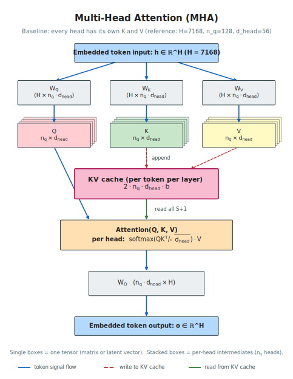
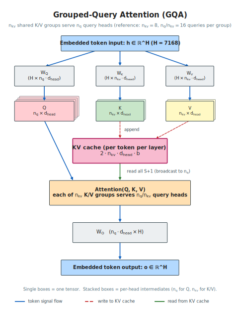
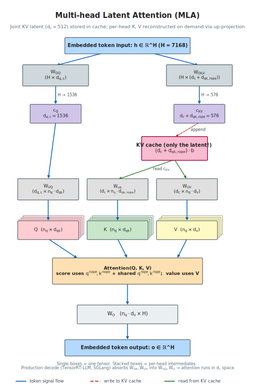

# Attention Variants

**Author:** Yue Lu  
**Date:** May 2026  

This document covers per-token attention architectures used in production large language models — from the original multi-head attention (MHA), through its production-dominant grouped-query attention (GQA) variant, to the more recent multi-head latent attention (MLA), with placeholder sections for sliding-window attention, DeepSeek Sparse Attention (DSA), and hybrid linear / full attention. Each architecture's per-layer parameter count, key-value (KV) cache footprint, per-token floating-point operations (FLOPs), and sharding behavior is given in one self-contained section. The rest of the transformer layer (feed-forward network (FFN), Mixture-of-Experts (MoE), collective communication) is unchanged across variants and lives in `decode.md` / `prefill.md`.

**Scope.** Each section gives (a) an architectural overview, (b) a symbol register, (c) per-layer parameter count, (d) KV cache footprint per token per layer, (e) per-token compute, (f) sharding behavior under tensor parallelism (TP) attention and data parallelism (DP) attention, and (g) a worked example. The decode and prefill cost formulas in `decode.md` / `prefill.md` use MHA / GQA (§1, §2) as the default reference; for each non-MHA/GQA variant they carry inline cross-references to the matching section here.

**Variants in this document:**

- §1 Multi-Head Attention (MHA) — original transformer formulation; LLaMA-1, GPT-3
- §2 Grouped-Query Attention (GQA) — LLaMA-3, Mistral, Qwen-2/3, most modern dense LLMs
- §3 Multi-head Latent Attention (MLA) — DeepSeek-V3 / R1, DeepSeek-V4-Pro, GLM-5, Kimi-K2.5
- §4 Sliding-window attention (placeholder) — Mistral, GPT-OSS, Gemma
- §5 DeepSeek Sparse Attention (DSA) (placeholder) — DeepSeek-V4-Pro, GLM-5
- §6 Hybrid linear / full attention (placeholder) — Qwen-3.5, Jamba, Hymba

---

## 1. Multi-Head Attention (MHA)

### 1.1 Architectural overview

Multi-head attention is the original transformer attention formulation [VASWANI17]. Each transformer layer projects the embedded token $h \in \mathbb{R}^H$ into $n_q$ independent attention heads, each carrying its own per-head $d_{\mathrm{head}}$-dimensional query, key, and value vector. Per token:

- **Q / K / V projection.** Three weight matrices $W_Q, W_K, W_V \in \mathbb{R}^{H \times n_q d_{\mathrm{head}}}$ project $h$ into per-head queries, keys, and values. By convention $n_q \cdot d_{\mathrm{head}} = H$, so each per-head slice is a $H \times d_{\mathrm{head}}$ block of the larger matrix and the full output is $\mathbb{R}^H$.
- **Per-head attention.** Each head $i$ independently computes $\mathrm{softmax}(q_i K_i^\top / \sqrt{d_{\mathrm{head}}}) \cdot V_i$, where $K_i, V_i$ contain the $S$ past tokens' K and V for that head (read from the KV cache; the current token's K and V are appended first).
- **Output projection.** Per-head outputs are concatenated into a $\mathbb{R}^H$ vector and projected back to the hidden dimension via $W_O \in \mathbb{R}^{n_q d_{\mathrm{head}} \times H}$.

Each head can be intuitively viewed as projecting the hidden state into a different subspace, capturing a different "view" of inter-token correlation; the output projection then mixes these views back into the hidden representation to produce the layer's output $o \in \mathbb{R}^H$.

The KV cache stores K and V for every past token so per-step decode does not have to recompute them. Per token per layer this is $2 \cdot n_q \cdot d_{\mathrm{head}}$ values (one K plus one V across all $n_q$ heads). For modern context lengths and head counts the KV cache dominates the per-rank static memory footprint at large $S$ — the constraint that motivates GQA (§2) and MLA (§3).

### 1.2 Symbol register

MHA uses the standard transformer symbols from `notation.md §3` directly, with no extensions:

| Symbol | Description | Typical LLaMA-1 7B value |
|--------|-------------|-------|
| $H$ | Hidden size | 4096 |
| $n_q$ | Number of query heads | 32 |
| $d_{\mathrm{head}} = H / n_q$ | Per-head dimension | 128 |
| $L$ | Number of transformer layers | 32 |

The convention $n_q \cdot d_{\mathrm{head}} = H$ ties the per-head dimension to the hidden size; the $n_q$ heads partition $H$ exactly. For MHA, $H_{kv} = n_q \cdot d_{\mathrm{head}} = H$, i.e. the KV side has the same total dimension as the Q side.

### 1.3 Per-layer attention parameter count

The MHA per-layer attention parameter count is the sum of the four projection matrices:

$$P_{\mathrm{attn,MHA}} = \underbrace{H \cdot n_q d_{\mathrm{head}}}_{W_Q} + \underbrace{H \cdot n_q d_{\mathrm{head}}}_{W_K} + \underbrace{H \cdot n_q d_{\mathrm{head}}}_{W_V} + \underbrace{n_q d_{\mathrm{head}} \cdot H}_{W_O} = 4 H^2$$

In bytes: multiply by $b$ (bytes per parameter, `notation.md §4`). The simplification $n_q \cdot d_{\mathrm{head}} = H$ collapses the four matrices to $4 H^2$ regardless of how the hidden dimension is split into heads — a useful invariant when reasoning about per-layer attention weight footprint across MHA-class models.

### 1.4 KV cache footprint

Per token per layer:

$$M_{\mathrm{KV,MHA}} = 2 \cdot n_q \cdot d_{\mathrm{head}} \cdot b = 2 H \cdot b$$

The factor of 2 accounts for K plus V; the per-head $d_{\mathrm{head}}$ scales with all $n_q$ heads since each head writes its own K and V to the cache. For LLaMA-1 7B at FP16 ($H = 4096$, $b = 2$), this is 16,384 bytes per token per layer; across $L = 32$ layers, a single 2K-token sequence's KV cache is ~1 GB.

This linear-in-$S$ growth is the headline scaling problem of MHA at modern context lengths, and the direct motivation for GQA (§2) — sharing K and V across multiple query heads — and the more aggressive compression in MLA (§3).

### 1.5 Per-token compute

Per-layer MHA FLOPs per decode step (one new token, $S$ past tokens):

$$F_{\mathrm{attn,MHA}}(S) = \underbrace{6 H^2}_{W_Q, W_K, W_V \text{ projections}} + \underbrace{2 S \cdot n_q \cdot d_{\mathrm{head}}}_{Q \cdot K^\top} + \underbrace{2 S \cdot n_q \cdot d_{\mathrm{head}}}_{\mathrm{softmax} \cdot V} + \underbrace{2 H^2}_{W_O} = 8 H^2 + 4 S H$$

The first and last terms are $S$-independent (per-token projection cost); the middle two scale linearly with $S$ (per-past-token attention cost). For typical decode workloads, the projection terms dominate at small $S$ and the score / value terms cross over at $S \sim 2 H$.

For prefill, where $S_{\mathrm{input}}$ tokens enter the cache simultaneously, the per-token projection cost is amortized into a single GEMM across all $S_{\mathrm{input}}$ tokens; the score / value terms become $S_{\mathrm{input}}^2$-scaling per layer (full causal attention matrix). See `prefill.md §1.1` for the prefill aggregate form.

### 1.6 Sharding under TP-attention / DP-attention

Under TP-attention (`attention_mode="tp"`, head-sharded), the four MHA projection matrices split as follows across the $G_{TP}$ tensor-parallel ranks:

- $W_Q$, $W_K$, $W_V$ are head-sharded — each rank gets $n_q / G_{TP}$ heads' worth of these weights.
- $W_O$ is input-dimension-sharded along the $n_q d_{\mathrm{head}}$ axis (one slice per rank, matching its head subset). A final all-reduce sums each rank's partial output to produce the layer's $\mathbb{R}^H$ output.
- KV cache footprint per rank scales as $n_q / G_{TP}$ — each rank stores K and V for its assigned heads only.

The per-rank attention parameter footprint is:

$$P_{\mathrm{attn,device}} = \frac{4 H^2}{G_{TP}}$$

Under DP-attention (`attention_mode="dp"`, batch-sharded), all MHA weights are replicated on every rank ($D_{\mathrm{attn}} = 1$ per `notation.md §1`), and the batch is split across the $G_{TP}$ attention DP groups. Per-rank KV cache footprint scales with the per-rank token count $B / G_{TP}$ instead of the full batch; each rank still stores all $n_q$ heads' K and V for its assigned tokens.

### 1.7 Worked example — LLaMA-1 7B

LLaMA-1 7B architecture: $H = 4096$, $n_q = 32$, $d_{\mathrm{head}} = 128$, $L = 32$. Total reported weight footprint: 6.74 B parameters.

Per-layer attention parameter count:

| Matrix | Term | Value |
|--------|------|------:|
| $W_Q$ | $H \cdot n_q d_{\mathrm{head}}$ | 16.8 M |
| $W_K$ | $H \cdot n_q d_{\mathrm{head}}$ | 16.8 M |
| $W_V$ | $H \cdot n_q d_{\mathrm{head}}$ | 16.8 M |
| $W_O$ | $n_q d_{\mathrm{head}} \cdot H$ | 16.8 M |
| **Total** | $4 H^2$ | **67.1 M** |

Across all 32 layers: total attention parameters = 2.15 B, about 32 % of LLaMA-1 7B's total weight footprint. KV cache per token per layer at FP16: $2 \cdot 32 \cdot 128 \cdot 2 = 16{,}384$ bytes. For a 2048-token sequence: $2048 \cdot 32 \cdot 16{,}384 / 10^9 \approx 1.07$ GB.

For long-context decode the picture changes sharply. At $S = 128$K and $L = 32$, a single sequence's MHA cache at FP16 is ~67 GB, exceeding HBM capacity on most accelerators; even at FP8 ($b = 1$) it is ~34 GB per sequence and leaves little room for batched serving. This is the operational pressure that drove the industry to GQA (§2) for nearly all post-LLaMA-2 production models.

---

## 2. Grouped-Query Attention (GQA)

### 2.1 Architectural overview

Grouped-query attention generalizes MHA by sharing K and V across groups of query heads [GQA]. The $n_q$ query heads are partitioned into $n_{kv}$ shared K/V groups; each group's K and V serves $n_q / n_{kv}$ query heads. When $n_{kv} = n_q$, GQA reduces to MHA; when $n_{kv} = 1$, it reduces to multi-query attention (MQA). Production LLMs typically pick $n_{kv}$ in the range 4–16 to balance KV cache savings (~$n_q / n_{kv}\times$ reduction) against quality loss.

Per token:

- **Q projection.** $W_Q \in \mathbb{R}^{H \times n_q d_{\mathrm{head}}}$ is unchanged from MHA — the query side still has $n_q$ independent heads.
- **K, V projection.** $W_K, W_V \in \mathbb{R}^{H \times n_{kv} d_{\mathrm{head}}}$ — the K and V side has only $n_{kv}$ heads, so these matrices are $n_q / n_{kv}\times$ smaller than MHA's $W_K, W_V$.
- **Per-head attention.** Each query head attends to its assigned K/V group; the K and V are shared (broadcast) across the $n_q / n_{kv}$ query heads in the group. Per-head $\mathrm{softmax}$ and value-weighted-sum are unchanged structurally.
- **Output projection.** $W_O \in \mathbb{R}^{n_q d_{\mathrm{head}} \times H}$ is unchanged from MHA — per-head outputs are still concatenated to a $\mathbb{R}^H$ vector before projection.

The asymmetry — full $n_q$ heads on the Q side, shared $n_{kv}$ groups on the K/V side — is the key efficiency trade-off. Q-side compute and parameter count are unchanged from MHA, but KV cache footprint and KV projection cost shrink by the $n_q / n_{kv}$ factor. This is the defining property of GQA: cheaper KV cache, same attention compute.

### 2.2 Symbol register

GQA adds one symbol — $n_{kv}$ — to the standard MHA register from `notation.md §3`:

| Symbol | Description | Typical LLaMA-3 70B value |
|--------|-------------|-------|
| $H$ | Hidden size | 8192 |
| $n_q$ | Number of query heads | 64 |
| $n_{kv}$ | Number of K/V groups | 8 |
| $d_{\mathrm{head}} = H / n_q$ | Per-head dimension | 128 |
| $H_{kv} = n_{kv} \cdot d_{\mathrm{head}}$ | Total K/V projection dimension | 1024 |
| $L$ | Number of transformer layers | 80 |

The convention $n_q \cdot d_{\mathrm{head}} = H$ from MHA is preserved on the Q side. The K/V side has its own total dimension $H_{kv} = n_{kv} \cdot d_{\mathrm{head}}$, generally much smaller than $H$. The compression ratio $n_q / n_{kv}$ governs both the KV cache savings and the K/V projection parameter savings.

### 2.3 Per-layer attention parameter count

The GQA per-layer attention parameter count is:

$$P_{\mathrm{attn,GQA}} = \underbrace{H \cdot n_q d_{\mathrm{head}}}_{W_Q} + \underbrace{H \cdot n_{kv} d_{\mathrm{head}}}_{W_K} + \underbrace{H \cdot n_{kv} d_{\mathrm{head}}}_{W_V} + \underbrace{n_q d_{\mathrm{head}} \cdot H}_{W_O} = 2 H^2 + 2 H \cdot H_{kv}$$

In bytes: multiply by $b$. For $n_{kv} = n_q$ (MHA limit), $H_{kv} = H$ and this reduces to $4 H^2$. For typical production GQA at $n_{kv} = 8$, $n_q = 64$: the K and V matrices are 8× smaller than the MHA equivalent, but $W_Q$ and $W_O$ are unchanged. GQA saves on K/V projection parameters only — the Q and O sides are full-sized.

### 2.4 KV cache footprint

Per token per layer:

$$M_{\mathrm{KV,GQA}} = 2 \cdot n_{kv} \cdot d_{\mathrm{head}} \cdot b = 2 H_{kv} \cdot b$$

The factor of $n_q / n_{kv}$ savings vs MHA is the headline efficiency gain — for $n_q = 64$, $n_{kv} = 8$ this is 8× smaller than MHA at the same $H$ and $n_q$. For LLaMA-3 70B at FP16 ($H_{kv} = 1024$, $b = 2$), this is 4096 bytes per token per layer.

### 2.5 Per-token compute

Per-layer GQA FLOPs per decode step (one new token, $S$ past tokens):

$$F_{\mathrm{attn,GQA}}(S) = \underbrace{2 H^2}_{W_Q} + \underbrace{4 H \cdot H_{kv}}_{W_K, W_V} + \underbrace{2 S \cdot n_q \cdot d_{\mathrm{head}}}_{Q \cdot K^\top} + \underbrace{2 S \cdot n_q \cdot d_{\mathrm{head}}}_{\mathrm{softmax} \cdot V} + \underbrace{2 H^2}_{W_O} = 4 H^2 + 4 H H_{kv} + 4 S H$$

The Q · K⊤ and softmax · V terms scale with $n_q$ (not $n_{kv}$) — every query head independently computes its attention scores, with the shared K and V broadcast across the group. KV cache memory shrinks $n_q / n_{kv}\times$ vs MHA, but attention FLOPs do not. This is the cheaper-memory-same-compute property of GQA: exactly what makes it operationally attractive for long-context, memory-bound decode workloads.

For prefill, the analogous form has $S_{\mathrm{input}}^2$-scaling on the score / value terms; see `prefill.md §1.1`.

### 2.6 Sharding under TP-attention / DP-attention

Under TP-attention (`attention_mode="tp"`, head-sharded), the four projection matrices split as follows across the $G_{TP}$ tensor-parallel ranks:

- $W_Q$ is head-sharded across $n_q / G_{TP}$ heads per rank.
- $W_K$ and $W_V$ are head-sharded across $n_{kv} / G_{TP}$ groups per rank when $G_{TP} \le n_{kv}$. When $G_{TP} > n_{kv}$ (common in large-TP deployments), $W_K$ and $W_V$ are replicated across the $G_{TP} / n_{kv}$ ranks within each K/V group — every rank in the group holds the full $W_K, W_V$ for the group's heads.
- $W_O$ is input-dimension-sharded along the $n_q d_{\mathrm{head}}$ axis (one slice per rank). A final all-reduce sums partial outputs to produce $\mathbb{R}^H$.

The per-rank attention parameter footprint depends on the relative ordering of $G_{TP}$ and $n_{kv}$:

$$P_{\mathrm{attn,device}} = \begin{cases} \dfrac{2 H^2 + 2 H \cdot H_{kv}}{G_{TP}} & G_{TP} \le n_{kv} \\[6pt] \dfrac{2 H^2}{G_{TP}} + \dfrac{2 H \cdot H_{kv}}{n_{kv}} & G_{TP} > n_{kv} \end{cases}$$

The second case captures the practical floor on KV-side sharding: once $G_{TP}$ exceeds $n_{kv}$, $W_K$ and $W_V$ stop scaling down and become a per-rank constant cost. This is the main reason production deployments cap $G_{TP}$ at or near $n_{kv}$ for GQA models.

Under DP-attention (`attention_mode="dp"`, batch-sharded), all GQA weights are replicated on every rank ($D_{\mathrm{attn}} = 1$ per `notation.md §1`), and the batch is split across the $G_{TP}$ attention DP groups. Per-rank KV cache footprint scales with the per-rank token count $B / G_{TP}$ instead of the full batch.

### 2.7 Worked example — LLaMA-3 70B

LLaMA-3 70B architecture: $H = 8192$, $n_q = 64$, $n_{kv} = 8$, $d_{\mathrm{head}} = 128$, $H_{kv} = 1024$, $L = 80$. Total reported weight footprint: 70.6 B parameters.

Per-layer attention parameter count:

| Matrix | Term | Value |
|--------|------|------:|
| $W_Q$ | $H \cdot n_q d_{\mathrm{head}}$ | 67.1 M |
| $W_K$ | $H \cdot n_{kv} d_{\mathrm{head}}$ | 8.4 M |
| $W_V$ | $H \cdot n_{kv} d_{\mathrm{head}}$ | 8.4 M |
| $W_O$ | $n_q d_{\mathrm{head}} \cdot H$ | 67.1 M |
| **Total** | $2 H^2 + 2 H H_{kv}$ | **151.0 M** |

Across all 80 layers: total attention parameters = 12.1 B, about 17 % of LLaMA-3 70B's total weight footprint (vs ~32 % for MHA at the same $H$ and $n_q$ — the GQA savings reduce attention's share of the weight budget by nearly half). KV cache per token per layer at FP16: $2 \cdot 1024 \cdot 2 = 4096$ bytes. For an 8192-token sequence: $8192 \cdot 80 \cdot 4096 / 10^9 \approx 2.7$ GB.

The headline number for GQA at this scale: ~8× smaller KV cache than the MHA equivalent at the same $H$ and $n_q$ (which would be $\sim 21.5$ GB for the same sequence). This compression makes long-context decode tractable on a single accelerator (e.g., H100 80 GB) for batch sizes that would not fit under MHA. The corresponding attention-weight savings (~70 M per layer) are a secondary benefit; the KV-cache shrinkage is what made GQA the dominant production attention architecture by 2024.

---

## 3. Multi-head Latent Attention (MLA)

### 3.1 Architectural overview

MLA replaces the standard per-head Q / K / V projections with two compressed paths: a query latent and a jointly-compressed KV latent [DSV3]. Per token:

- **Query path.** The hidden state $h \in \mathbb{R}^H$ is first down-projected to a query latent $c_Q \in \mathbb{R}^{d_{q,c}}$ via $W_{DQ}$, then up-projected to per-head queries via $W_{UQ}$. Each per-head query has two parts: a non-positional component $q_i^{\mathrm{nope}} \in \mathbb{R}^{d_{qk,\mathrm{nope}}}$ and a rotary-position-embedded (RoPE) component $q_i^{\mathrm{rope}} \in \mathbb{R}^{d_{qk,\mathrm{rope}}}$.
- **KV path.** The hidden state is jointly down-projected to a KV latent $c_{KV} \in \mathbb{R}^{d_c + d_{qk,\mathrm{rope}}}$ via $W_{DKV}$. The first $d_c$ dimensions form a head-shared K / V latent; the trailing $d_{qk,\mathrm{rope}}$ dimensions form the RoPE-positional K, also shared across all heads.
- **Per-head reconstruction.** Non-positional keys $k_i^{\mathrm{nope}}$ are reconstructed on demand as $W_{UK,i} \cdot c_{KV}[:d_c]$; per-head values $v_i$ as $W_{UV,i} \cdot c_{KV}[:d_c]$. The RoPE part is shared, not per-head.
- **Attention.** Computed per head against $(k_i^{\mathrm{nope}}, c_{KV}[d_c:])$ and $v_i$, then per-head outputs are projected back to the hidden dimension via $W_O$.

The compression has two benefits relative to standard MHA. First, the KV cache stores only the latent $c_{KV}$ — $(d_c + d_{qk,\mathrm{rope}})$ per token per layer — instead of the full per-head K and V at $2 \cdot n_q \cdot d_{qk}$ bytes per token per layer. Second, the per-step latent space is compact enough that attention can run entirely in the $d_c$-dimensional space without materializing the full per-head K and V each step (see §3.5 absorbed mode).

### 3.2 Symbol register

| Symbol | Description | Typical DSv3 value |
|--------|-------------|-------|
| $d_c$ | KV latent dimension (head-shared) | 512 |
| $d_{q,c}$ | Query latent dimension | 1536 |
| $d_{qk,\mathrm{nope}}$ | Non-positional Q / K head dimension | 128 |
| $d_{qk,\mathrm{rope}}$ | RoPE-positional Q / K head dimension (head-shared on K side) | 64 |
| $d_v$ | Value head dimension | 128 |
| $n_q$ | Number of attention heads (same as `notation.md §3`) | 128 |

Composite shorthand: $d_{qk} = d_{qk,\mathrm{nope}} + d_{qk,\mathrm{rope}}$ — total per-head Q / K dimension on the query side.

The MHA / GQA symbols $H$, $H_{kv} = n_{kv} \cdot d_{\mathrm{head}}$, $d_{\mathrm{head}} = H / n_q$ from `decode.md` and `notation.md §3` are not used in MLA accounting; the relationship $H = n_q \cdot d_{\mathrm{head}}$ does not constrain MLA dimensions, which are independent design choices.

### 3.3 Per-layer attention parameter count

The MHA / GQA per-layer attention parameter count from `decode.md §1.1`:

$$P_{\mathrm{attn,MHA}} = 2 H^2 + 2 H \cdot H_{kv}$$

The MLA per-layer attention parameter count is the sum of the six weight matrices:

$$P_{\mathrm{attn,MLA}} = \underbrace{H \cdot d_{q,c}}_{W_{DQ}} + \underbrace{d_{q,c} \cdot n_q \cdot d_{qk}}_{W_{UQ}} + \underbrace{H \cdot (d_c + d_{qk,\mathrm{rope}})}_{W_{DKV}} + \underbrace{n_q \cdot d_c \cdot d_{qk,\mathrm{nope}}}_{W_{UK}} + \underbrace{n_q \cdot d_c \cdot d_v}_{W_{UV}} + \underbrace{n_q \cdot d_v \cdot H}_{W_O}$$

In bytes: multiply by $b$ (bytes per parameter, `notation.md §4`).

The two large terms for typical deployments are $W_{UQ}$ (scales with $n_q \cdot d_{qk}$ on the inside dimension) and $W_O$ (scales with $n_q \cdot d_v \cdot H$). The four smaller terms ($W_{DQ}$, $W_{DKV}$, $W_{UK}$, $W_{UV}$) are roughly an order of magnitude smaller in DSv3-class configurations; see the worked example in §3.8.

### 3.4 KV cache footprint

Per token per layer, the MHA / GQA form from `decode.md §1.3` is $M_{\mathrm{KV,MHA}} = 2 \cdot H_{kv} \cdot b$.

The MLA per-token-per-layer KV cache stores only the joint latent:

$$M_{\mathrm{KV,MLA}} = (d_c + d_{qk,\mathrm{rope}}) \cdot b$$

This is much smaller than MHA / GQA on equivalent models. A worked DSv3 comparison: MLA stores $(512 + 64) \cdot 0.5 = 288$ bytes per token per layer at FP4 (`notation.md §4`); equivalent dense MHA at $H_{kv} = H = 7168$ would store $2 \cdot 7168 \cdot 0.5 = 7168$ bytes per token per layer — about 25× larger; a typical production GQA at $n_{kv} = 8$ would store $2 \cdot 8 \cdot 56 \cdot 0.5 = 448$ bytes — about 1.5× larger than MLA. See §3.8 for the joint comparison of attention weights and KV cache against multiple baselines, including the GQA form one obtains by tuning $n_{kv}$ to recover MLA's KV footprint.

### 3.5 Two execution modes

MLA admits two equivalent ways of computing attention per step. Both consume the same KV cache content $(c_{KV}[:d_c], c_{KV}[d_c:])$ and produce the same output — they differ in where the $W_{UK}$ and $W_{UV}$ multiplications happen.

#### Materialized mode

For each step, decompress the latent into per-head K and V, then run standard attention:

- Read $c_{KV}$ from the KV cache for all $S$ past tokens (KV cache traffic per token per layer = $(d_c + d_{qk,\mathrm{rope}}) \cdot b$).
- Compute $K_i = W_{UK,i} \cdot c_{KV}[:d_c]$ for each head $i$ and each past token (one-time per token added to the cache; cached in fast on-die memory if possible).
- Compute $V_i = W_{UV,i} \cdot c_{KV}[:d_c]$ similarly.
- Run standard multi-head attention on $(K_i, c_{KV}[d_c:])$ and $V_i$.

The materialization step costs $2 \cdot n_q \cdot d_c \cdot (d_{qk,\mathrm{nope}} + d_v)$ FLOPs per token-added-to-cache per layer (for MLA-class decode this is once per step per layer, since one new token enters the cache per step). It also requires a transient per-head K / V buffer of size $n_q \cdot S \cdot (d_{qk,\mathrm{nope}} + d_v) \cdot b$ in fast memory.

#### Absorbed mode (production default)

Fold the up-projections into Q and O at compile time so attention runs entirely in the $d_c$-dimensional latent space:

- Precompute $W_{UQ} \otimes W_{UK}$ so the query is projected directly to a form that can dot-product against $c_{KV}[:d_c]$ — no per-step K reconstruction.
- Precompute $W_{UV} \otimes W_O$ so the output projection consumes a weighted sum of $c_{KV}[:d_c]$ entries — no per-step V reconstruction.

Effectively the per-step attention is:

$$\mathrm{score}_i = q'_i \cdot c_{KV}[:d_c]^T + q_i^{\mathrm{rope}} \cdot c_{KV}[d_c:]^T$$

$$\mathrm{output}_i = \mathrm{softmax}(\mathrm{score}_i) \cdot c_{KV}[:d_c]$$

followed by the absorbed output projection. The compute is dominated by two per-past-token multiplications in $d_c$ space (score and value sum), each $O(n_q \cdot d_c)$ per past token per layer, instead of the materialized form's $O(n_q \cdot d_{qk,\mathrm{nope}} + n_q \cdot d_v)$ per past token. For DSv3 with $d_c = 512$ and $d_{qk,\mathrm{nope}} = d_v = 128$, the absorbed score / value cost per past token is $\sim 4 \times$ the materialized form's score / value cost ($2 \cdot 128 \cdot 512 = 131{,}072$ vs $128 \cdot (128 + 128) = 32{,}768$ FLOPs per past token per layer) — but the absorbed form skips the per-token K and V materialization entirely and avoids the transient per-head K / V buffer. The DSv3 paper itself derives the canonical decode-time forward pass without explicitly naming the two modes; the materialized / absorbed distinction is a production-framework implementation choice. Production frameworks (NVIDIA TensorRT-LLM, SGLang's DeepSeek-V3 path) use absorbed mode by default for decode; materialized mode appears in some reference and CPU-fallback implementations.

The exact per-mode FLOP breakdown is given in §3.6.

### 3.6 Per-token compute

Per-layer attention FLOPs per decode step (one new token, $S$ past tokens in cache):

$$F_{\mathrm{attn,MLA,materialized}}(S) = \underbrace{2 H \cdot d_{q,c}}_{W_{DQ}} + \underbrace{2 \cdot d_{q,c} \cdot n_q \cdot d_{qk}}_{W_{UQ}} + \underbrace{2 H \cdot (d_c + d_{qk,\mathrm{rope}})}_{W_{DKV}} + \underbrace{2 \cdot n_q \cdot d_c \cdot d_{qk,\mathrm{nope}}}_{W_{UK} \text{ on new token}} + \underbrace{2 \cdot n_q \cdot d_c \cdot d_v}_{W_{UV} \text{ on new token}} + \underbrace{2 S \cdot n_q \cdot d_{qk}}_{Q \cdot K^T} + \underbrace{2 S \cdot n_q \cdot d_v}_{\mathrm{softmax} \cdot V} + \underbrace{2 \cdot n_q \cdot d_v \cdot H}_{W_O}$$

$$F_{\mathrm{attn,MLA,absorbed}}(S) = \underbrace{2 H \cdot d_{q,c}}_{W_{DQ}} + \underbrace{2 \cdot d_{q,c} \cdot n_q \cdot d_{qk}}_{W_{UQ}} + \underbrace{2 H \cdot (d_c + d_{qk,\mathrm{rope}})}_{W_{DKV}} + \underbrace{2 S \cdot n_q \cdot (d_c + d_{qk,\mathrm{rope}})}_{\mathrm{score in latent}} + \underbrace{2 S \cdot n_q \cdot d_c}_{\mathrm{value in latent}} + \underbrace{2 \cdot n_q \cdot d_c \cdot H}_{\text{absorbed } W_O}$$

The structure of the difference: materialized pays a fixed (S-independent) cost per step to reconstruct K and V for the new token, then standard attention scales with $S$ in the smaller $d_{qk,\mathrm{nope}}$ and $d_v$ dimensions. Absorbed pays no per-step reconstruction but the per-past-token attention scales with the larger $d_c$ dimension. Crossover happens at moderate $S$; production deployments at $S \gtrsim 1\mathrm{K}$ generally prefer absorbed because the $S$-scaling savings on the per-token reconstruction exceed the $d_c$-vs-$d_{qk,\mathrm{nope}}$ overhead on the score / value compute.

For prefill, where the input has $S_{\mathrm{input}}$ tokens entering the cache simultaneously, the materialization cost amortizes over the full input: the per-token cost is the same $(W_{UK}, W_{UV})$ work but consolidated into a single GEMM. Per-token compute differences between modes are smaller in prefill than in decode.

### 3.7 Sharding under TP-attention / DP-attention

Under TP-attention (`attention_mode="tp"`, head-sharded), the MLA weights split as follows across the $G_{TP}$ tensor-parallel ranks:

- $W_{UQ}$, $W_{UK}$, $W_{UV}$, $W_O$ are head-sharded — each rank gets $n_q / G_{TP}$ heads' worth of these weights.
- $W_{DQ}$, $W_{DKV}$ are not sharded — they project from / to the hidden dimension $H$ and are replicated on every rank.
- KV cache footprint per rank: the latent $c_{KV}$ is computed once per rank via $W_{DKV}$ and stored full (no head-sharding — the latent is shared across all heads by construction).

The per-rank attention parameter footprint is therefore:

$$P_{\mathrm{attn,device}} = \frac{1}{G_{TP}} \cdot (W_{UQ} + W_{UK} + W_{UV} + W_O) + W_{DQ} + W_{DKV}$$

Replacing the per-device attention parameter term in `decode.md §1.4` for MLA models.

Under DP-attention (`attention_mode="dp"`, batch-sharded), all MLA weights are replicated on every rank ($D_{\mathrm{attn}} = 1$ per `notation.md §1`), and the batch is split across the $G_{TP}$ attention DP groups. Per-rank KV cache footprint scales with the per-rank token count $B / G_{TP}$ instead of the full batch:

$$M_{\mathrm{KV,device}} = \frac{B}{G_{TP}} \cdot S \cdot (d_c + d_{qk,\mathrm{rope}}) \cdot b \cdot \frac{L}{PP}$$

(per-stage form; the $L / PP$ factor and the rest of the outer composition are unchanged from `decode.md §1.4` and `decode.md §2.3`).

### 3.8 Worked example — DSv3 / DSR1

DeepSeek-V3 / R1 architecture: $H = 7168$, $n_q = 128$, $d_c = 512$, $d_{q,c} = 1536$, $d_{qk,\mathrm{nope}} = 128$, $d_{qk,\mathrm{rope}} = 64$, $d_v = 128$, $L = 61$ (60 MoE + 1 dense). Bytes per parameter $b$ depends on quantization (FP4 → 0.5, FP8 → 1, BF16 → 2). Total reported weight footprint: 671 B parameters.

Per-layer MLA attention parameter count (six matrices from §3.3):

| Matrix | Term | Value |
|--------|------|------:|
| $W_{DQ}$ | $H \cdot d_{q,c}$ | 11.0 M |
| $W_{UQ}$ | $d_{q,c} \cdot n_q \cdot (d_{qk,\mathrm{nope}} + d_{qk,\mathrm{rope}})$ | 37.7 M |
| $W_{DKV}$ | $H \cdot (d_c + d_{qk,\mathrm{rope}})$ | 4.1 M |
| $W_{UK}$ | $n_q \cdot d_c \cdot d_{qk,\mathrm{nope}}$ | 8.4 M |
| $W_{UV}$ | $n_q \cdot d_c \cdot d_v$ | 8.4 M |
| $W_O$ | $n_q \cdot d_v \cdot H$ | 117.4 M |
| **Total MLA** | | **187.0 M** |

Comparison against same-$H$ MHA / GQA baselines, with $H = 7168$ and $n_q = 128$ held fixed (so $d_{\mathrm{head}} = H / n_q = 56$ in the MHA / GQA forms $P = 2 H^2 + 2 H \cdot H_{kv}$ from `decode.md §1.1`):

| Attention variant | Attn params / layer | KV bytes / token / layer (FP4) | Across $L = 61$ layers | % of 671 B total weights |
|---|---:|---:|---:|---:|
| Full MHA ($n_{kv} = 128$) | 205.5 M | 7168 | 12.5 B | 1.87 % |
| **MLA (real)** | **187.0 M** | **288** | **11.4 B** | **1.70 %** |
| Typical GQA ($n_{kv} = 8$) | 109.2 M | 448 | 6.66 B | 0.99 % |
| GQA tuned to MLA KV ($n_{kv} = 5$) | 106.8 M | 280 | 6.51 B | 0.97 % |

**Reading the table.** MLA's relevant deployed-baseline alternative is typical GQA, since full MHA is rarely deployed at this scale. Against typical GQA, MLA *costs* ~78 M extra attention parameters per layer (~4.7 B across 61 layers, ~0.7 % of total weights) to *buy* a ~1.5× smaller KV cache (288 vs 448 bytes per token per layer). Against full MHA, MLA is both smaller in attention weights *and* ~25× smaller in KV cache — but full MHA is a reference point rather than an active alternative at this parameter count. The original MLA design pitch (DSv3 [DSV3] §2.1.1) frames MLA against MHA, where the KV-cache reduction looks dramatic; the production-relevant pitch is against GQA, where MLA buys a more modest KV-cache reduction in exchange for a slight attention-weight increase.

The fourth row shows what the generic GQA form produces when $n_{kv}$ is tuned to recover MLA's tiny KV cache — the same approximation used by some MLA model specs before the variant-aware path lands. The KV cache footprint matches real MLA to within ~3 % (280 vs 288), but the attention-parameter count is ~80 M per layer too low — about a 43 % relative under-count on the attention block alone, equivalent to ~0.7 % under-count on total weights. For decode workloads where KV-cache traffic dominates and the attention-weight under-count is second-order, this approximation is acceptable. For prefill / TTFT predictions and per-device static memory accounting, the proper MLA accounting from §3.3 is meaningfully more accurate.

---

## 4. Sliding-window attention (placeholder)

When the attention block is capped at a per-token sliding window of $W$ past tokens (Mistral 7B, GPT-OSS, Gemma), the KV cache caps at $W$ tokens per layer per sequence (with rolling eviction) and the attention compute scales with $W$ instead of the full context length $S$. To be filled in when the framework lands sliding-window support.

---

## 5. DeepSeek Sparse Attention (DSA) (placeholder)

DSA introduces a top-k token selector before attention so each query attends to only the top $k$ most-relevant past tokens (DeepSeek-V4-Pro, GLM-5). The KV cache is unchanged but the per-step attention compute scales with $k$ instead of $S$ for the score / value stage. To be filled in when the framework lands DSA support.

---

## 6. Hybrid linear / full attention (placeholder)

Some model classes interleave linear-attention layers (Mamba / RWKV / RetNet style) with full-attention layers (Qwen-3.5, Jamba, Hymba). Linear-attention layers replace softmax attention with a cumulative state update that does not store a per-token KV cache; per-layer cost is $O(d \cdot d_{\mathrm{state}})$ regardless of $S$. To be filled in when the framework lands a per-layer layer-type field.
